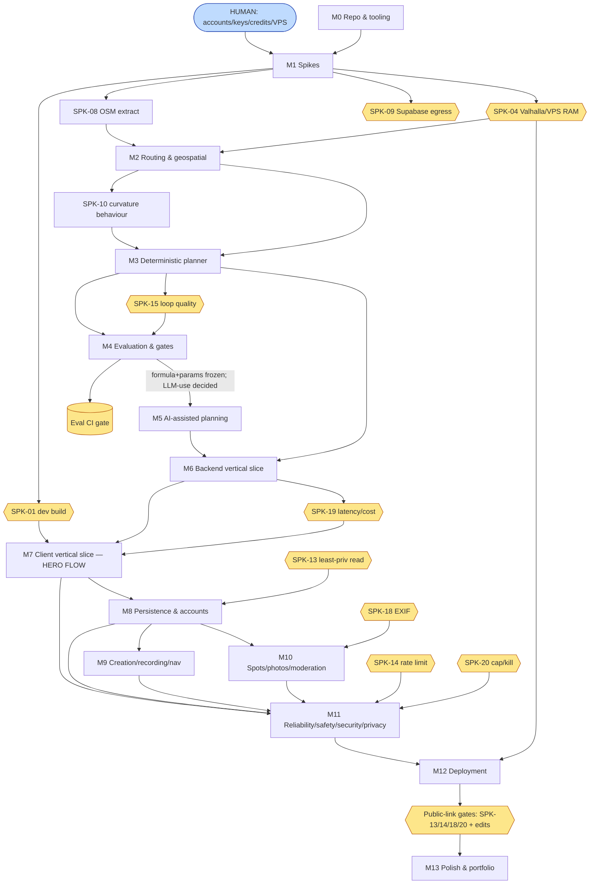

# GoDrive — Implementation Plan & Backlog

**Version:** 1.0
**Companions:** `GoDrive_Final_PreBuild_Review_v1.0.md` (verdict: CONDITIONAL GO) · `GoDrive_Build_Contract_v1.0.md` (agent operating agreement) · v2 spec · dependency verification · experimental protocol.
**Audience:** the human owner + Claude coding agents. **A reader should be able to take the first unblocked task (M0-T01) and begin without re-reading the whole spec.**

**Reconciled decisions in force** (from the Pre-Build Review §2): the planner is **deterministic-first**; **LLM selection & correction are gated (off by default)**, decided in M4; the **AI MVP boundary = parse + explanation + auto-title/summary/tags + deterministic refinement-merge**; **numeric scenic scoring is gated** (labels-only default); **Mapbox Navigation SDK is prohibited** (follow-mode built from Valhalla maneuvers); the verification §8 edits are folded into the tasks.

---

## Table of contents

1. Implementation strategy
2. Milestone overview
3. Critical path
4. Mermaid dependency diagram
5. Scenario A — 4-week aggressive vertical slice
6. Scenario B — 6–8 week target build
7. Scenario C — 10+ week polished version
8. Complete backlog by milestone
9. Task dependency table
10. Human-action table
11. Cut-order
12. Release gates
13. MVP definition of done
14. Public portfolio release definition of done

---

## 1. Implementation strategy

**Principle: reduce risk and keep a demoable vertical slice alive at all times.** Build the scariest, most architecture-defining things first (spikes → routing → deterministic planner → eval → vertical slice), and *prove the planner before investing in anything around it.* Do **not** start with UI polish, profiles, favourites, photos, or secondary community features while the planner is unproven.

Execution order (maps to milestones):

1. **Repo + dev environment** (M0) — the substrate agents work in.
2. **Feasibility spikes** (M1) — settle the measurement-dependent unknowns; blocking spikes gate their dependents.
3. **Local routing proof + OSM/Valhalla/geospatial proof** (M2) — the data + engine foundation.
4. **Deterministic route-generation prototype** (M3) — the planner *without* the LLM; the thing everything else sits on.
5. **Evaluation harness + experiments** (M4) — prove the methodology; finalize formula/parameters; decide gated LLM uses.
6. **Minimal backend API** (M6, after M5 AI) and **AI-assisted planning** (M5) — wrap the proven pipeline with the boundary LLM uses + SSE + cost controls.
7. **Minimal mobile map + end-to-end planner vertical slice + refinement + trace + eval page** (M7) — the hero flow.
8. **Persistence + auth** (M8), then **retained supporting features** (M9 creation/recording/nav, M10 spots/photos/moderation).
9. **Reliability/safety/privacy/moderation** (M11), **deployment** (M12), **polish + portfolio packaging** (M13).

**Vertical-slice discipline:** the slice "anonymous brief → streamed deterministic route → result + constraints + explanation" must be runnable end-to-end as early as M7, and remain runnable as later milestones add around it. Every milestone ends in something demoable; the eval set becomes a CI gate as soon as it exists (M4) so quality cannot silently regress.

**Why this order is safe:** the two things that could invalidate the architecture — Valhalla-on-a-small-VPS (SPK-04) and loop quality (SPK-15) — are proven in M1–M4 before the client, accounts, or community features consume effort. If SPK-15 fails, the project pivots (smaller region, simpler loops) *before* sunk cost, not after.

---

## 2. Milestone overview

| ID | Milestone | Outcome | Gated by | Demoable result |
|---|---|---|---|---|
| **M0** | Repo & tooling | agents can build/test/commit safely | — | CI green on an empty skeleton |
| **M1** | Technical spikes | measurement unknowns settled | [HUMAN] accounts | spike reports + go/no-go decisions |
| **M2** | Routing & geospatial foundation | Valhalla + PostGIS + curvature + seeds | SPK-04/08/10 | routes/isochrones/match on real region data |
| **M3** | Deterministic planner | NL-agnostic route generation (no LLM) | M2 | a feasible twisty loop from a constraints object |
| **M4** | Experimental evaluation | methodology proven; gates decided | M3 + dataset | eval report; formula+params frozen; LLM-use decisions |
| **M5** | AI-assisted planning | boundary LLM uses + cost controls | M4 | NL brief → parsed constraints → explanation |
| **M6** | Backend vertical slice | `/plan` SSE + `/route` + `/match` + guards | M3/M5 | streamed generation over HTTP, capped |
| **M7** | Client vertical slice | **the hero flow** | SPK-01 + M6 | end-to-end on a real phone |
| **M8** | Persistence & accounts | auth + save/fork/fav/share + deletion | M7 + SPK-13 | sign in, save a route, fork, delete account |
| **M9** | Creation, recording, navigation | manual build + record + follow-mode | M7/M8 | build a route, record a drive, navigate |
| **M10** | Spots, photos, moderation | UGC + EXIF + report→remove | M8 + SPK-18 | add a spot with a safe photo; report→remove |
| **M11** | Reliability/safety/security/privacy | tests + backups + alerts | M6–M10 + SPK-14/20 | failure-mode + RLS + cap/kill tests green |
| **M12** | Deployment | production on the VPS | SPK-04 + M11 | live public link, smoke test green |
| **M13** | Polish & portfolio packaging | demo assets + docs | M12 | hero video + README + eval page polish |

---

## 3. Critical path

The true critical path runs through the planner, not the UI:

**M0 → SPK-04 (Valhalla/VPS) & SPK-08/10 (extract/curvature) → M2 (routing+curvy_segments+seeds) → M3 (deterministic candidate-gen + loop assembly + scoring + validation) → SPK-15 (loop quality) → M4 (formula/param freeze + LLM-use gates) → M5 (parse+explanation+cost controls) → M6 (`/plan` SSE) → SPK-01 (dev build) & SPK-19 (latency/cost) → M7 (hero flow on device) → [public-link security gates: SPK-13/14/18/20] → M12 (deploy) → M13 (packaging).**

- **Earliest start:** M0 + the [HUMAN] account-provisioning tasks (S0) start day 1 in parallel.
- **Earliest completion of the hero flow (Scenario A):** ~end of week 4 *if* SPK-01/04/15/19 pass cleanly on first attempt (optimistic).
- **Parallel work:** SPK-01 (mobile dev build) runs in parallel with the M2/M3 routing/planner chain (different skill, different surface); M4 dataset/gold-label authoring (M4-T0x) overlaps M3; documentation/decision-log + demo-fixture maintenance run continuously.
- **Human approval gates (block progress):** account/key/credit/VPS provisioning (M0/M1); Free-vs-Pro cost decision (after SPK-09); device tests (SPK-01/03/07/17, M7, M9); architecture/dependency changes; public-launch sign-off; demo recording.
- **Decision gates:** SPK go/no-go (esp. SPK-04/15/19); M4 selection gates ([GATE-R/F/S/C/W/RF/LAT]).
- **High-risk tasks (failure changes the architecture):** SPK-04 (→ size up / hosted Valhalla), SPK-15 (→ smaller region / simpler loops), SPK-09 (→ Supabase Pro), SPK-19 (→ fewer candidates / Haiku-only / tighter budget). These are the tasks to watch.
- **Cut-first-if-delayed:** see §11 (cut-order) — refinement, then record-a-drive, then spots/photos, then manual builder, before ever touching the hero flow or the eval page.

---

## 4. Mermaid dependency diagram

---

## 5. Scenario A — 4-week aggressive vertical slice

**Honest framing: the full v2 MVP does NOT fit in 4 weeks.** Scenario A delivers the **hero flow only**, deployed, as a focused proof; everything else is cut. It assumes the blocking spikes pass on first attempt (optimistic) and high human availability.

- **Included:** M0; the blocking spikes (SPK-01/04/08/09/10/15/19); M2 (routing + `curvy_segments` + a handful of seeds); M3 (deterministic planner); a **minimal M4** (small gold set, curvature gate, baseline B6 sanity — *not* the full experiment suite); M5 **parse + explanation only**; M6 (`/plan` SSE + cap/kill + rate limit); M7 **hero flow** (map home, plan, streamed generation, result + constraints + explanation, basic trace) on a real device; minimal M12 deploy (VPS + one Supabase project); a **minimal public eval page** (objective production metrics: validity, latency, cost — no gold benchmark section yet).
- **Cut:** conversational refinement (or a single hard-coded "make it longer"); record-a-drive; manual builder; spots/photos; accounts beyond anonymous (no save/fork/fav/share); moderation UI; full eval campaign + human eval; auto-title/summary/tags; advanced sliders (presets only); polish/accessibility; backups beyond a manual dump.
- **Demo quality:** a **working grounded planner** an evaluator can use anonymously — strong, but thin around the edges (no persistence, no community).
- **Technical story preserved?** **Mostly.** Grounding + deterministic pipeline + honest constraints + cost cap are all demonstrable. The *measured-quality* story (gold eval, ablations) is reduced to a sanity check — the weakest part of Scenario A.
- **Main risks:** spikes overrun the budget (most likely failure); loop quality (SPK-15) not converged in time → demo routes look mediocre; no slack for debugging AI-generated code.
- **Deployment target:** VPS + Supabase Free; EAS dev build on the owner's phone; a basic landing/eval link.
- **Required human availability:** **high** — daily reviews, all credential/device tasks front-loaded in week 1.

## 6. Scenario B — 6–8 week target build (recommended)

The **recommended** plan: the full v2 MVP, demoable and honest.

- **Included:** everything in Scenario A **plus** the **full M4** (dataset, gold labels, baselines, curvature/scenicness/ranking/correction experiments, LLM ablations, selection gates, CI gate); **conversational refinement** + route comparison; **reasoning-transparency view** (safe, no CoT); **auto-title/summary/tags**; **presets + clamped advanced sliders**; **M8** accounts (save/fork/fav/share, profiles, account+data deletion, RLS, Storage cleanup); **M9** manual builder + foreground record-a-drive + follow-mode + best-effort hand-off; **M10** spots + photos (**EXIF strip + re-encode**) + report→remove moderation floor; **M11** reliability/security/privacy tests + backups + restore drill + alerts + smoke test; **M12** full production deploy (dev/prod Supabase split, VPS hardening); a **full public eval page** (benchmark + production sections, partitioned); a small **human-eval campaign**; **M13** core packaging (hero video, README, decision log, architecture diagram, eval report).
- **Cut (still deferred):** all post-MVP features (likes, multimodal spot-assist, AI dup-detection, semantic search, weather, voice, region expansion, offline, ratings/feed/collections/comments, versioning, fly-along, GPX, freehand); store submission (P6); deep accessibility/perf polish beyond a baseline pass.
- **Demo quality:** **high** — the complete hero flow + refinement + visible reasoning + real published metrics + a working community/persistence layer, deployed and safe.
- **Technical story preserved?** **Fully.** Grounding, the deterministic/LLM boundary decided *by evidence*, honest constraint reporting, the public eval page with real provenance, bounded cost — the whole intended narrative.
- **Main risks:** SPK-15/M4 quality iteration takes longer than budgeted (the likeliest slip); breadth of M8–M10 stretches one developer; the Free-vs-Pro decision affecting demo reliability.
- **Deployment target:** VPS (CX32) + Supabase (Free dev / **Pro recommended for the public demo**); EAS dev/internal build; landing + eval deep links; backups to R2.
- **Required human availability:** **moderate-to-high** — regular reviews, all human gates, device tests, one human-eval session with 2–4 friends.

## 7. Scenario C — 10+ week polished version

Scenario B **plus** polish, a fuller evaluation, and store-readiness prep — without un-deferring deferred features.

- **Included:** all of Scenario B **plus** a deeper **accessibility** pass (VoiceOver/TalkBack on all key screens), a **performance** pass (60 fps, payload/egress tuning, warm-tile latency), an **expanded eval** (larger gold set, more archetypes, fuller human-eval with inter-rater agreement + CIs), **P6 store-readiness** prep (full moderation admin UI, **user blocking**, privacy labels/data-safety, ToS/EULA + privacy policy, account-deletion UX, EAS production builds, reviewer account — *submission optional/owner's call*), polished demo fixtures + landing page, resume bullets + interview talking points, and **at most one fast-follow** if time allows (candidate: multimodal spot-assist or AI dup-detection — explicitly re-approved, not assumed).
- **Cut:** the rest of the deferred list stays deferred; no region expansion; no learned personalization/fine-tuning.
- **Demo quality:** **portfolio-grade + near-store-ready** — polished, accessible, performant, with a rigorous public eval page and a fast-follow demonstrating extensibility.
- **Technical story preserved?** **Fully, with depth** — adds the "I evaluated rigorously and hardened for the stores" chapter.
- **Main risks:** scope creep (the fast-follow eating the schedule); over-polishing instead of shipping; store-review surprises if submission is pursued.
- **Deployment target:** VPS (CX32/CX42) + Supabase Pro; EAS production + internal/TestFlight track; full monitoring + alerts + backups + restore drill.
- **Required human availability:** **moderate, sustained** over 10+ weeks; multiple human-eval sessions; store-account setup if submitting.

**Recommendation:** target **Scenario B**; fall back to **A** if time compresses (cut per §11); extend to **C** only after B's MVP DoD is met.

---

## 8. Complete backlog by milestone

**Task ID scheme:** `M{n}-T{nn}` (task), `SPK-{nn}` (spike, IDs preserved from the verification doc), `RG-{n}` (release gate, §12). **Type** ∈ {Spike, Tech-story, Feature-story, Task, Bug, Gate}. **Priority** P0 (critical path) > P1 (MVP) > P2 (polish). **Confidence** = agent's likely first-pass success (High/Med/Low). Every task block carries all required fields in a dense form; "Verify" is the literal command/procedure an agent runs to prove done. Tasks are sized 0.5–4 h; anything larger is already split.

> **Format key (one block per task):**
> `ID — Title` · *Type* · *Priority* · *Est* · Conf · Risk · **Parallel** Y/N · **Blocking** Y/N · **Human** Y/N
> **Parent:** epic. **Deps:** prerequisite IDs. **Desc/Rationale:** what + why.
> **In→Out:** inputs → expected outputs. **Files:** likely-affected paths. **Guidance:** how.
> **AC:** measurable acceptance criteria. **Tests:** required tests. **Verify:** command/procedure. **DoD:** done means. **Rollback:** recovery note (where relevant).

---

### M0 — Repository & Tooling  *(Epic E-M0)*

> **M0-T01 — Initialize monorepo skeleton** · Tech-story · P0 · 1h · High · Low · Parallel N · Blocking Y · Human N
> **Parent:** E-M0. **Deps:** —. **Desc/Rationale:** create the canonical layout (`app/`, `backend/`, `shared/`, `db/`, `data/`, `eval/`, `infra/`, `docs/`) with pnpm workspaces so agents have one consistent structure (spec §76).
> **In→Out:** empty repo → workspace skeleton + root `package.json` + `pnpm-workspace.yaml` + `.gitignore` + `README.md` stub.
> **Files:** `/package.json`, `/pnpm-workspace.yaml`, `/.gitignore`, `/README.md`, the 7 package dirs.
> **Guidance:** pnpm workspaces; Node 20 LTS engine; `.gitignore` covers node_modules, .env, build artifacts, tiles.
> **AC:** `pnpm install` succeeds at root; the 7 dirs exist; no secrets committed.
> **Tests:** n/a. **Verify:** `pnpm install && ls app backend shared db data eval infra docs`. **DoD:** committed; clean install. **Rollback:** delete branch.

> **M0-T02 — Add `.env.example` + env-loading convention** · Tech-story · P0 · 0.5h · High · Low · Parallel N · Blocking Y · Human N
> **Parent:** E-M0. **Deps:** M0-T01. **Desc/Rationale:** document every runtime/build secret (runtime `ANTHROPIC_API_KEY`, Supabase URL+anon+service, Mapbox public token, `REGION_ID`, `REGION_POLY_PATH`, model IDs, tunables) without ever committing real values (spec §57, verification §8).
> **In→Out:** skeleton → `.env.example` + a typed config loader (zod) in `shared/`.
> **Files:** `/.env.example`, `shared/src/config.ts`.
> **Guidance:** zod-validate env at boot; **never** log secret values; the app build gets only Supabase anon + Mapbox public.
> **AC:** missing required env fails fast with a clear error; `.env` is git-ignored; `.env.example` lists all keys with placeholder values + comments.
> **Tests:** unit: loader rejects missing required keys. **Verify:** `pnpm -C shared test config`. **DoD:** loader + example committed. **Rollback:** revert.

> **M0-T03 — Strict TypeScript + path aliases** · Tech-story · P0 · 1h · High · Low · Parallel N · Blocking Y · Human N
> **Parent:** E-M0. **Deps:** M0-T01. **Desc/Rationale:** a shared strict tsconfig so agents cannot merge type-unsafe code; `@shared/*` aliases.
> **In→Out:** skeleton → `tsconfig.base.json` + per-package extends.
> **Files:** `/tsconfig.base.json`, `*/tsconfig.json`.
> **Guidance:** `strict:true`, `noUncheckedIndexedAccess`, `exactOptionalPropertyTypes`; path alias `@shared/*`.
> **AC:** `tsc --noEmit` passes in all packages; `@shared/*` resolves.
> **Tests:** n/a. **Verify:** `pnpm -r exec tsc --noEmit`. **DoD:** typecheck green everywhere. **Rollback:** revert config.

> **M0-T04 — ESLint + Prettier (shared config)** · Tech-story · P0 · 0.5h · High · Low · Parallel Y · Blocking N · Human N
> **Parent:** E-M0. **Deps:** M0-T03. **Desc/Rationale:** consistent lint/format so agent diffs are clean and reviewable.
> **In→Out:** → shared eslint + prettier configs + scripts.
> **Files:** `/.eslintrc.cjs`, `/.prettierrc`, root scripts.
> **Guidance:** TS + import + (RN for app) plugins; format-on-commit via the hook in M0-T07.
> **AC:** `pnpm lint` and `pnpm format:check` pass on the skeleton.
> **Tests:** n/a. **Verify:** `pnpm lint && pnpm format:check`. **DoD:** committed. **Rollback:** revert.

> **M0-T05 — Unit-test framework (Vitest) + first trivial test** · Tech-story · P0 · 1h · High · Low · Parallel Y · Blocking Y · Human N
> **Parent:** E-M0. **Deps:** M0-T03. **Desc/Rationale:** the harness all deterministic + AI-output tests use.
> **In→Out:** → Vitest config + a passing sample test per package.
> **Files:** `vitest.config.ts`, `*/src/__tests__/smoke.test.ts`.
> **Guidance:** Vitest (fast, TS-native); coverage reporter on; shared test utils in `shared/`.
> **AC:** `pnpm -r test` runs and passes the smoke tests.
> **Tests:** the smoke tests themselves. **Verify:** `pnpm -r test`. **DoD:** green. **Rollback:** revert.

> **M0-T06 — Shared domain types package** · Tech-story · P0 · 2h · Med · Low · Parallel N · Blocking Y · Human N
> **Parent:** E-M0. **Deps:** M0-T03. **Desc/Rationale:** the single source of truth for `Route`, `Spot`, `ParsedConstraints`, tool I/O, and `GenerationEvent` shapes, shared app↔backend (spec §42, §50).
> **In→Out:** spec §21/§28/§50 shapes → zod schemas + inferred TS types in `shared/`.
> **Files:** `shared/src/types/{route,spot,constraints,tools,events}.ts`.
> **Guidance:** zod as the runtime validator + type source; export both schema and `z.infer` type; keep enums (character tags, intensity, spot types) here.
> **AC:** types compile; a round-trip parse/serialize unit test passes for each schema.
> **Tests:** unit: schema parse/serialize round-trips. **Verify:** `pnpm -C shared test types`. **DoD:** committed + imported by a stub in app + backend. **Rollback:** revert.

> **M0-T07 — Git hooks (pre-commit lint/format/typecheck)** · Tech-story · P1 · 0.5h · High · Low · Parallel Y · Blocking N · Human N
> **Parent:** E-M0. **Deps:** M0-T04,M0-T03. **Desc/Rationale:** stop broken code entering history.
> **In→Out:** → husky + lint-staged.
> **Files:** `/.husky/pre-commit`, `package.json` lint-staged.
> **Guidance:** run prettier + eslint on staged files + `tsc --noEmit`.
> **AC:** a deliberately bad commit is blocked locally.
> **Tests:** n/a. **Verify:** attempt a lint-failing commit → blocked. **DoD:** hook active. **Rollback:** disable hook.

> **M0-T08 — CI skeleton (GitHub Actions: install/lint/typecheck/test)** · Tech-story · P0 · 1.5h · High · Low · Parallel N · Blocking Y · Human N
> **Parent:** E-M0. **Deps:** M0-T04,M0-T05. **Desc/Rationale:** the pipeline every PR runs (spec §74); the eval gate is added in M4.
> **In→Out:** → `.github/workflows/ci.yml`.
> **Files:** `/.github/workflows/ci.yml`.
> **Guidance:** matrix per package; cache pnpm; jobs: install → lint → typecheck → unit. Secrets via GH Actions secrets only.
> **AC:** CI runs on PR and passes on the skeleton; fails if any job fails.
> **Tests:** the CI run itself. **Verify:** open a draft PR; observe green. **DoD:** workflow merged. **Rollback:** revert workflow.

> **M0-T09 — Docker Compose dev setup (backend + Valhalla placeholder)** · Tech-story · P0 · 2h · Med · Med · Parallel Y · Blocking Y · Human N
> **Parent:** E-M0. **Deps:** M0-T01. **Desc/Rationale:** the local stack agents run against (spec §41, §73).
> **In→Out:** → `infra/docker-compose.dev.yml` (Fastify dev + a Valhalla service stub + Caddy optional).
> **Files:** `infra/docker-compose.dev.yml`, `infra/Caddyfile`, `backend/Dockerfile`.
> **Guidance:** Valhalla image pinned by tag; tiles mounted as a volume (populated in M2); backend hot-reload; Valhalla bound to the compose network (not public).
> **AC:** `docker compose -f infra/docker-compose.dev.yml up` starts both; backend health stub returns 200.
> **Tests:** n/a. **Verify:** `docker compose ... up` + `curl localhost:PORT/health`. **DoD:** stack boots. **Rollback:** `compose down`.

> **M0-T10 — Supabase local/dev project + CLI migrations bootstrap** · Tech-story · P0 · 2h · Med · Med · Parallel Y · Blocking Y · **Human Y**
> **Parent:** E-M0. **Deps:** M0-T01. **Desc/Rationale:** the dev DB + reversible migration workflow (spec §73); **owner creates the Supabase project + supplies keys**.
> **In→Out:** Supabase CLI + a dev project → `db/migrations/` workflow + an initial empty migration; **Data-API grants** note recorded (verification §8, new-project requirement).
> **Files:** `db/supabase/config.toml`, `db/migrations/0000_init.sql`, `docs/setup/supabase.md`.
> **Guidance:** local stack via `supabase start`; migrations versioned + reversible; document the explicit PostgREST grants step for new projects.
> **AC:** `supabase db reset` applies migrations cleanly locally; grants step documented.
> **Tests:** n/a. **Verify:** `supabase db reset` succeeds. **DoD:** migration workflow working; [HUMAN] keys in `.env`. **Rollback:** `supabase db reset` to a prior migration.

> **M0-T11 — Docs standards + decision-log + work-packet template** · Tech-story · P0 · 1h · High · Low · Parallel Y · Blocking N · Human N
> **Parent:** E-M0. **Deps:** M0-T01. **Desc/Rationale:** where agents record decisions + the per-task workflow (spec §76–§78; Build Contract §2).
> **In→Out:** → `docs/decision-log.md` (seeded with the v2 + reconciled decisions), `docs/work-packet-template.md`, `docs/README.md` (doc standards).
> **Files:** `docs/*`.
> **Guidance:** decision-log entries = decision + rationale + date; copy v2 §89 + the Pre-Build Review §2 reconciliations as the starting entries.
> **AC:** decision-log seeded; template matches the Build Contract per-task workflow.
> **Tests:** n/a. **Verify:** files present + reviewed. **DoD:** committed. **Rollback:** n/a.

**M0 exit:** CI green; strict TS; shared types; local Docker + Supabase; docs/decision-log/template live. *(~13 h)*

---

### M1 — Technical Spikes  *(Epic E-M1; spikes specified in full in the verification doc §21 — reproduced here as backlog tasks with build-facing fields. Blocking spikes gate their dependents.)*

> **SPK-00/S0 — [HUMAN] Provision accounts, keys, credits, VPS** · Task · P0 · 2h · High · Med · Parallel Y · Blocking Y · **Human Y**
> **Parent:** E-M1. **Deps:** —. **Desc/Rationale:** Supabase (dev+prod), Mapbox (public token restricted by bundle/URL), **Anthropic API key + prepaid credits + workspace spend limit**, VPS, domain. Everything downstream needs these.
> **In→Out:** owner accounts → keys in `.env` (dev) + GH/EAS secrets; prepaid credit set; workspace spend limit set.
> **Files:** `.env` (local, untracked), secret stores.
> **Guidance:** set the Anthropic **prepaid balance low** initially (the true spend ceiling); restrict the Mapbox token; do **not** enable the Mapbox Nav SDK product.
> **AC:** a trivial authenticated call to each service succeeds from a scratch script.
> **Tests:** n/a. **Verify:** scratch connectivity script per provider. **DoD:** all providers reachable; credit + limit set. **Rollback:** rotate/revoke keys.

> **SPK-01 — Expo + Mapbox dev build renders (New Arch) on real devices** · Spike · P0 · 1–2d · Med · High · Parallel Y · **Blocking Y** · **Human Y**
> **Parent:** E-M1. **Deps:** S0. **Question/Why:** does a custom dev build on **SDK 55 / RN 0.83 / rnmapbox 11.20.1** render the custom style + clustered pins + an amber route line with twisty highlight on real iOS+Android, all native deps building under the New Architecture? Gates the entire client.
> **In→Out:** minimal Expo app + config plugin + EAS dev build → a rendering map on two devices.
> **Files:** `app/` spike branch, `app/app.config.ts` (plugins), `eas.json`.
> **Guidance:** pin `RNMapboxMapsVersion`; confirm New-Arch; restricted public token.
> **AC/Pass:** builds + renders + clustering + line layers on both devices; New Arch on. **Fail:** a native dep won't build under New Arch.
> **Tests:** manual device check (recorded). **Verify:** install dev build on iPhone+Android, observe map. **DoD:** decision recorded (pins locked) or fallback chosen (SDK 54 / MapLibre). **Rollback/Fallback:** MapLibre-react-native; or SDK 54 legacy arch.

> **SPK-04 — Valhalla VPS deployment + tile RAM** · Spike · P0 · 2d · Med · High · Parallel Y · **Blocking Y** · **Human Y**
> **Parent:** E-M1. **Deps:** S0, SPK-08. **Question/Why:** do road-class-filtered regional tiles serve on a CX32 (8 GB) with comfortable RAM + acceptable latency? Gates host + cost + deploy.
> **In→Out:** clipped+filtered extract → built tiles on the VPS → sample `/route`/`/isochrone`/`/trace_route`.
> **Files:** `data/build_tiles.sh`, `infra/valhalla/valhalla.json`.
> **Guidance:** measure tile dir size, peak RSS, route p95, build time.
> **AC/Pass:** peak RAM ≤ ~60% of box; route p95 < ~1 s; build time tolerable. **Fail:** OOM/thrash or slow.
> **Tests:** scripted latency probe. **Verify:** run probe on the VPS; record metrics. **DoD:** VPS size committed (CX32) or fallback (CX42 / hosted Valhalla). **Rollback/Fallback:** Stadia hosted Valhalla (same API; base-URL swap).

> **SPK-08 — OSM extract + road-class/POI filter** · Spike · P0 · 0.5d · High · Low · Parallel Y · Blocking Y · Human N
> **Parent:** E-M1. **Deps:** S0. **Question/Why:** clipped+filtered corridor size + retains drive-worthy roads? Feeds tiles + curvature.
> **In→Out:** Geofabrik Ontario `.pbf` + `.poly` → filtered `.pbf` + sizes.
> **Files:** `data/region.poly`, `data/extract.sh` (`osmium extract` + `tags-filter`).
> **Guidance:** keep primary/secondary/tertiary/unclassified/through-residential; drop service/parking/driveway.
> **AC/Pass:** filtered size reasonable; spot-check confirms good roads kept. **Fail:** over/under-filtered.
> **Tests:** n/a. **Verify:** inspect size + sample road retention. **DoD:** filter parameters recorded. **Rollback:** adjust filter.

> **SPK-09 — Supabase free-tier fit (egress + DB)** · Spike · P0 · 1d · Med · Med · Parallel Y · **Blocking Y** · **Human Y**
> **Parent:** E-M1. **Deps:** S0. **Question/Why:** do map/list payloads (with simplified geometry + CDN headers) keep projected egress < 5 GB/mo and schema+`curvy_segments` < 500 MB? Settles Free-vs-Pro.
> **In→Out:** seeded representative data → measured per-view egress + projection + DB size.
> **Files:** `db/seed/`, `eval/egress_probe.ts`.
> **Guidance:** compare precise vs simplified geometry payloads; project at demo traffic.
> **AC/Pass:** projected egress < ~3 GB + DB < ~350 MB. **Fail:** near caps.
> **Tests:** scripted payload measurement. **Verify:** run probe; project. **DoD:** **[HUMAN] Free-vs-Pro decision recorded.** **Rollback/Fallback:** Supabase Pro $25 + tighter simplification.

> **SPK-10 — Curvature table size + behaviour on known roads** · Spike · P0 · 2d · Med · High · Parallel N · Blocking Y · Human N
> **Parent:** E-M1. **Deps:** SPK-08. **Question/Why:** `curvy_segments` size + does the metric rank known twisty roads above urban grids? Core quality signal.
> **In→Out:** filtered network → curvature compute → PostGIS load → ranking vs a hand-labeled set.
> **Files:** `data/curvature/compute.ts`, `db/migrations/00xx_curvy_segments.sql`.
> **Guidance:** circumcircle-radius (or heading/km) with resampling + junction exclusion; build the hand-label set of ~30–40 known segments.
> **AC/Pass:** table low-MB; Spearman ρ vs human above threshold; grid FP below threshold; `find_curvy_roads` < 1 s. **Fail:** bloated or grids rank twisty.
> **Tests:** unit on the curvature fn; ρ + FP report. **Verify:** `pnpm -C data test curvature` + the ranking report. **DoD:** formula + `THETA_CURVY` candidate set (finalized in M4). **Rollback:** stricter thresholds / grid suppression.

> **SPK-03 — SSE streaming on a real device** · Spike · P1 · 1d · Med · Med · Parallel Y · Blocking N · **Human Y**
> **Parent:** E-M1. **Deps:** S0. **Question/Why:** does `/plan` SSE render incrementally on device, survive blips, and cancel cleanly (halting backend spend)? (Fix before M7-trace.)
> **In→Out:** a stub SSE endpoint → an incremental client timeline + cancel + backgrounding test.
> **Files:** `backend/src/routes/plan_stub.ts`, `app/src/lib/sse.ts`.
> **Guidance:** use a vetted RN SSE approach (EventSource polyfill / chunked fetch); `AbortController`; backend stops on disconnect.
> **AC/Pass:** incremental render + cancel stops spend + graceful backgrounding. **Fail:** no incremental render or spend continues after cancel.
> **Tests:** manual device check. **Verify:** observe on device. **DoD:** transport chosen. **Rollback/Fallback:** poll a job-status endpoint.

> **SPK-13 — Least-privilege planner read path** · Spike · P0 · 0.5d · Med · High · Parallel Y · Blocking N(release-Y) · Human N
> **Parent:** E-M1. **Deps:** SPK-09. **Question/Why:** can an anon `/plan` read public/OSM data but never a private row? Release-critical.
> **In→Out:** a `SECURITY DEFINER` fn + an RLS test attempting private reads anonymously.
> **Files:** `db/migrations/00xx_planner_read_fn.sql`, `db/__tests__/rls_planner.test.ts`.
> **Guidance:** definer fn owned by a role limited to public/OSM rows.
> **AC/Pass:** zero private leakage. **Fail:** any leakage.
> **Tests:** RLS leakage test. **Verify:** `pnpm -C db test rls_planner`. **DoD:** fn + passing test. **Rollback:** route planner reads through backend with explicit filtering.

> **SPK-14 — Anonymous rate limiting + abuse guard** · Spike · P1 · 0.5d · High · Med · Parallel Y · Blocking N(release-Y) · Human N
> **Parent:** E-M1. **Deps:** S0. **Question/Why:** do per-IP + per-session limits stop budget burn while allowing the demo? Release-critical.
> **In→Out:** rate-limit middleware + abusive-burst simulation.
> **Files:** `backend/src/middleware/ratelimit.ts`, test.
> **Guidance:** per-IP + per-session; tune limits.
> **AC/Pass:** abuse blocked, normal demo unaffected. **Fail:** either breaks.
> **Tests:** burst test. **Verify:** `pnpm -C backend test ratelimit`. **DoD:** middleware + test. **Rollback:** lower anon quota.

> **SPK-15 — Loop-generation quality (core quality gate)** · Spike · P0 · 3d · Low · High · Parallel N · **Blocking Y** · Human N
> **Parent:** E-M1. **Deps:** SPK-04, SPK-10. **Question/Why:** does the deterministic candidate pipeline produce diverse, drivable, non-retracing loops satisfying briefs? Gates the AI-product claim.
> **In→Out:** the M3 candidate generator (early form) → ~15 briefs → diversity/retrace/drivability inspection.
> **Files:** `backend/src/planner/*` (prototype), `eval/loop_quality.ts`.
> **Guidance:** isochrone + sectors + curvy-waypoint + TSP order + overlap dedup; measure `edge_overlap`, `self_overlap`, subjective drivability.
> **AC/Pass:** ≥ `K_PRESENT` distinct candidates, overlap ≤ `TAU_OVERLAP`, low self-overlap, drivable, brief-satisfying. **Fail:** duplicates / out-and-back / undrivable.
> **Tests:** the loop-quality report. **Verify:** run the report on the fixed briefs. **DoD:** candidate-gen tunables set (finalized M4). **Rollback/Fallback:** simpler 1–2-cluster loop + relaxed diversity; or reduce region.

> **SPK-18 — Server-side EXIF strip + re-encode** · Spike · P1 · 1d · High · Med · Parallel Y · Blocking N(release-Y) · Human N
> **Parent:** E-M1. **Deps:** SPK-09. **Question/Why:** does upload→sharp re-encode strip EXIF/GPS, validate MIME by magic bytes, thumbnail, replace original, and clean up on delete? Release-critical (no image served before processing).
> **In→Out:** an upload → a processed image + thumbnail; a delete → blob removed.
> **Files:** `backend/src/images/process.ts` (or a Supabase Edge Function), test fixtures incl. a GPS-tagged image.
> **Guidance:** sharp (drops metadata on re-encode by default); `file-type` magic-byte check; reject oversized/wrong-type.
> **AC/Pass:** EXIF gone, format normalized, bad types rejected, thumbnail via signed URL, blob removed on delete. **Fail:** metadata remains / bad type passes.
> **Tests:** unit: a GPS-tagged fixture → no EXIF in output. **Verify:** `pnpm -C backend test images`. **DoD:** pipeline + tests. **Rollback/Fallback:** Supabase image transforms / reject-by-default.

> **SPK-19 — End-to-end AI generation latency + cost** · Spike · P0 · 2d · Med · High · Parallel N · **Blocking Y** · **Human Y**
> **Parent:** E-M1. **Deps:** SPK-15, M5 (parse/explain wired). **Question/Why:** under the real model mix + caching + parallel routing, is generation p50<15 s / p90<25 s and ~1–3¢/gen? Gates the interactive promise.
> **In→Out:** the full loop over the eval briefs with real Anthropic calls → latency percentiles + per-gen cost.
> **Files:** `eval/latency_cost.ts`.
> **Guidance:** Haiku parse/correct + Sonnet select/explain; prompt caching; session tool-cache; parallel candidate routing.
> **AC/Pass:** p50<15 s, p90<25 s, p50 cost ≤ ~3¢. **Fail:** p90 ≫ 25 s or cost ≫ target.
> **Tests:** latency/cost report. **Verify:** run the report (uses prepaid credit). **DoD:** model mix + budgets frozen. **Rollback/Fallback:** fewer candidates / Haiku-only select / tighter wall-clock.

> **SPK-20 — AI spend cap + kill switch** · Spike · P1 · 1d · High · Med · Parallel Y · Blocking N(release-Y) · **Human Y**
> **Parent:** E-M1. **Deps:** S0. **Question/Why:** does app-side accounting enforce $20 soft / $30 hard with graceful degradation, and does the kill switch + prepaid ceiling stop spend? Release-critical.
> **In→Out:** a forced cap-hit → correct degradation + kill switch + prepaid ceiling check.
> **Files:** `backend/src/ai/cost_guard.ts`, test.
> **Guidance:** sum `token_cost_usd`; thresholds; degrade (anon off/limited, logged-in reduced, auto-title→cheaper/async, browse/saved/manual/record keep working); kill switch; **prepaid balance is the true max**.
> **AC/Pass:** thresholds fire; degradation correct; kill switch immediate; credits cap the absolute max. **Fail:** spend continues past cap.
> **Tests:** cap-hit simulation. **Verify:** `pnpm -C backend test cost_guard`. **DoD:** guard + tests. **Rollback/Fallback:** rely on prepaid-credit ceiling + workspace limit.

*(Other verification spikes — SPK-02 twisty-render, SPK-05 route metadata/duration, SPK-06 hard/soft semantics, SPK-07 map-match, SPK-11 scenic inputs, SPK-12 RPC perf, SPK-16 loop duration, SPK-17 hand-off, SPK-21 eval provenance — are P1/P2 backlog spikes carried verbatim from verification §21; each is non-blocking but scheduled before its dependent milestone. They follow the same block format.)*

**M1 exit:** all **blocking** spikes (SPK-01/04/08/09/10/15/19) passed or fallbacks chosen; release-critical spikes (SPK-13/14/18/20) scheduled before the public link; go/no-go + Free-vs-Pro decisions recorded in the decision log.

---

### M2 — Routing & Geospatial Foundation  *(Epic E-M2)*  Deps: M0, SPK-04/08/10

> **M2-T01 — Region `.poly` + config wiring** · Tech-story · P0 · 1h · High · Low · Parallel N · Blocking Y · Human N
> **Parent:** E-M2. **Deps:** SPK-08. **Desc/Rationale:** make the region replaceable via `REGION_ID`+`REGION_POLY_PATH` (spec §46).
> **In→Out:** the corridor `.poly` → config-driven path used by all scripts.
> **Files:** `data/regions/wgh-niagara.poly`, `shared/src/config.ts`.
> **Guidance:** every pipeline script reads the env, never a hard-coded box.
> **AC:** scripts resolve the region from env; swapping the path changes the region.
> **Tests:** unit: config resolves region. **Verify:** `pnpm -C shared test config`. **DoD:** committed. **Rollback:** revert.

> **M2-T02 — Reproducible OSM acquisition + clip + filter script** · Tech-story · P0 · 2h · High · Low · Parallel N · Blocking Y · Human N
> **Parent:** E-M2. **Deps:** M2-T01, SPK-08. **Desc/Rationale:** one idempotent script: download Ontario `.pbf` → `osmium extract --polygon` → `tags-filter` (spec §46).
> **In→Out:** Geofabrik URL + `.poly` → filtered regional `.pbf`.
> **Files:** `data/extract.sh`.
> **Guidance:** idempotent; checksum the download; record extract date in a manifest.
> **AC:** rerunning produces the same filtered output; extract date logged.
> **Tests:** n/a. **Verify:** run script; inspect output + manifest. **DoD:** script + manifest. **Rollback:** re-run.

> **M2-T03 — Valhalla tile build script + pinned config** · Tech-story · P0 · 2h · Med · Med · Parallel N · Blocking Y · Human N
> **Parent:** E-M2. **Deps:** M2-T02, SPK-04. **Desc/Rationale:** build tiles from the filtered extract with a pinned `valhalla.json` incl. **`allow_hard_exclusions: true`** (spec §45, §28).
> **In→Out:** filtered `.pbf` → tile dir + config.
> **Files:** `data/build_tiles.sh`, `infra/valhalla/valhalla.json`.
> **Guidance:** enable hard exclusions in config; build offline; ship tiles as a volume (not rebuilt on deploy).
> **AC:** tiles build; Valhalla serves `/route` on them locally.
> **Tests:** n/a. **Verify:** `docker compose up valhalla` + a sample `/route`. **DoD:** tiles + config committed (config) / volume (tiles). **Rollback:** rebuild from script.

> **M2-T04 — Routing client wrapper (`route_through`, flags, maneuvers)** · Tech-story · P0 · 2h · Med · Med · Parallel N · Blocking Y · Human N
> **Parent:** E-M2. **Deps:** M2-T03, SPK-05. **Desc/Rationale:** typed backend client for Valhalla `/route` returning geometry+distance+duration+maneuvers+`has_highway/toll/ferry/unpaved` (spec §50).
> **In→Out:** waypoints+profile → `RoutedCandidate` shape (shared type).
> **Files:** `backend/src/valhalla/route.ts`, test.
> **Guidance:** map Valhalla response → shared type; **scan road classes** in results (hard-exclusion warn-and-ignore caveat, verification §11).
> **AC:** returns the typed shape for a known OD; flags correct on a known highway vs backroad.
> **Tests:** unit against recorded Valhalla responses. **Verify:** `pnpm -C backend test valhalla-route`. **DoD:** client + tests. **Rollback:** revert.

> **M2-T05 — Isochrone + map-match + elevation + TSP wrappers** · Tech-story · P0 · 3h · Med · Med · Parallel Y · Blocking Y · Human N
> **Parent:** E-M2. **Deps:** M2-T03, SPK-07. **Desc/Rationale:** typed clients for `/isochrone` (search scope), `/trace_route` (record), `/height` (elevation), `/optimized_route` (TSP, **≥4 pts** guard) (spec §36/§50; verification §11).
> **In→Out:** params → typed results.
> **Files:** `backend/src/valhalla/{isochrone,match,elevation,optimize}.ts`, tests.
> **Guidance:** TSP wrapper rejects <4 points and falls back to deterministic order.
> **AC:** each returns correct typed output on a sample; TSP guard works.
> **Tests:** unit per wrapper. **Verify:** `pnpm -C backend test valhalla-*`. **DoD:** clients + tests. **Rollback:** revert.

> **M2-T06 — `curvy_segments` migration + loader** · Tech-story · P0 · 2h · Med · Med · Parallel N · Blocking Y · Human N
> **Parent:** E-M2. **Deps:** SPK-10. **Desc/Rationale:** the compact curvature support table + GiST index + loader from the SPK-10 compute (spec §31/§44).
> **In→Out:** curvature output → `curvy_segments` rows (osm_way_id, geometry, curviness, road_class).
> **Files:** `db/migrations/00xx_curvy_segments.sql`, `data/load_curvy.ts`.
> **Guidance:** GiST on geometry; resample + junction exclusion as finalized in SPK-10/M4.
> **AC:** table populated for the region; GiST index present.
> **Tests:** integration: row count > 0; index used by a sample query (EXPLAIN). **Verify:** `pnpm -C db test curvy`. **DoD:** migration + load. **Rollback:** down-migration.

> **M2-T07 — Core schema migration (routes, spots, route_spots, profiles)** · Tech-story · P0 · 3h · Med · Med · Parallel N · Blocking Y · Human N
> **Parent:** E-M2. **Deps:** M0-T10. **Desc/Rationale:** the central tables incl. `geometry`, `geometry_simplified`, `bbox`, enums (spec §47–§48).
> **In→Out:** spec ER → migrations.
> **Files:** `db/migrations/00xx_core.sql`.
> **Guidance:** PostGIS LineString/Point 4326; GiST indexes; B-tree on owner/visibility/`distance_m`/`bbox`; FK `forked_from`.
> **AC:** migrations apply; a sample route+spot insert/select round-trips.
> **Tests:** integration round-trip. **Verify:** `supabase db reset` + a seed insert test. **DoD:** migration. **Rollback:** down-migration.

> **M2-T08 — Spatial RPCs (`find_spots`, `find_curvy_roads`, search) + indexes** · Tech-story · P0 · 3h · Med · Med · Parallel N · Blocking Y · Human N
> **Parent:** E-M2. **Deps:** M2-T06, M2-T07, SPK-12. **Desc/Rationale:** the PostGIS RPCs reused by app + planner; trigram on names (spec §44/§49/§53).
> **In→Out:** params → ranked results.
> **Files:** `db/migrations/00xx_rpcs.sql`, tests.
> **Guidance:** `find_*` GiST-indexed; trigram (`pg_trgm`) on `routes.name`/`spots.name`; planner variants are the `SECURITY DEFINER` fn from SPK-13.
> **AC:** each RPC returns correct results on seed data < 1 s.
> **Tests:** integration on seed data + latency assertion. **Verify:** `pnpm -C db test rpcs`. **DoD:** RPCs + tests. **Rollback:** down-migration.

> **M2-T09 — Seed routes + OSM-seeded spots** · Tech-story · P0 · 2h · High · Low · Parallel Y · Blocking Y · Human N
> **Parent:** E-M2. **Deps:** M2-T02, M2-T07. **Desc/Rationale:** the map is never empty (spec §10 SC); seed a handful of routes + café/viewpoint/fuel POIs (`source='osm'`).
> **In→Out:** filtered extract POIs + a few hand-made routes → seed rows.
> **Files:** `db/seed/seed.ts`, `data/extract_pois.ts`.
> **Guidance:** OSM POIs `owner_id=null, source='osm'`, display-only; simplified geometry computed for seed routes.
> **AC:** seed produces ≥5 routes + ≥ café/viewpoint/fuel spots; visible via RPC.
> **Tests:** integration: seed counts. **Verify:** `pnpm -C db run seed && pnpm -C db test seed`. **DoD:** seed script. **Rollback:** truncate + re-seed.

**M2 exit:** Valhalla serves route/isochrone/match/elevation/TSP on regional tiles; `curvy_segments` + core schema + RPCs live; map has seed content; all scripts reproducible.

---

### M3 — Deterministic Planner (no LLM)  *(Epic E-M3)*  Deps: M2

> **M3-T01 — `ParsedConstraints` schema + validator** · Tech-story · P0 · 1.5h · High · Low · Parallel N · Blocking Y · Human N
> **Parent:** E-M3. **Deps:** M0-T06. **Desc/Rationale:** the typed constraints object the planner consumes (protocol §3.4); parser-agnostic (rules now, LLM in M5).
> **In→Out:** spec §28/protocol §3.4 → zod schema + validator in `shared/`.
> **Files:** `shared/src/types/constraints.ts`, test.
> **Guidance:** include hard/hard-relaxable/soft fields, weights, flags (unsafe/out-of-region/injection), confidence, clarification.
> **AC:** valid objects parse; invalid (bad enum, out-of-range duration) rejected.
> **Tests:** unit: valid + invalid cases. **Verify:** `pnpm -C shared test constraints`. **DoD:** schema + tests. **Rollback:** revert.

> **M3-T02 — Rules-based parser (baseline) + clarify/disposition logic** · Tech-story · P0 · 3h · Med · Med · Parallel N · Blocking Y · Human N
> **Parent:** E-M3. **Deps:** M3-T01. **Desc/Rationale:** the deterministic parser baseline (protocol §18-A) + the clarify-vs-best-effort + unsafe/out-of-region/injection rule (protocol §3.5).
> **In→Out:** brief text + weights → `ParsedConstraints`.
> **Files:** `backend/src/planner/parse_rules.ts`, test.
> **Guidance:** units/keyword maps/gazetteer; **default to best-effort+disclose**; clarify only on no-origin or undecidable shape; flag unsafe/out-of-region/injection.
> **AC:** parses the canonical briefs to gold on a small fixture; asks to clarify only the ill-defined cases.
> **Tests:** unit vs a small gold fixture. **Verify:** `pnpm -C backend test parse_rules`. **DoD:** parser + tests. **Rollback:** revert.

> **M3-T03 — Search-region (isochrone scope) module** · Tech-story · P0 · 2h · Med · Med · Parallel N · Blocking Y · Human N
> **Parent:** E-M3. **Deps:** M2-T05, M3-T01. **Desc/Rationale:** build `Ω` via isochrone with `τ_out = α·T*` (protocol §3.3).
> **In→Out:** origin + duration + shape → reachable polygon.
> **Files:** `backend/src/planner/scope.ts`, test.
> **Guidance:** `α≈0.55` loops (tunable, calibrated M4); A→B corridor variant.
> **AC:** returns a polygon scaling with duration; loop vs A→B differ sensibly.
> **Tests:** unit on fixtures. **Verify:** `pnpm -C backend test scope`. **DoD:** module + tests. **Rollback:** revert.

> **M3-T04 — Candidate-road + candidate-spot retrieval** · Tech-story · P0 · 2h · High · Low · Parallel Y · Blocking Y · Human N
> **Parent:** E-M3. **Deps:** M2-T08, M3-T03. **Desc/Rationale:** `find_curvy_roads`/`find_spots` within `Ω` (protocol §3.3).
> **In→Out:** `Ω` + constraints → curvy segments + requested-type spots.
> **Files:** `backend/src/planner/retrieve.ts`, test.
> **Guidance:** apply `THETA_CURVY`; real spots only.
> **AC:** returns segments+spots inside `Ω`; respects requested types.
> **Tests:** integration on seed data. **Verify:** `pnpm -C backend test retrieve`. **DoD:** module + tests. **Rollback:** revert.

> **M3-T05 — Curvature scoring module (chosen formula)** · Tech-story · P0 · 2.5h · Med · Med · Parallel Y · Blocking Y · Human N
> **Parent:** E-M3. **Deps:** SPK-10. **Desc/Rationale:** per-segment + route-level curviness with resampling + junction handling (protocol §12; finalized in M4).
> **In→Out:** geometry → curviness value.
> **Files:** `backend/src/planner/curvature.ts`, test.
> **Guidance:** the SPK-10/M4-selected formula (likely heading/km or circumcircle); resample to fixed spacing; drop degenerate triples; re-measure on final geometry.
> **AC:** matches expected values on the hand-label set within tolerance; grid FP below threshold.
> **Tests:** unit vs hand-label fixtures. **Verify:** `pnpm -C backend test curvature`. **DoD:** module + tests. **Rollback:** swap formula (config).

> **M3-T06 — Candidate generation (isochrone + sectors + clusters + POI)** · Tech-story · P0 · 4h · Low · High · Parallel N · Blocking Y · Human N
> **Parent:** E-M3. **Deps:** M3-T04, M3-T05. **Desc/Rationale:** generate `N_CANDIDATES` ordered waypoint sets via directional sectors + curvy clusters + POI anchors (protocol §9; spec §29). *(The make-or-break module — pairs with SPK-15.)*
> **In→Out:** `Ω`+roads+spots+constraints → candidate waypoint sets.
> **Files:** `backend/src/planner/candidates.ts`, test.
> **Guidance:** `N_SECTORS` bands; `K_CLUSTERS` clusters; loops choose return sector ≠ outbound; deterministic only (no LLM).
> **AC:** produces ≥ `N_CANDIDATES` candidates across ≥3 sectors on a rural fixture.
> **Tests:** unit: sector spread, cluster coverage. **Verify:** `pnpm -C backend test candidates`. **DoD:** module + tests. **Rollback:** revert.

> **M3-T07 — Loop assembly (radial-sector circuits)** · Tech-story · P0 · 3h · Low · High · Parallel N · Blocking Y · Human N
> **Parent:** E-M3. **Deps:** M3-T06, M2-T04. **Desc/Rationale:** build closing loops (outbound≠return sector, angular order), route via Valhalla (protocol §10).
> **In→Out:** candidate waypoints → routed loop (closes within `ε`).
> **Files:** `backend/src/planner/loop.ts`, test.
> **Guidance:** angular ordering; close to origin; reject non-closing.
> **AC:** loops close within `ε`; `self_overlap` below the cap on fixtures.
> **Tests:** unit: closure + self-overlap. **Verify:** `pnpm -C backend test loop`. **DoD:** module + tests. **Rollback:** revert.

> **M3-T08 — A→B assembly (curvy corridor + POI + detour cap)** · Tech-story · P0 · 2.5h · Med · Med · Parallel Y · Blocking Y · Human N
> **Parent:** E-M3. **Deps:** M3-T06, M2-T04/T05. **Desc/Rationale:** A→B with stops ordered by TSP (≥4 pts) under a detour cap (protocol §11).
> **In→Out:** origin+dest+constraints → routed A→B.
> **Files:** `backend/src/planner/atob.ts`, test.
> **Guidance:** `detour_max` cap; TSP order or progress-order fallback.
> **AC:** stays under detour cap; includes requested stops or reports absence.
> **Tests:** unit on fixtures. **Verify:** `pnpm -C backend test atob`. **DoD:** module + tests. **Rollback:** revert.

> **M3-T09 — Overlap/diversity dedup (`edge_overlap`, `self_overlap`)** · Tech-story · P0 · 2h · Med · Med · Parallel Y · Blocking Y · Human N
> **Parent:** E-M3. **Deps:** M3-T07/T08. **Desc/Rationale:** the diversification primitives + greedy dedup to `K_PRESENT` (protocol §9; spec §29).
> **In→Out:** routed candidates → ≤ `K_PRESENT` distinct.
> **Files:** `backend/src/planner/diversify.ts`, test.
> **Guidance:** `edge_overlap > TAU_OVERLAP` ⇒ drop; keep highest-scoring distinct set.
> **AC:** presented set pairwise overlap ≤ `TAU_OVERLAP`; out-and-back rejected.
> **Tests:** unit: overlap math + dedup. **Verify:** `pnpm -C backend test diversify`. **DoD:** module + tests. **Rollback:** revert.

> **M3-T10 — Deterministic weighted scoring + presets** · Tech-story · P0 · 3h · Med · Med · Parallel N · Blocking Y · Human N
> **Parent:** E-M3. **Deps:** M3-T05, M3-T09. **Desc/Rationale:** the scalar objective + preset weight vectors (protocol §14/§15; spec §30).
> **In→Out:** routed candidate + weights → score; preset → weight vector.
> **Files:** `backend/src/planner/score.ts`, `backend/src/planner/presets.ts`, test.
> **Guidance:** `dur_fit/curv_fit/stop_cover/scenic_signal − self_overlap − uturn`; presets map to vectors; scenic term gated (default 0 until [GATE-S]).
> **AC:** weight changes change ranking in the expected direction (responsiveness fixture); presets produce their character.
> **Tests:** unit: monotonic responsiveness; preset sanity. **Verify:** `pnpm -C backend test score`. **DoD:** module + tests. **Rollback:** revert.

> **M3-T11 — Constraint validation gates** · Tech-story · P0 · 2.5h · Med · Med · Parallel Y · Blocking Y · Human N
> **Parent:** E-M3. **Deps:** M3-T07/T08. **Desc/Rationale:** the deterministic feasibility gates (closure, routable, duration±tol, road-class scan, sane geometry, stop presence) (protocol §3.6; spec §33).
> **In→Out:** routed candidate → pass/fail + per-constraint result.
> **Files:** `backend/src/planner/validate.ts`, test.
> **Guidance:** **road-class scan** even when hard-exclusion was requested (warn-and-ignore caveat); self-overlap sanity cap.
> **AC:** correctly flags a highway-containing route on a no-highway request; correctly passes a clean route.
> **Tests:** unit on labeled candidates. **Verify:** `pnpm -C backend test validate`. **DoD:** module + tests. **Rollback:** revert.

> **M3-T12 — Relaxation hierarchy + best-so-far + redirect** · Tech-story · P0 · 3h · Med · Med · Parallel N · Blocking Y · Human N
> **Parent:** E-M3. **Deps:** M3-T11, M3-T03/T06. **Desc/Rationale:** the ordered relaxation (widen→lower θ→relax soft→relax hard-relaxable+disclose→redirect) + best-so-far (protocol §3.7; spec §28/§40).
> **In→Out:** a failing search → a relaxed feasible route (annotated) or a redirect outcome.
> **Files:** `backend/src/planner/relax.ts`, test.
> **Guidance:** disclose every relaxation; iteration cap 3; wall-clock 25 s; never fabricate a route.
> **AC:** an impossible all-backroad brief relaxes + discloses; a truly impossible one redirects.
> **Tests:** unit on impossible fixtures. **Verify:** `pnpm -C backend test relax`. **DoD:** module + tests. **Rollback:** revert.

> **M3-T13 — Planner orchestrator (deterministic end-to-end) + budget** · Tech-story · P0 · 3h · Med · High · Parallel N · Blocking Y · Human N
> **Parent:** E-M3. **Deps:** M3-T02..T12. **Desc/Rationale:** wire parse→scope→retrieve→generate→route(parallel)→score→validate→relax→enrich(elevation) under the wall-clock budget (spec §27 state machine, minus LLM).
> **In→Out:** brief+origin+shape+weights → best feasible route + per-stage trace events (deterministic).
> **Files:** `backend/src/planner/run.ts`, test.
> **Guidance:** parallel candidate routing; emit `GenerationEvent`s per stage (consumed by SSE in M6 + trace in M7); best-so-far on timeout.
> **AC:** returns a feasible loop for the canonical brief within the budget on seed data; emits ordered stage events.
> **Tests:** integration: canonical briefs → feasible routes. **Verify:** `pnpm -C backend test planner-e2e`. **DoD:** orchestrator + tests; **feeds SPK-15**. **Rollback:** revert.

**M3 exit:** a deterministic planner turns a `ParsedConstraints` object into a feasible, scored, validated route (loop or A→B) with honest relaxation and stage events — **the thing SPK-15 evaluates and everything else wraps.**

---

### M5 — AI-Assisted Planning (boundary LLM uses + cost controls)  *(Epic E-M5)*  Deps: M4 (gates), M3

*(M4 — Experimental Evaluation — runs between M3 and M5; its backlog is summarized in §8-late with the eval harness + dataset + gold-label + baseline + experiment + gate tasks. M5 implements only the AI uses M4 approved: parse + explanation + title/summary/tags by default; selection/correction only if [GATE-R]/[GATE-F] passed.)*

> **M5-T01 — Anthropic SDK client + model config + prompt-version registry** · Tech-story · P0 · 2h · High · Low · Parallel N · Blocking Y · Human N
> **Parent:** E-M5. **Deps:** S0, M0-T02. **Desc/Rationale:** the typed Anthropic client with model routing (Haiku/Sonnet) + a prompt-version registry for reproducibility (spec §25; protocol §22).
> **In→Out:** env key → a client wrapper + versioned prompt templates.
> **Files:** `backend/src/ai/client.ts`, `backend/src/ai/prompts/` (versioned), test (mocked).
> **Guidance:** prompt caching on the stable prefix; never log secrets; record prompt+model versions per call.
> **AC:** a mocked call returns a parsed structured output; prompt version recorded.
> **Tests:** unit (mocked transport). **Verify:** `pnpm -C backend test ai-client`. **DoD:** client + registry. **Rollback:** revert.

> **M5-T02 — Structured-output validation + grounding fact-check wrapper** · Tech-story · P0 · 2.5h · Med · Med · Parallel N · Blocking Y · Human N
> **Parent:** E-M5. **Deps:** M5-T01, M0-T06. **Desc/Rationale:** every LLM output is schema-validated **and fact-checked against tool results** before use; reject novel entities (protocol §18 cross-cutting; spec §37).
> **In→Out:** raw LLM output + the run's tool facts → validated output or rejection (regenerate once, then deterministic fallback).
> **Files:** `backend/src/ai/validate_output.ts`, test.
> **Guidance:** reject any road/place/number not in tool facts; bounded re-prompt; this is what enables the "no hallucinated geography" claim.
> **AC:** an output inventing a place name is rejected; a grounded output passes.
> **Tests:** unit: grounded vs hallucinated fixtures. **Verify:** `pnpm -C backend test ai-validate`. **DoD:** wrapper + tests. **Rollback:** revert.

> **M5-T03 — LLM request parser (Haiku) behind the parser interface** · Feature-story · P0 · 2.5h · Med · Med · Parallel N · Blocking Y · Human N
> **Parent:** E-M5. **Deps:** M5-T02, M3-T01. **Desc/Rationale:** the LLM parser producing `ParsedConstraints`, swappable with the rules parser (protocol §18-A; [GATE-A]).
> **In→Out:** brief+weights → validated `ParsedConstraints`.
> **Files:** `backend/src/ai/parse_llm.ts`, test.
> **Guidance:** structured output to the §3.4 schema; obey the clarify rule; fall back to rules on validation failure.
> **AC:** parses the canonical briefs to gold ≥ the rules baseline on the fixture; doesn't over-ask.
> **Tests:** unit vs gold fixture (mocked + a few live in M4). **Verify:** `pnpm -C backend test parse_llm`. **DoD:** parser + tests. **Rollback:** switch interface to rules parser (config flag).

> **M5-T04 — Explanation generation (Sonnet, grounded, validated)** · Feature-story · P0 · 2h · Med · Med · Parallel Y · Blocking Y · Human N
> **Parent:** E-M5. **Deps:** M5-T02, M3-T13. **Desc/Rationale:** the honest "why this route" explanation from tool facts + satisfied/relaxed constraints (protocol §18-E; spec §25).
> **In→Out:** route facts + constraint results → prose + satisfied[]/relaxed[].
> **Files:** `backend/src/ai/explain.ts`, test.
> **Guidance:** facts-only; validated (no novel entities); template fallback if factuality fails.
> **AC:** explanation cites only grounded facts; states relaxations; 0 invented places on the fixture.
> **Tests:** unit: factuality check. **Verify:** `pnpm -C backend test explain`. **DoD:** module + tests. **Rollback:** template explanation.

> **M5-T05 — Auto-title / summary / tags (Haiku, grounded)** · Feature-story · P1 · 2h · Med · Low · Parallel Y · Blocking N · Human N
> **Parent:** E-M5. **Deps:** M5-T02. **Desc/Rationale:** AI-suggested title/summary/tags from route facts, user-editable (protocol §18-F; spec §25).
> **In→Out:** route facts → title + 1–2 sentence summary + tag suggestions.
> **Files:** `backend/src/ai/title_summary_tags.ts`, test.
> **Guidance:** factuality ≈1.0 (no invented place); tags from the enum; user edits before save.
> **AC:** 0 invented places on the fixture; tags valid enum members.
> **Tests:** unit: factuality + tag validity. **Verify:** `pnpm -C backend test tst`. **DoD:** module + tests. **Rollback:** template title.

> **M5-T06 — Deterministic refinement-merge (`Δc`) + route comparison** · Feature-story · P1 · 3h · Med · Med · Parallel N · Blocking N · Human N
> **Parent:** E-M5. **Deps:** M3-T13. **Desc/Rationale:** merge a follow-up into `c'` deterministically (rules), persist hard constraints, re-run; compute the route diff (protocol §17; [GATE-D] default deterministic).
> **In→Out:** prior `c` + follow-up → `c'` + a re-run + a computed comparison.
> **Files:** `backend/src/planner/refine.ts`, `backend/src/planner/compare.ts`, tests.
> **Guidance:** "longer/shorter"→duration; "add stop"→hard-relaxable; "avoid X"→`exclude_polygons`; hard constraints persist; comparison numbers are computed (LLM may phrase, not compute).
> **AC:** refined route satisfies original hard set + `Δc`; hard-constraint retention 100%; comparison reflects real deltas.
> **Tests:** unit on REF fixtures. **Verify:** `pnpm -C backend test refine`. **DoD:** modules + tests. **Rollback:** revert.

> **M5-T07 — Cost tracking + spend cap + kill switch integration** · Tech-story · P0 · 2.5h · Med · Med · Parallel N · Blocking Y · **Human Y** · 
> **Parent:** E-M5. **Deps:** SPK-20, M5-T01. **Desc/Rationale:** record `token_cost_usd` per call; enforce $20 soft/$30 hard with graceful degradation; kill switch; prepaid-credit backstop (spec §38/§65; verification §16).
> **In→Out:** each LLM call → a cost ledger entry + cap checks.
> **Files:** `backend/src/ai/cost_guard.ts` (from SPK-20), `backend/src/ai/ledger.ts`, test.
> **Guidance:** degrade per FR-261; **[HUMAN]** keep prepaid balance as the true max + workspace limit set.
> **AC:** cap-hit degrades correctly; kill switch disables runtime AI; ledger accurate.
> **Tests:** unit: cap-hit + kill paths. **Verify:** `pnpm -C backend test cost_guard`. **DoD:** integrated + tests. **Rollback:** kill switch ON.

> **M5-T08 — (Gated) LLM selection / correction behind a flag** · Feature-story · P1 · 3h · Low · Med · Parallel N · Blocking N · Human N
> **Parent:** E-M5. **Deps:** M4 [GATE-R]/[GATE-F]. **Desc/Rationale:** **only if M4 approved** — LLM selection among `K_PRESENT` and/or LLM repair-action choice, behind a config flag, default OFF (reconciliation R1).
> **In→Out:** shortlist/failure → LLM choice (validated) → deterministic execution.
> **Files:** `backend/src/ai/select.ts`, `backend/src/ai/repair.ts`, tests.
> **Guidance:** bounded choice; schema-validated; N=3 stability check; **do not build unless the gate passed.**
> **AC:** matches the M4-measured improvement; no new violations; within latency.
> **Tests:** unit + the M4 comparison. **Verify:** `pnpm -C backend test ai-select`. **DoD:** flagged feature + tests, or **task closed as "not adopted"** per M4. **Rollback:** flag OFF (deterministic).

> **M5-T09 — AI regression tests wired to the eval set** · Tech-story · P0 · 2h · Med · Low · Parallel Y · Blocking N · Human N
> **Parent:** E-M5. **Deps:** M4 harness. **Desc/Rationale:** parse/explanation/title factuality + (if adopted) selection/correction run in the eval CI gate (spec §70; protocol §20).
> **In→Out:** eval fixtures → CI thresholds.
> **Files:** `eval/regression/*`, CI step.
> **Guidance:** Batch + caching; gate on parse accuracy + factuality + (gated) selection metrics; infra failures distinguished from quality failures.
> **AC:** the gate fails on a deliberately degraded prompt.
> **Tests:** the gate itself. **Verify:** run the eval gate locally. **DoD:** gate wired. **Rollback:** revert.

**M5 exit:** NL brief → validated parse → deterministic route → grounded explanation + title/summary/tags; cost capped + killable; refinement merge deterministic; selection/correction present only if M4 approved.

---

### M6 — Backend Vertical Slice  *(Epic E-M6)*  Deps: M3, M5

> **M6-T01 — Fastify service skeleton + health + trace IDs + error model** · Tech-story · P0 · 2h · High · Low · Parallel N · Blocking Y · Human N
> **Parent:** E-M6. **Deps:** M0-T09. **Desc/Rationale:** the service shell with `/health`, per-request trace IDs, a consistent error shape, structured logging (spec §43/§49).
> **In→Out:** → Fastify app + `/health` + logging.
> **Files:** `backend/src/server.ts`, `backend/src/lib/{logger,errors}.ts`, test.
> **Guidance:** JSON-schema validation on; trace ID per request; never leak secrets/stack to clients.
> **AC:** `/health` 200; errors return the consistent shape; logs carry trace IDs.
> **Tests:** unit: health + error shape. **Verify:** `pnpm -C backend test server`. **DoD:** skeleton + tests. **Rollback:** revert.

> **M6-T02 — JWT verification + Supabase integration + least-priv RPC calls** · Tech-story · P0 · 2.5h · Med · Med · Parallel N · Blocking Y · Human N
> **Parent:** E-M6. **Deps:** M6-T01, SPK-13. **Desc/Rationale:** verify Supabase JWTs for gated calls; planner reads go through the `SECURITY DEFINER` fn (spec §54/§55).
> **In→Out:** request → verified identity (or anon) + scoped DB access.
> **Files:** `backend/src/auth/jwt.ts`, `backend/src/db/planner_reads.ts`, test.
> **Guidance:** anon allowed for `/plan` (rate-limited); planner reads cannot return private rows.
> **AC:** invalid JWT rejected on gated routes; planner read path returns no private rows (re-assert SPK-13 test).
> **Tests:** unit + the RLS leakage test. **Verify:** `pnpm -C backend test auth && pnpm -C db test rls_planner`. **DoD:** integrated. **Rollback:** revert.

> **M6-T03 — `POST /route` (manual snap) + `POST /match` (record)** · Feature-story · P0 · 2h · Med · Low · Parallel Y · Blocking N · Human N
> **Parent:** E-M6. **Deps:** M2-T04/T05. **Desc/Rationale:** expose snapping + map-matching for M9 (spec §49).
> **In→Out:** waypoints→snapped route; trace→matched route.
> **Files:** `backend/src/routes/route.ts`, `backend/src/routes/match.ts`, tests.
> **Guidance:** validate inputs (coords within `.poly`, bounded counts).
> **AC:** valid requests return typed routes; out-of-region rejected.
> **Tests:** integration. **Verify:** `pnpm -C backend test route-match`. **DoD:** endpoints + tests. **Rollback:** revert.

> **M6-T04 — `POST /plan` (SSE) wiring the planner + AI boundary** · Feature-story · P0 · 4h · Med · High · Parallel N · Blocking Y · Human N
> **Parent:** E-M6. **Deps:** M3-T13, M5-T03/T04/T07, M6-T02. **Desc/Rationale:** the hero endpoint — stream parse→…→explain `GenerationEvent`s over SSE, return the route (spec §49; SPK-03/19).
> **In→Out:** brief+origin+shape+weights → streamed events + final route.
> **Files:** `backend/src/routes/plan.ts`, test.
> **Guidance:** stream stage events; enforce cap + rate limit; **stop the loop + token spend on client disconnect**; best-so-far on timeout.
> **AC:** streams ordered events + returns a feasible route for the canonical brief; cancel halts spend.
> **Tests:** integration: event order + cancellation. **Verify:** `pnpm -C backend test plan-sse`. **DoD:** endpoint + tests. **Rollback:** revert.

> **M6-T05 — Rate limiting + spend-cap middleware + kill switch on `/plan`** · Tech-story · P0 · 1.5h · High · Med · Parallel N · Blocking Y · Human N
> **Parent:** E-M6. **Deps:** SPK-14, M5-T07. **Desc/Rationale:** apply the anon rate limiter + global cap + kill switch to the open endpoint (spec §38/§57).
> **In→Out:** request → allowed/limited/blocked.
> **Files:** `backend/src/routes/plan.ts` (wire middleware), test.
> **Guidance:** per-IP+per-session; cap-hit → degraded response + admin banner flag.
> **AC:** abusive bursts limited; cap-hit degrades; kill switch disables.
> **Tests:** integration: limit + cap + kill. **Verify:** `pnpm -C backend test plan-guards`. **DoD:** wired + tests. **Rollback:** kill switch ON.

> **M6-T06 — Graceful failure modes for `/plan` (degradation ladder)** · Tech-story · P0 · 2h · Med · Med · Parallel Y · Blocking N · Human N
> **Parent:** E-M6. **Deps:** M6-T04. **Desc/Rationale:** map planner/Valhalla/Anthropic failures to the §40 ladder (best-effort+note→redirect→unavailable→timeout best-so-far) — never a raw error/fake route.
> **In→Out:** a downstream failure → an honest degraded response.
> **Files:** `backend/src/routes/plan.ts` (error handling), test.
> **Guidance:** distinguish failure types; emit an honest event; rest of app unaffected.
> **AC:** simulated Valhalla/Anthropic outage yields an honest degraded response, not a 500 or a fake route.
> **Tests:** integration: injected failures. **Verify:** `pnpm -C backend test plan-degrade`. **DoD:** handling + tests. **Rollback:** revert.

**M6 exit:** `/plan` streams a real, capped, cancellable, gracefully-degrading generation over HTTP; `/route` + `/match` ready for M9; auth + least-priv reads enforced.

---

### M7 — Client Vertical Slice (the hero flow)  *(Epic E-M7)*  Deps: SPK-01, M6

> **M7-T01 — Expo dev build config + app shell + bottom-tab nav** · Tech-story · P0 · 3h · Med · Med · Parallel N · Blocking Y · **Human Y** (device)
> **Parent:** E-M7. **Deps:** SPK-01. **Desc/Rationale:** the dev-build app shell + Map/Plan/Create/Saved tabs (spec §16/§20).
> **In→Out:** SPK-01 pins → app shell + navigation + a typed API client + the SSE client (from SPK-03).
> **Files:** `app/app.config.ts`, `app/src/App.tsx`, `app/src/nav/*`, `app/src/lib/{api,sse}.ts`.
> **Guidance:** New Arch; Mapbox **Maps SDK only** (never Nav SDK); Supabase anon + Mapbox public token from secrets.
> **AC:** dev build runs on a real device; tabs navigate; API client reaches `/health`.
> **Tests:** component smoke. **Verify:** install on device; navigate. **DoD:** shell on device. **Rollback:** revert.

> **M7-T02 — Map home (seeded routes + clustered spots + attribution)** · Feature-story · P0 · 3h · Med · Med · Parallel N · Blocking Y · Human N
> **Parent:** E-M7. **Deps:** M7-T01, M2-T09. **Desc/Rationale:** the never-empty map with amber routes + clustered pins + OSM/Mapbox attribution (spec §10/§19; FR-010..014).
> **In→Out:** seed RPCs → rendered map.
> **Files:** `app/src/screens/MapHome.tsx`, map style assets.
> **Guidance:** custom dark style; amber route line + distinct twisty highlight (SPK-02); clustering; attribution always visible.
> **AC:** map renders seed content on launch; attribution visible; tap route/spot opens detail.
> **Tests:** component + manual device. **Verify:** observe on device. **DoD:** map home live. **Rollback:** revert.

> **M7-T03 — Plan screen (brief + origin selector + presets + sliders)** · Feature-story · P0 · 3h · Med · Med · Parallel N · Blocking Y · Human N
> **Parent:** E-M7. **Deps:** M7-T01. **Desc/Rationale:** the planning input: brief text, origin (current/map-pick/place), loop/destination, preset chips, advanced sliders (clamped) (spec §15; FR-040; protocol §15).
> **In→Out:** user input → a `/plan` request payload.
> **Files:** `app/src/screens/Plan.tsx`, `app/src/components/{OriginPicker,Presets,Sliders}.tsx`.
> **Guidance:** presets default; sliders behind "advanced"; clamp slider ranges; out-of-region origin → friendly message.
> **AC:** builds a valid request; presets/sliders set weights; out-of-region handled.
> **Tests:** component. **Verify:** build a request on device. **DoD:** plan screen live. **Rollback:** revert.

> **M7-T04 — Generation-progress (streamed steps)** · Feature-story · P0 · 2.5h · Med · Med · Parallel N · Blocking Y · Human N
> **Parent:** E-M7. **Deps:** M7-T03, M6-T04, SPK-03. **Desc/Rationale:** the streamed step timeline (the showpiece) (spec §15; FR-041).
> **In→Out:** SSE events → an incremental timeline + cancel.
> **Files:** `app/src/screens/GenerationProgress.tsx`.
> **Guidance:** render each `GenerationEvent` as it arrives; cancel via `AbortController`; handle backgrounding.
> **AC:** steps appear incrementally; cancel stops the request.
> **Tests:** component + manual device. **Verify:** run a plan on device; watch steps. **DoD:** streaming UI live. **Rollback:** revert.

> **M7-T05 — Route result = shared route-detail + constraints panel + explanation** · Feature-story · P0 · 4h · Med · Med · Parallel N · Blocking Y · Human N
> **Parent:** E-M7. **Deps:** M7-T04. **Desc/Rationale:** the shared route-detail component (reused by saved/shared) showing the route, curviness/distance/time/elevation, the constraints panel (satisfied/relaxed), and the honest explanation (spec §15/§70; FR-042/070-074).
> **In→Out:** the `/plan` result → rendered detail.
> **Files:** `app/src/components/RouteDetail.tsx`, `app/src/screens/Result.tsx`.
> **Guidance:** one component for Result/saved/shared (cohesion); constraints panel reflects *actual* satisfied/relaxed (never fabricated).
> **AC:** route renders with stats + accurate constraints panel + explanation.
> **Tests:** component. **Verify:** observe on device after a plan. **DoD:** result live. **Rollback:** revert.

> **M7-T06 — Reasoning-transparency view (safe; no chain-of-thought)** · Feature-story · P0 · 2.5h · Med · Med · Parallel N · Blocking Y · Human N
> **Parent:** E-M7. **Deps:** M7-T05. **Desc/Rationale:** a collapsible "how this route was built" showing **pipeline steps + tool calls + grounded results + validated outputs** — **never raw model chain-of-thought** (spec §25; Pre-Build Review §7; release gate).
> **In→Out:** the run's stage events + tool facts → a readable trace.
> **Files:** `app/src/components/ReasoningView.tsx`.
> **Guidance:** show parse→…→explain, the tool results (the grounding), and the validated LLM outputs; **assert no CoT tokens are ever sent to the client** (backend never emits them).
> **AC:** the view shows the pipeline + grounded facts; a code review confirms no chain-of-thought is exposed.
> **Tests:** component + a backend assertion that trace events contain no CoT field. **Verify:** review payload; observe view. **DoD:** trace live + CoT-absence asserted. **Rollback:** revert.

> **M7-T07 — Inline conversational refinement + route comparison** · Feature-story · P1 · 3h · Med · Med · Parallel N · Blocking N · Human N
> **Parent:** E-M7. **Deps:** M7-T05, M5-T06. **Desc/Rationale:** inline refine ("make it longer", "add a viewpoint", "avoid X") + original-vs-refined comparison (spec §34; protocol §17; [GATE-RF] — ship only if one-shot stable).
> **In→Out:** a follow-up → a re-run + an in-place update + a comparison.
> **Files:** `app/src/components/RefineChat.tsx`, `app/src/components/RouteCompare.tsx`.
> **Guidance:** inline on Result (not a separate screen); session memory; show the computed comparison.
> **AC:** a follow-up updates the route consistently; comparison shows real deltas; hard constraints persist.
> **Tests:** component + REF integration. **Verify:** refine on device. **DoD:** refinement live. **Rollback:** hide refinement (flag).

> **M7-T08 — Error / loading / empty / offline / degraded states** · Tech-story · P0 · 2.5h · Med · Low · Parallel Y · Blocking N · Human N
> **Parent:** E-M7. **Deps:** M7-T02..T05. **Desc/Rationale:** the §18 state matrix (never a raw error; out-of-region message; cap-hit banner; timeout best-so-far note).
> **In→Out:** various failure signals → friendly states.
> **Files:** `app/src/components/states/*`.
> **Guidance:** skeletons; honest notes; map works on location-denied.
> **AC:** each state renders the right friendly UI on device.
> **Tests:** component. **Verify:** force each state. **DoD:** states live. **Rollback:** revert.

> **M7-T09 — Physical-device hero-flow test (iOS + Android)** · Gate · P0 · 2h · Med · Med · Parallel N · Blocking Y · **Human Y**
> **Parent:** E-M7. **Deps:** M7-T01..T08. **Desc/Rationale:** confirm the end-to-end hero flow on real hardware (spec §69; SC-1).
> **In→Out:** dev builds → a verified hero flow on two devices.
> **Files:** `docs/test/hero-flow-checklist.md`.
> **Guidance:** land→plan→stream→result→constraints→explanation→(refine)→trace, on iPhone + Android.
> **AC:** the full hero flow works anonymously on both devices; no crash; states behave.
> **Tests:** manual checklist (recorded). **Verify:** run the checklist on both devices. **DoD:** **hero flow verified end-to-end (the M7 milestone gate).** **Rollback:** file bugs; fix before proceeding.

**M7 exit (and the project's pivotal milestone): the core hero flow works end-to-end on a real device — anonymous brief → streamed deterministic generation → grounded result + constraints + explanation, with refinement + a safe reasoning view.**

---

### M4 — Experimental Evaluation  *(Epic E-M4; runs between M3 and M5)*  Deps: M3, SPK-15

M4 executes the experimental protocol: it **freezes the planner's formula + parameters and decides the gated LLM uses** before M5 builds them. Production methodology is **not final** until M4 passes. Tasks (each a full block in execution; summarized here with core fields):

| ID | Title | Type | Est | Prio | Par | Block | AC (summary) | Verify |
|---|---|---|---|---|---|---|---|---|
| M4-T01 | Request dataset scaffold (DEV/VAL/TEST/ADV/REF/PFR) + versioning | Tech | 3h | P0 | N | Y | splits exist, versioned, leakage-controlled (protocol §6) | fixtures load; version recorded |
| M4-T02 | Author DEV+VAL gold labels (schema §3.4) | Task | 6h | P0 | N | Y | ≥60 single-turn + ~15 multi-turn labeled (protocol §7) | gold validates against schema |
| M4-T03 | Second-labeler agreement subset (~20%) + adjudication | Task | 2h | P1 | Y | N | κ/agreement reported; disagreements adjudicated | agreement report present |
| M4-T04 | Baselines B0–B5 (fastest, avoid-hwy, random, POI, curvature, round-trip) | Tech | 3h | P0 | Y | N | each runs through the harness | baseline runs logged |
| M4-T05 | Eval harness + metric calculators (exact denominators §19) | Tech | 4h | P0 | N | Y | all §19 metrics computed with stated denominators | metric unit tests pass |
| M4-T06 | Curvature experiment ([GATE-C]) → freeze formula + `THETA_CURVY` | Task | 3h | P0 | N | Y | ρ + grid-FP reported; simplest passing formula chosen | curvature report + decision-log |
| M4-T07 | Scenicness experiment ([GATE-S]) → labels-only vs numeric | Task | 3h | P1 | Y | N | incremental ρ reported; scenic weight decided (default 0) | scenic report + decision-log |
| M4-T08 | Ranking experiment R1 vs R4 ([GATE-R]) | Task | 3h | P0 | N | Y | blind-pref + gold satisfaction; selection decision | ranking report + decision-log |
| M4-T09 | Correction experiment F1/F2 vs F3/F4 ([GATE-F]) | Task | 3h | P1 | N | N | efficacy + new-violation; correction decision | correction report + decision-log |
| M4-T10 | Weight responsiveness/stability ([GATE-W]) + clamp ranges | Task | 2h | P1 | Y | N | monotonic + non-degenerate; ranges set | responsiveness report |
| M4-T11 | LLM parse ablation ([GATE-A]) | Task | 2h | P0 | N | Y | parse accuracy vs rules + over-ask check | parse-ablation report |
| M4-T12 | Calibrate remaining params (α, N_*, TAU_OVERLAP, detour_max, etc.) on DEV | Task | 3h | P0 | N | Y | params set on DEV, validated on VAL, frozen (§21) | params manifest committed |
| M4-T13 | Experiment tracking + reproducibility manifests | Tech | 2h | P0 | Y | N | every run logs the §22 manifest | a run produces a manifest |
| M4-T14 | CI vs scheduled eval split (smoke per-push, full on merge/nightly; Batch) | Tech | 2h | P0 | N | Y | gate fails on degraded prompt; eval cost bounded | gate run + cost ledger |

**Worked exemplar — M4-T08 (Ranking experiment):** · Task · P0 · 3h · Conf Med · Risk Med · Parallel N · Blocking Y · Human N. **Parent:** E-M4. **Deps:** M4-T05, M3-T10. **Desc/Rationale:** decide [GATE-R] — does LLM selection (R4) beat deterministic top-1 (R1)? (protocol §14/§18-B.) **In→Out:** the candidate pool + both selectors → blind-preference + gold-satisfaction comparison. **Files:** `eval/experiments/ranking.ts`, `eval/reports/ranking.md`. **Guidance:** same pool both ways; blind pairwise on VAL finalists; account for latency/cost; N=3 for the LLM variant. **AC:** a report with the pre-registered margin + CI + a recorded decision (adopt R4 only if margin cleared, else R1+explanation-only). **Tests:** metric calc unit tests. **Verify:** `pnpm -C eval run ranking` → report + decision-log entry. **DoD:** [GATE-R] decided + logged; M5-T08 scope set. **Rollback:** default R1.

**M4 exit:** the curvature formula + all planner parameters are **frozen**; [GATE-C/S/R/F/W/A] decided + logged; the eval CI gate is live; the AI-use scope for M5 is fixed.

---

### M8 — Persistence & Accounts  *(Epic E-M8)*  Deps: M7, SPK-13

| ID | Title | Type | Est | Prio | Par | Block | AC (summary) | Human |
|---|---|---|---|---|---|---|---|---|
| M8-T01 | Supabase Auth (anon→sign-in at first gated action) | Feature | 3h | P0 | N | Y | anon browses+plans; sign-in only at first gated action (FR-200/201) | N |
| M8-T02 | Profiles (1:1 auth user; display name + avatar) | Feature | 2h | P0 | N | N | profile created on sign-up; shows owned content (FR-090/091) | N |
| M8-T03 | RLS policies (public/private, ownership, favourites, prefs, reports) | Tech | 3h | P0 | N | Y | private rows unreadable by others; per-table favourite policies (spec §55) | N |
| M8-T04 | Save route (+ AI metadata) | Feature | 2h | P0 | N | N | a generated/created route persists with metadata (FR-080) | N |
| M8-T05 | Fork route (`forked_from`; independent copy) | Feature | 2h | P0 | N | N | fork is editable + independent; original unchanged (FR-081) | N |
| M8-T06 | Favourite route/spot (per-target tables; idempotent) | Feature | 2h | P1 | Y | N | idempotent per user/target; cascade-safe (FR-082; spec §47) | N |
| M8-T07 | Share public route (link/preview; no precise private leak) | Feature | 2h | P1 | Y | N | shareable link to a public route; no private-location leak (FR-083/058) | N |
| M8-T08 | Public/private visibility behaviour | Feature | 1.5h | P0 | N | N | private readable only by owner; recorded drives default private (FR-093) | N |
| M8-T09 | Account + data deletion (cascade; forks survive) | Feature | 2.5h | P0 | N | Y | deletes user routes+spots; forks others made survive (FR-207; spec §47.3) | N |
| M8-T10 | `user_preferences` storage (weights; no learning) | Feature | 1.5h | P1 | Y | N | weights stored per user; no learning claim (spec §35) | N |
| M8-T11 | Integration tests (auth, save/fork/fav/delete, RLS) | Tech | 3h | P0 | N | Y | cascades + RLS verified | N |

**Worked exemplar — M8-T09 (Account + data deletion):** · Feature · P0 · 2.5h · Med · Med · Parallel N · Blocking Y · Human N. **Parent:** E-M8. **Deps:** M8-T03. **Desc/Rationale:** store-required deletion that removes the user's content while preserving forks others made (spec §47.3/§58; FR-207). **In→Out:** a delete request → user routes+spots removed, **Storage blobs cleaned**, forks preserved, auth identity removed. **Files:** `db/migrations/00xx_delete_account.sql` (RPC), `backend/src/account/delete.ts`, test. **Guidance:** transactional; cascade favourites/route_spots; **explicitly delete Storage objects** (the row cascade does not — verification §8); forks are independent owned copies and remain. **AC:** after deletion, the user's content is gone, their photos' blobs are gone, a fork another user made still exists. **Tests:** integration: deletion + fork-survival + blob-removal. **Verify:** `pnpm -C backend test account-delete`. **DoD:** deletion works + tested. **Rollback:** the operation is irreversible by design; guarded behind explicit confirmation (no rollback of a real deletion).

**M8 exit:** sign-in, save/fork/favourite/share, profiles, account+data deletion, RLS, and Storage cleanup all work and are tested.

---

### M9 — Creation, Recording, Navigation  *(Epic E-M9)*  Deps: M7/M8

| ID | Title | Type | Est | Prio | Par | Block | AC (summary) | Human |
|---|---|---|---|---|---|---|---|---|
| M9-T01 | Manual builder (tap waypoints → `/route` snap) | Feature | 3h | P1 | N | N | tapped waypoints snap; geometry+stats update < 2 s (FR-050/051) | N |
| M9-T02 | Manual route metadata + save (`origin_type='manual'`) | Feature | 2h | P1 | N | N | name/tags/intensity/visibility/spots saved (FR-052/053) | N |
| M9-T03 | Foreground record-a-drive (GPS + wake-lock) | Feature | 3h | P1 | N | N | foreground capture + wake-lock; **no background perm** (FR-060; spec §20.3) | Y(device) |
| M9-T04 | Map-match recorded trace (`/match`) + review | Feature | 2h | P1 | N | N | trace snaps to roads; review before save (FR-061) | N |
| M9-T05 | Save recorded route (`origin_type='recorded'`, private) | Feature | 1h | P1 | Y | N | saves private by default (FR-062) | N |
| M9-T06 | Follow-mode (route + live position + remaining + maneuver hints) | Feature | 3h | P1 | N | N | live tracking + next-maneuver + wake-lock + disclaimer (FR-110-114) | Y(device) |
| M9-T07 | Best-effort external hand-off (A→B + leg + decimated Google) | Feature | 2.5h | P1 | N | N | opens Apple/Google within limits; **no faithful-loop claim** (FR-115-117; verification §17; current Apple unified-URL schema) | Y(device) |
| M9-T08 | Safe-driving disclaimers + honest public-roads wording | Tech | 1h | P0 | Y | N | disclaimers on nav/generated routes; "biases not guarantees" (spec §59; verification §8) | N |

**Worked exemplar — M9-T07 (Best-effort hand-off):** · Feature · P1 · 2.5h · Med · Med · Parallel N · Blocking N · Human Y(device). **Parent:** E-M9. **Deps:** M9-T06. **Desc/Rationale:** open the platform map app honestly within documented limits (verification §17; SPK-17). **In→Out:** a route → an Apple/Google URL (A→B, leg-by-leg, or decimated Google) + a disclaimer. **Files:** `app/src/lib/handoff.ts`, test. **Guidance:** **target Apple's current unified Maps URL schema (post-iOS-18.4)**; Google `dir/?api=1` with ≤ cap waypoints + URL-length guard; **never imply a faithful loop in Apple Maps**; follow-mode remains primary. **AC:** A→B + leg-by-leg open on both platforms on device; Google decimated stays within limits; UI never claims faithful loop hand-off. **Tests:** unit: URL construction + length guard; manual device check. **Verify:** `pnpm -C app test handoff` + open on iPhone+Android. **DoD:** hand-off works within limits + honest copy. **Rollback:** destination-only + follow-mode.

**M9 exit:** manual build, foreground record→match→review, follow-mode with maneuver hints, and best-effort hand-off all work on device with safe-driving framing.

---

### M10 — Car Spots, Photos & Moderation  *(Epic E-M10)*  Deps: M8, SPK-18

| ID | Title | Type | Est | Prio | Par | Block | AC (summary) | Human |
|---|---|---|---|---|---|---|---|---|
| M10-T01 | Spot creation (pin + type + name + optional desc/tags) | Feature | 2h | P1 | N | N | pin+type+name required; saved (FR-030/031) | N |
| M10-T02 | OSM-seeded spots display-only | Feature | 1h | P1 | Y | N | `source='osm'` spots shown, not user-editable (FR-032/034) | N |
| M10-T03 | Proximity nudge (warn on near-duplicate same-type) | Feature | 1.5h | P1 | Y | N | non-blocking warning on a close same-type spot (FR-033) | N |
| M10-T04 | Spot detail (type/name/desc/tags/photos + report) | Feature | 2h | P1 | N | N | renders + report action (FR-030; spec §15) | N |
| M10-T05 | Photo upload → server EXIF strip + re-encode + thumbnail (signed) | Feature | 3h | P0 | N | Y | **no image served before processing**; EXIF gone; signed URL (FR-035/036/310-312; SPK-18) | N |
| M10-T06 | Report content (route/spot/photo → `reports`) | Feature | 2h | P0 | N | N | any UGC reportable; anon allowed (FR-300/304) | N |
| M10-T07 | Remove content (owner/admin) + `moderation_action` log | Feature | 2h | P0 | N | Y | reported item removable; action logged (FR-301/302) | N |
| M10-T08 | Abuse/contact path | Tech | 0.5h | P1 | Y | N | a contact/abuse route exists (FR-304) | N |

**Worked exemplar — M10-T05 (Photo upload + EXIF strip):** · Feature · P0 · 3h · Med · Med · Parallel N · Blocking Y · Human N. **Parent:** E-M10. **Deps:** SPK-18, M8-T03. **Desc/Rationale:** the privacy/safety-critical image path — **no uploaded image is ever displayed before EXIF strip + re-encode** (spec §56; FR-036; Build Contract §9). **In→Out:** an upload → a processed, re-encoded, metadata-free image + thumbnail, served via signed URL; original discarded. **Files:** `backend/src/images/process.ts` (or Edge Function), `app/src/components/PhotoUpload.tsx`, test. **Guidance:** sharp re-encode (drops metadata); `file-type` magic-byte validation; reject oversized/wrong-type; the client shows only the processed URL. **AC:** a GPS-tagged upload yields an output with no EXIF/GPS; bad types rejected; the UI never references the raw original. **Tests:** unit: GPS-tagged fixture → no EXIF; integration: upload→display path uses processed URL only. **Verify:** `pnpm -C backend test images && pnpm -C app test photo-upload`. **DoD:** safe image path + tests; **release gate RG-image satisfied**. **Rollback:** disable uploads (feature flag) — never serve unprocessed images.

**M10 exit:** spots + photos with a verified EXIF-strip/re-encode pipeline; report→remove moderation floor with action logging; abuse path present.

---

### M11 — Reliability, Safety, Security & Privacy  *(Epic E-M11)*  Deps: M6–M10, SPK-14/20

| ID | Title | Type | Est | Prio | Par | Block | AC (summary) |
|---|---|---|---|---|---|---|---|
| M11-T01 | Input validation everywhere (Fastify schemas; coords in `.poly`; bounds) | Tech | 2h | P0 | Y | N | malformed/oversized/out-of-region inputs rejected (spec §37/§57) |
| M11-T02 | Prompt-injection regression (ADV set; tool-results-as-data) | Tech | 2h | P0 | N | N | injected briefs/spot-names → rejected/relaxed, never an action (spec §37) |
| M11-T03 | RLS/authorization test suite | Tech | 3h | P0 | N | Y | no cross-user private read/write; least-priv planner re-asserted (spec §55) |
| M11-T04 | Spend-cap + kill-switch end-to-end test | Tech | 1.5h | P0 | N | Y | cap-hit degrades; kill switch disables (SPK-20) |
| M11-T05 | Privacy tests (EXIF gone; no precise loc in URLs; deletion) | Tech | 2h | P0 | N | N | privacy invariants hold (spec §58) |
| M11-T06 | Safe-driving UX verification (no speed/racing/timing anywhere) | Tech | 1h | P0 | Y | N | a scan finds no speed/timing framing in any surface (spec §59) |
| M11-T07 | Dependency-failure tests (Valhalla/Anthropic/Mapbox/Supabase down) | Tech | 2.5h | P0 | N | N | each degrades per §40/§63; browsing survives |
| M11-T08 | Backup job (nightly `pg_dump` → R2) | Tech | 2h | P0 | Y | N | nightly dump lands in R2; 30-day retention (spec §75) |
| M11-T09 | Restore drill (into dev project) | Task | 1.5h | P0 | N | N | a dump restores + verifies (spec §75) |
| M11-T10 | Sentry + health + alerts (egress/MAU/spend) + keep-alive cron | Tech | 2.5h | P0 | N | N | crashes captured; alerts fire; project won't pause (spec §66) |
| M11-T11 | Production smoke test (app + `/plan` + map) | Tech | 1.5h | P0 | N | Y | post-deploy check confirms the live hero path |

**M11 exit:** RLS/privacy/safety/cap/kill/dependency-failure tests green; backups + restore drill done; observability + alerts + keep-alive live; smoke test ready.

---

### M12 — Deployment  *(Epic E-M12)*  Deps: SPK-04, M11

| ID | Title | Type | Est | Prio | Par | Block | AC (summary) | Human |
|---|---|---|---|---|---|---|---|---|
| M12-T01 | VPS provisioning + hardening (SSH keys, firewall, unattended-upgrades, Fail2ban) | Tech | 2h | P0 | N | Y | hardened per verification §9 | Y |
| M12-T02 | Production Docker Compose (valhalla + agent-api + Caddy TLS) | Tech | 2.5h | P0 | N | Y | stack up; Valhalla bound to localhost; Caddy TLS | N |
| M12-T03 | Deploy Valhalla tiles (as a volume, not rebuilt on deploy) | Tech | 1.5h | P0 | N | Y | tiles served in prod; warm | N |
| M12-T04 | Backend deploy (git-based pull + Compose restart) | Tech | 2h | P0 | N | Y | push → deploy → health green | N |
| M12-T05 | Supabase prod project + migrations + **Data-API grants** + seed | Tech | 2h | P0 | N | Y | prod schema + grants + seed applied | Y(Free/Pro) |
| M12-T06 | Environment secrets (VPS env, GH/EAS secrets) | Tech | 1h | P0 | N | Y | secrets present; none in repo | Y |
| M12-T07 | EAS dev/internal build + (optional) domain/deep links | Tech | 2h | P1 | N | N | installable build; deep links to plan + eval page | Y(device) |
| M12-T08 | Production smoke test + rollback procedure | Tech | 1.5h | P0 | N | Y | smoke green; documented rollback (image tag / Compose) | N |

**Worked exemplar — M12-T04 (Backend deploy):** · Tech · P0 · 2h · Med · Med · Parallel N · Blocking Y · Human N. **Parent:** E-M12. **Deps:** M12-T02. **Desc/Rationale:** a simple, revertible deploy (spec §74). **In→Out:** a push to `main` → a pull + Compose restart on the VPS → health green. **Files:** `infra/deploy.sh`, `.github/workflows/deploy.yml`. **Guidance:** image-tagged builds for rollback; health-gated; never deploys if CI (incl. eval gate) is red. **AC:** a push deploys and `/health` returns 200; a bad deploy rolls back to the prior image tag. **Tests:** the deploy + smoke run. **Verify:** push → observe deploy + smoke. **DoD:** CD working + rollback documented. **Rollback:** `docker compose` to the previous image tag.

**M12 exit:** production live on the VPS + Supabase prod; tiles deployed; secrets set; smoke test green; rollback documented. **(Public-link release gates RG-1..6 in §12 must pass before sharing.)**

---

### M13 — Polish & Portfolio Packaging  *(Epic E-M13)*  Deps: M12

| ID | Title | Type | Est | Prio | Par | Block | AC (summary) | Human |
|---|---|---|---|---|---|---|---|---|
| M13-T01 | Final UX pass (cohesion, twisty-highlight contrast, copy) | Task | 3h | P2 | Y | N | consistent design system; legible highlight dark+light | N |
| M13-T02 | Accessibility pass (labels/contrast/dynamic type; VoiceOver/TalkBack key screens) | Task | 3h | P2 | N | N | key screens pass a manual a11y check | Y(device) |
| M13-T03 | Performance pass (60 fps; payload/egress; warm-tile latency) | Task | 2.5h | P2 | N | N | map 60 fps; egress within budget; p90 latency met | N |
| M13-T04 | Demo fixtures (curated briefs/origins for a reliable demo) | Task | 1.5h | P1 | Y | N | a scripted demo runs reliably | N |
| M13-T05 | Public eval page polish (benchmark + production, partitioned, annotated) | Feature | 2.5h | P1 | N | N | real provenance; n/version/date/caveat per metric (protocol §23; SPK-21) | N |
| M13-T06 | Hero video (60–90s) | Task | 2h | P1 | N | **Y** | the hero flow captured; no speed/racing framing | Y(record) |
| M13-T07 | Architecture diagram + methodology summary | Task | 1.5h | P1 | Y | N | diagram + grounded-hybrid explanation in README | N |
| M13-T08 | Evaluation report (results + honest negatives + limits) | Task | 2h | P1 | N | N | metrics + CIs + what was cut and why (protocol §24/§29) | N |
| M13-T09 | README + decision log finalization | Task | 1.5h | P1 | Y | N | reproducible setup + decision log complete | N |
| M13-T10 | Resume bullets + interview talking points | Task | 1h | P2 | Y | N | honest, metric-backed bullets (protocol §29) | N |

**M13 exit (portfolio-ready):** polished, accessible, performant demo; hero video; polished public eval page with real provenance; README + architecture + methodology + decision log + evaluation report; honest resume/interview material.

---

## 9. Task dependency table

Per-task `Deps` are listed in every §8 block; this table gives the **inter-milestone edges** and the **cross-milestone task dependencies that matter for scheduling**. ★ = on the critical path.

### 9.1 Milestone-level dependencies

| Milestone | Depends on | Gated by (spike/gate) | Critical path |
|---|---|---|---|
| M0 | — | — | ★ |
| M1 | M0; [HUMAN] S0 accounts | — | ★ (blocking spikes) |
| M2 | M0 | SPK-04, SPK-08, SPK-10 | ★ |
| M3 | M2 | — | ★ |
| M4 | M3 | SPK-15 | ★ (freezes formula/params + LLM gates) |
| M5 | M4 (gates), M3 | [GATE-A/R/F/S] | ★ |
| M6 | M3, M5 | — | ★ |
| M7 | M6, SPK-01 | SPK-19 | ★ (hero-flow gate) |
| M8 | M7 | SPK-13 | — |
| M9 | M7, M8 | — | — |
| M10 | M8 | SPK-18 | — |
| M11 | M6–M10 | SPK-14, SPK-20 | — |
| M12 | M11 | SPK-04 | ★ (deploy) |
| M13 | M12 | public-link gates RG-1..6 | — |

### 9.2 Critical-path task chain (the spine)

`M0-T01→T03→T06` → `S0`(human) → `SPK-08 ★` → `SPK-04 ★` → `M2-T02→T03→T04` + `SPK-10 ★`→`M2-T06` → `M2-T07→T08→T09` → `M3-T01→T02→T03→T04→T05→T06 ★→T07 ★→T09→T10→T11→T12→T13 ★` → `SPK-15 ★` → `M4-T01→T02→T05→T06→T08→T11→T12 ★` (freeze) → `M5-T01→T02→T03→T04→T07 ★` → `M6-T01→T02→T04 ★→T05` → (`SPK-01 ★` in parallel) + `SPK-19 ★` → `M7-T01→T02→T03→T04→T05→T06→T09 ★` (hero-flow gate) → `M11`(release tests) → `M12-T01→T02→T03→T04→T05→T08 ★` → public-link gates → `M13`.

### 9.3 Cross-milestone task dependencies (non-obvious edges)

| Task | Needs (from another milestone) | Why |
|---|---|---|
| SPK-04 | SPK-08 (filtered extract) | tiles built from the extract |
| SPK-10 | SPK-08 | curvature computed on the filtered network |
| SPK-15 | SPK-04 + SPK-10 + M3-T06/T07 prototype | needs tiles + curvature + candidate-gen |
| SPK-19 | SPK-15 + M5 parse/explain wired | end-to-end real-model latency/cost |
| M3-T05 (curvature module) | SPK-10 / M4-T06 (frozen formula) | uses the selected formula + `THETA_CURVY` |
| M3-T13 (orchestrator) | M2-T04/T05 (Valhalla clients) | routes candidates |
| M5-T08 (LLM select/correct) | M4 [GATE-R]/[GATE-F] | built only if the gate passed |
| M6-T02 (least-priv reads) | SPK-13 | the `SECURITY DEFINER` fn |
| M6-T04 (`/plan` SSE) | M3-T13 + M5-T03/T04/T07 | wires deterministic + AI + cost guard |
| M7 (all) | SPK-01 | the dev build must render first |
| M7-T04 (streaming UI) | SPK-03 | the SSE transport choice |
| M8 (all) | SPK-13 | least-priv reads + RLS basis |
| M8-T09 (deletion) | M10 Storage path | blob cleanup on deletion |
| M10-T05 (photos) | SPK-18 | EXIF/re-encode pipeline |
| M11-T04 (cap/kill test) | SPK-20 + M5-T07 | the cost guard |
| M12-T03 (tiles deploy) | SPK-04 | the built tiles |
| M13-T05 (eval page) | M4 + SPK-21 | real provenance |

---

## 10. Human-action table

The owner is the sole authority for the items below. **Front-load S0 and the device-build tasks in week 1** — they gate the longest chains. "Blocks" names what cannot proceed until the action is done.

| Task(s) | Human action | When | Blocks |
|---|---|---|---|
| **S0 / SPK-00** | Create accounts (Supabase dev+prod, Mapbox, **Anthropic + prepaid credits + workspace spend limit**, VPS, domain); supply keys; set the Mapbox token restriction; **do not enable the Mapbox Nav SDK** | Week 1, first | M1 spikes, all downstream |
| **M0-T10** | Create the Supabase dev project; supply keys | Week 1 | M2 schema, M8 |
| **SPK-01** | Run the Mapbox dev build on a real iPhone + Android; confirm/choose pins or fallback | Week 1 | M7 (entire client) |
| **SPK-03** | Confirm SSE on device | Before M7-T04 | streaming UI |
| **SPK-04** | Approve VPS size; run tile-RAM probe on the VPS | Before M2 routing finalize | routing host, M12 |
| **SPK-09** | **Decide Supabase Free vs Pro** for the public demo (cost approval) | After the egress probe | data tier, M8/M12 |
| **SPK-19** | Approve running real-model latency/cost (uses prepaid credit) | After M5 wired | latency/cost sign-off |
| **SPK-20** | Set the Anthropic workspace spend limit + keep prepaid balance as the true ceiling | Week 1 + ongoing | cost-cap guarantee |
| **Cap policy** | Approve $20 soft / $30 hard / $40 testing-override; approve any change that raises runtime spend | At M5; on change | runtime AI scope |
| **M7-T09** | Run the hero-flow checklist on iPhone + Android | End of M7 | M8+ (the hero-flow gate) |
| **M9-T03/T06/T07** | Run record-a-drive / follow-mode / hand-off device tests; **approve location (foreground only) + photo permissions** | M9 | nav/recording features |
| **M12-T01/T05/T06/T07** | Provision/harden the VPS; create the Supabase prod project; set production secrets; install the EAS build | M12 | production deploy |
| **App permissions** | Approve location (foreground) + photos; ensure **no background-location** declaration | M9/M12 | store/permission correctness |
| **Architecture/dependency change** | Approve any deviation from the verified topology or any new dependency | On any agent escalation (Build Contract §3/§5) | the change |
| **RG public-link** | Sign off the launch-readiness checklist (§12 RG-1..6) | Before sharing the link | public launch |
| **M13-T06** | Record the hero video | M13 | portfolio packaging |
| **(P6, Scenario C)** | Create Apple ($99/yr) + Google ($25) developer accounts; reviewer account; approve store submission | P6 only | store submission |

---

## 11. Cut-order

If time compresses, cut **from the top down**; never cut below the line without abandoning the project's purpose. Each cut states what is lost and the honest story that remains.

1. **P6 store-readiness** (Scenario C only) — lose: store submission. Story intact (it's a demo/portfolio build).
2. **Deep polish** (M13-T01/02/03 beyond a baseline) — lose: a11y depth, 60 fps tuning. Demo still clean.
3. **Any fast-follow** (multimodal/dup-detection) — never start it before the MVP DoD is met.
4. **Spots + photos + moderation** (M10) — lose: the community/UGC layer (and the EXIF showcase). Planner story fully intact; **if any photo feature ships, its EXIF gate is non-negotiable** (never cut SPK-18 while M10 exists).
5. **Record-a-drive + follow-mode + hand-off** (M9-T03..T07) — lose: the "capture/navigate" chapter. Manual create + planner remain.
6. **Manual builder** (M9-T01/T02) — lose: hand-authoring. Planner + persistence remain.
7. **Accounts breadth** (M8 fork/favourite/share; keep save + deletion) — lose: social-lite. Save + delete (privacy) remain.
8. **Conversational refinement** (M7-T07, M5-T06) — lose: multi-turn. One-shot generation + trace remain ([GATE-RF] may cut this anyway if one-shot is unstable).
9. **Auto-title/summary/tags** (M5-T05) — lose: AI naming. Core planner + explanation remain.
10. **Advanced sliders** (keep presets) — lose: fine control. Presets remain.
11. **Full eval campaign + human eval** (reduce M4 to a sanity subset) — lose: rigorous published metrics. A working planner + a basic eval page remain (this is the Scenario-A reduction).

**Never cut (the core that is the project):** the **grounded deterministic planner** (M2–M3), the **AI boundary** (parse + explanation, M5), **`/plan` SSE + cost cap + kill switch** (M6), the **map + plan + result + constraints + explanation + safe reasoning view** hero flow (M7), **honest failure/relaxation** behaviour, the **public-roads/safe-driving framing**, **least-privilege reads + RLS** for whatever persists, **EXIF strip** if any photo ships, **backups** if any user data persists, and **verified deployment**.

---

## 12. Release gates

Gates are **mandatory checkpoints**; a gate that is red blocks the action it guards. Quality gates run continuously (CI); release gates guard the public link. (Full gate *definitions* — what each checks — are in the Build Contract §12; this lists them and what they block.)

### 12.1 Continuous quality gates (every PR / merge — block merge)
- **QG-static** lint + format · **QG-types** `tsc --noEmit` all packages · **QG-unit** unit tests · **QG-integration** integration tests (DB/RPC/endpoints) · **QG-determinism** deterministic route checks (closure, no-highway scan, duration, self-overlap) · **QG-ai-output** AI structured-output + grounding validation · **QG-eval** evaluation regression (smoke per-push, full on merge/nightly; fails on degraded prompt) · **QG-rls** RLS/authorization tests · **QG-image** image-processing safety (EXIF-gone) · **QG-docs** docs/decision-log updated.
- **Enforcement:** CD (M12-T04) refuses to deploy if any QG is red.

### 12.2 Milestone gates (block the next milestone)
- **RG-M1** all **blocking spikes** (SPK-01/04/08/09/10/15/19) passed or fallbacks chosen + logged.
- **RG-M4** curvature formula + all planner params **frozen**; [GATE-C/S/R/F/W/A] decided + logged; eval CI gate live.
- **RG-M7 (hero-flow gate)** the full hero flow verified on iPhone + Android (M7-T09).

### 12.3 Public-link release gates (block sharing the live link) — the security/privacy/safety floor
- **RG-1 (RG-security)** SPK-13 least-privilege planner read path: **zero private-data leakage**; full RLS/authz suite green (M11-T03).
- **RG-2 (RG-abuse)** SPK-14 anonymous rate limiting active; **RG-cost** SPK-20 spend cap + kill switch verified end-to-end (M11-T04).
- **RG-3 (RG-image)** SPK-18 EXIF strip + re-encode verified; **no image served before processing** (M10-T05) — *applies whenever photos ship*.
- **RG-4 (RG-safety/privacy)** no speed/racing/timing framing anywhere (M11-T06); public-roads claim honest; no precise location in URLs; account+data deletion works (M11-T05).
- **RG-5 (RG-trace)** the reasoning view exposes **no chain-of-thought** (M7-T06 review) and the public eval page shows **real, partitioned provenance** (M13-T05).
- **RG-6 (RG-ops)** production smoke test green (M11-T11/M12-T08); backups running + a restore drill passed (M11-T08/T09); the verification §8 edits applied.
- **Human sign-off:** the owner approves the launch-readiness checklist (RG-1..6) before the link is shared.

---

## 13. MVP definition of done

The MVP is **not** done because code exists. It is done when **all** of the following hold (this is the Scenario-B bar):

1. **End-to-end hero flow** — anonymous brief → streamed deterministic generation → grounded route + accurate constraints panel + honest explanation — **verified on a real iPhone and Android** (M7-T09).
2. **Conversational refinement** — at least one refinement turn updates the route consistently with a computed comparison (or refinement is explicitly cut per [GATE-RF] with the reason logged).
3. **Execution trace** — the reasoning view shows pipeline + tool calls + grounded results + validated outputs, with **no chain-of-thought** (RG-5).
4. **Public eval page with real provenance** — benchmark + production sections, **partitioned and annotated** (n, versions, date, caveat); never mixed (RG-5; protocol §23).
5. **Verified deployment** — live on the VPS + Supabase prod; production **smoke test green** (RG-6).
6. **Reproducible setup** — `README` + scripts let a fresh environment build tiles, apply migrations, seed, and run app+backend from documented steps + `.env.example`.
7. **Passing critical tests** — all continuous quality gates green (§12.1), including deterministic route checks + AI-output validation + RLS + eval regression.
8. **Known limitations documented** — region-specific, heuristic (no optimality), scenicness as signals/labels, hand-off best-effort, foreground-only recording (decision log + README).
9. **Evaluation results** — the M4 report with metrics + CIs + **honest negatives** (what was cut and why) published.
10. **Safe failure states** — best-effort/relaxation/redirect/timeout-best-so-far behave honestly; no fake routes; dependency-outage degradation verified (M11-T07).
11. **Cost controls** — spend cap ($20/$30) + kill switch + prepaid-credit ceiling verified (RG-2).
12. **Privacy controls** — EXIF stripped before display (if photos ship), no precise location in URLs, account + data deletion working (RG-3/RG-4).
13. **Moderation minimum** — report → remove with action logging (if UGC ships) (M10-T06/T07).
14. **Backup process** — nightly backup running + a restore drill passed (RG-6).
15. **Demo assets** — curated demo fixtures + a hero video (M13-T04/T06).
16. **Technical documentation** — architecture diagram + methodology summary + decision log (M13-T07/T09).

---

## 14. Public portfolio release definition of done

Everything in the **MVP DoD (§13)** **plus** the packaging that makes it a credible public portfolio piece:

1. **All public-link release gates (§12.3 RG-1..6) green and human-signed-off.**
2. **Polished, reliable demo** — the curated demo path runs without rough edges; baseline accessibility + performance passes done (M13-T01/02/03).
3. **Polished public eval page** — readable, honest, partitioned, linking to the methodology (the experimental protocol) and stating region-specificity + small-sample limits (M13-T05; protocol §23/§24).
4. **Hero video** (60–90 s) showing the real hero flow, **no speed/racing/timing framing** (M13-T06).
5. **Architecture diagram + methodology summary** — the grounded-hybrid design + the deterministic/LLM boundary **decided by evidence** (M13-T07).
6. **Evaluation report** — metrics, CIs, and the honest negatives, framed as a strength (M13-T08; protocol §29/§30).
7. **README** — what it is, the stack, how to run it, the honest claims/limits (M13-T09).
8. **Decision log** — complete, including the v2 reconciliations (Pre-Build Review §2) and every M4 gate decision (M13-T09).
9. **Honest claims only** — every public claim maps to a metric on a stated dataset/region (protocol §29); **no forbidden claim** (optimality, objective scenicness, general-region, significance-from-small-n, "AI computes the route," "learns your taste") appears anywhere (protocol §30).
10. **Resume bullets + interview talking points** — metric-backed and truthful (M13-T10).

*(Store-ready release — Scenario C / P6 — additionally requires: full moderation admin + user blocking, privacy labels / data-safety form, ToS/EULA + privacy policy, polished account-deletion UX, EAS production builds, a reviewer account, and store-listing assets. Defined here for completeness; submission is the owner's call and out of MVP scope.)*

---

*End of GoDrive Implementation Plan & Backlog v1.0.*
