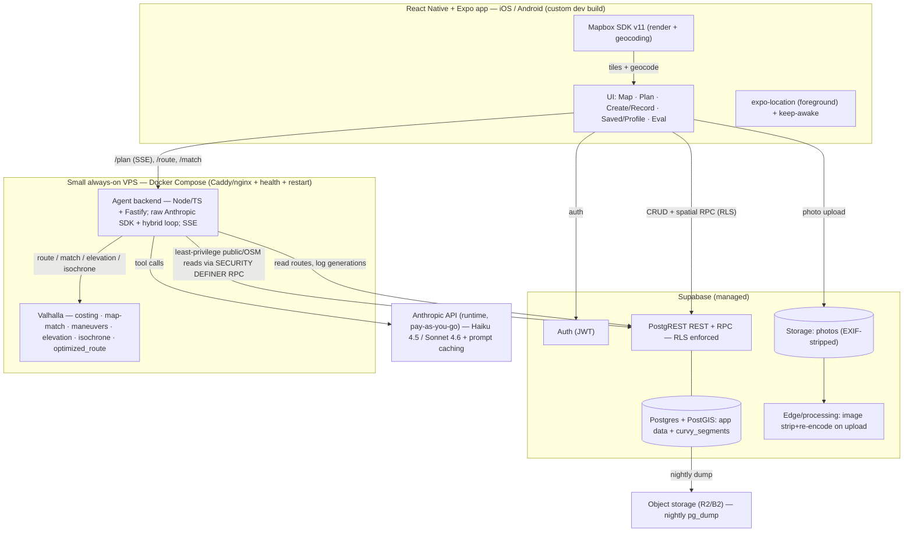
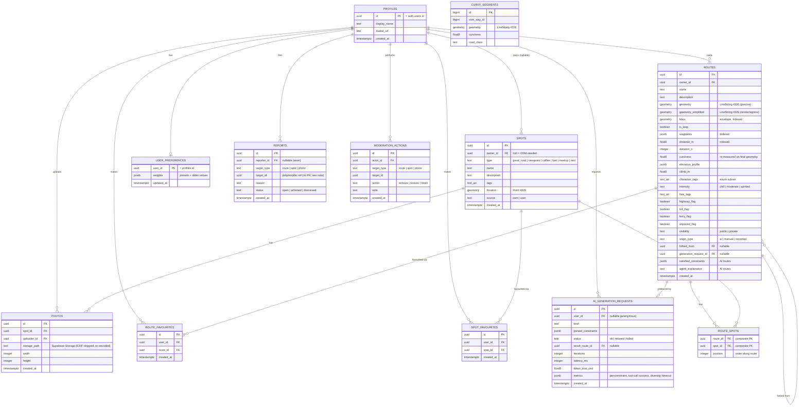

# GoDrive — Master Specification

**Version:** 2.0
**Author:** Angad Khera
**Date:** June 18, 2026
**Status:** Approved for build (supersedes v1.0)
**Build model:** AI-assisted — Claude coding agents implement; human is product owner, reviewer, tester, credential/deployment manager.
**Timeline:** Serious home project, ~4–10 weeks, phased and risk-ordered. **No hard external deadline.**

---

## 0. How to read this document

This is the authoritative implementation contract for **GoDrive**, a native mobile app for driving enthusiasts whose centerpiece is a grounded, tool-using Claude agent that composes real, road-following routes from a plain-English brief. V2 replaces v1.0. It is written so a Claude coding agent (or any engineer) can build the system without re-deriving its design.

**This document is both a product spec and an operating contract for AI coding agents.** §77–§80 define how agents work the backlog; §79 is the work-packet template every implementation task must follow.

Conventions:

- **[KEEP]** marks a decision carried unchanged from v1.0. **[STRENGTHENED]** marks a v1.0 decision made more rigorous. **[REDESIGNED]** marks a materially changed decision. **[NEW]** marks an addition. Where useful, a v1.0 cross-reference is given.
- **Requirements** use testable language. "**MUST**" is a hard requirement; "**SHOULD**" is a strong default; "**MAY**" is optional. Every functional requirement has an ID (`FR-xxx`); non-functional requirements use `NFR-xxx`.
- **Facts vs hypotheses vs tunables.** A *fact* is verified against a primary source (with access date). A *hypothesis* is an implementation belief to be validated by a spike. A *tunable* is a value to be measured-and-set during the build (§92). These are never conflated.
- **Provider/platform assumptions that must be verified before relying on them** are flagged inline and collected in §85.
- **Human-required actions** (credentials, device tests, approvals) are flagged `[HUMAN]` and collected per phase in §81.

The single structural rule: **a live, demoable, grounded route planner exists as early as possible, and everything else is built on top of a thing that already works — without optimizing the whole product around a tiny deadline-protected core.**

---

## Table of contents

1. Executive summary
2. Changes from V1
3. Product vision
4. Product principles
5. Goals
6. Non-goals
7. Success criteria
8. Target users & personas
9. Product positioning
10. Complete feature inventory
11. Feature classification & rationale
12. Functional requirements
13. Non-functional requirements
14. User roles & permissions
15. Screen inventory
16. Navigation architecture
17. Complete user flows
18. Error, loading, empty, offline & degraded states
19. UX & visual-design direction
20. Native mobile requirements
21. Route domain model
22. Car-spot domain model
23. Community & social features
24. Recording & navigation
25. Runtime AI capability map
26. Build-time AI development methodology
27. AI route-planner methodology
28. Constraint model
29. Candidate-generation methodology
30. Route scoring & ranking
31. Curvature methodology
32. Scenicness methodology
33. Route validation & correction
34. Conversational refinement
35. Personalization & preference memory
36. AI grounding & tool design
37. AI security & prompt-injection protection
38. AI cost & latency controls
39. AI evaluation framework
40. AI failure & fallback behaviour
41. System architecture
42. Mobile-client architecture
43. Backend architecture
44. Geospatial architecture
45. Routing-engine architecture
46. Data ingestion & preprocessing
47. Database design
48. Complete Mermaid ER diagram
49. API & RPC inventory
50. Tool schemas
51. Background jobs & scheduled tasks
52. Caching
53. Search & retrieval
54. Authentication & authorization
55. Row-level security
56. Storage & photo handling
57. Security model
58. Privacy model
59. Safety model
60. Moderation model
61. Legal, licensing & attribution
62. Performance targets
63. Reliability & graceful degradation
64. Scalability path
65. Cost model by usage tier
66. Observability
67. Analytics & product metrics
68. Testing strategy
69. Device-testing matrix
70. AI regression testing
71. Security testing
72. App Store & Play Store readiness
73. Environments & deployment
74. CI/CD
75. Backup & recovery
76. AI-assisted repository workflow
77. Coding-agent operating rules
78. Work-packet template
79. Human approval gates
80. Implementation phases
81. Detailed backlog
82. Requirement traceability matrix
83. Technical-spike plan
84. Dependency-verification plan
85. Risk register
86. Definition of done
87. Launch-readiness checklist
88. Final demonstration plan
89. Decision log
90. Assumptions
91. Tunable parameters
92. Deferred & rejected ideas
93. Open questions
94. Glossary

---

## 1. Executive summary

GoDrive is a **native mobile application** (**React Native + Expo + TypeScript**, iOS-primary with Android support, one codebase) for people who drive *for the drive* — who care which road is good, not just which is fastest. Users discover, create, share, record, and navigate scenic and engaging driving routes, plus a community layer of **car spots** (great roads, viewpoints, coffee/food, fuel, meet-ups, rest stops).

The centerpiece — and the engineering story the project exists to tell — is the **AI Route Planner**: a **grounded, hybrid, tool-using agent** that turns a natural-language brief ("90-minute twisty loop near Hamilton, a coffee stop, no highways") into a real, drivable route. **The agent never invents geography.** A deterministic pipeline runs the spatial queries, routing, candidate generation, diversification, scoring, constraint-checking, and loop assembly; a Claude model is invoked only at four bounded decision points (parse the brief into constraints, select among genuinely distinct pre-scored candidate routes, decide a self-correction move, write the explanation). Because every claim is anchored in a tool result over real OpenStreetMap-derived data and a self-hosted routing engine, the output is **verifiable** — which is also what makes the evaluation rigorous and automatable.

V2 promotes three capabilities into the core launch that make GoDrive *demonstrably* an AI product, not a map with a prompt box: **conversational refinement** ("make it longer," "add a viewpoint"), a **reasoning-transparency view** ("how this route was built"), and a **public evaluation page** showing honest, real agent metrics.

The backend is deliberately lean: **Supabase** (Postgres + PostGIS + Auth + Storage + row-level security) handles most CRUD and spatial queries directly from the app; a small **Node/TypeScript service (Fastify)** colocated with a self-hosted **Valhalla** routing engine handles only what needs server-side secrets and logic (the agent, custom routing, GPS map-matching, isochrones). The routing/agent box runs on a **small always-on VPS** (Docker Compose), with hosted Valhalla as an emergency fallback. Maps render via **Mapbox**.

**Cost is bounded and honest.** Runtime LLM inference uses the **pay-as-you-go Anthropic API** (separate from any Claude subscription) and is protected by a **$30/month hard spend cap** with a kill switch. Realistic total operating cost at small scale is **~$10–22/month** on a VPS (not the v1.0 "$10–30 total," which was unachievable with an always-on routing engine on usage-billed Railway).

GoDrive **never** has timing, racing, leaderboards, or speed competition of any kind, and the agent never optimizes for or describes speed. It is a tool for finding good drives, not a street-racing aid.

---

## 2. Changes from V1

This section is the authoritative diff. v1.0 was a sound, detailed spec; V2 preserves its strong core and corrects four critical issues, eleven major ones, and a set of moderate/minor refinements found in adversarial review.

### 2.1 Critical corrections

1. **Build-time vs runtime AI are now explicitly separated, and runtime inference is funded and capped.** [REDESIGNED] v1.0 implicitly assumed runtime inference was free because Claude builds the app. It is not: the runtime planner uses the pay-as-you-go Anthropic API, which is *separate from any Claude.ai/Max subscription* (**fact**, verified 18 Jun 2026: "There is no monthly subscription for the API… separate from the Claude.ai consumer plans… which do not include API access"). V2 adds §25–§26 and §65, a **$30/month hard cap**, and a kill switch.
2. **External-maps navigation hand-off is redesigned to be honest.** [REDESIGNED] Apple Maps' URL scheme supports only a single origin + destination — **no intermediate waypoints** (**fact**, Apple *Map Links* reference). Google Maps' universal URL supports a *capped* waypoint list (**fact**, Google *Maps URLs* docs). A scenic **loop cannot be faithfully driven in an external app**. V2 makes **in-app follow-mode the primary nav experience**; hand-off is best-effort (destination-only or simplified legs). See §24.
3. **The routing/agent host and cost are corrected.** [REDESIGNED] An always-on Valhalla holds tiles in RAM; usage-billed Railway charges idle compute, making the v1.0 "~$5–15/mo" optimistic (**fact**, Railway pricing: $5/$20 minimums + per-GB-RAM/-vCPU usage). V2 defaults to a **small always-on VPS** (Docker Compose) with hosted Valhalla as fallback. See §45, §65, §89.
4. **The "no highways" constraint now has coherent, honest semantics.** [REDESIGNED] Valhalla distinguishes *soft avoidance* from *hard exclusion*, and hard exclusion (`exclude_highways`, requires `allow_hard_exclusions` in config) can yield **no route** (**fact**, Valhalla CHANGELOG/API). v1.0 contradicted itself (hard in §10.5, relaxed in §10.8). V2 defines a three-tier constraint hierarchy where "hard" means *never violated without disclosure*. See §28.

### 2.2 Major corrections

5. **Candidate generation is now a real, AOP-aware procedure with diversification.** [REDESIGNED] Scenic routing is the NP-hard **Arc Orienteering Problem** (**fact**, SIGSPATIAL literature). v1.0's "assemble ordered sets" would produce out-and-back ugliness and near-duplicate candidates. V2 adds isochrone-bounded search, directional-sector circuit construction, and overlap-based deduplication. See §29.
6. **The headline eval metric is no longer circular.** [STRENGTHENED] v1.0 measured constraint satisfaction against the *model's own parse*. V2 uses **human-authored gold constraint labels** and reports both *parse accuracy* and *satisfaction-vs-gold*. See §39.
7. **Scenicness is no longer overclaimed as "computed."** [REDESIGNED] Only *curviness* is genuinely computable; "scenic" becomes a transparent, grounded **heuristic signal** (OSM tags, water/greenery proximity, viewpoint spots), never asserted as objective beauty. See §32.
8. **Likes/favourites schema split for referential integrity.** [REDESIGNED] Polymorphic `(target_type, target_id)` cannot carry a foreign key, so v1.0's promised cascade deletes were not enforceable. V2 uses per-target tables with real FKs. See §47. (Also: **"like" is deferred** to post-MVP — see below.)
9. **A least-privilege planner read path is specified.** [STRENGTHENED] The anonymous planner must read spots/curvy data without exposing private rows; V2 mandates a `SECURITY DEFINER` function over public/OSM data only. See §55.
10. **Record-a-drive is explicitly foreground-only.** [STRENGTHENED] True background location triggers Android store review and doesn't run after iOS app termination (**fact**, Expo Location docs). V2 makes foreground+wake-lock the deliberate design and names exact permission strings. See §24, §72.
11. **The map SDK requires a custom dev build from day one.** [STRENGTHENED] `@rnmapbox/maps` "cannot be used in the Expo Go app" (**fact**, rnmapbox docs); current SDK v11. EAS Update OTA is scoped to JS-only changes. See §20.
12. **A moderation + image-safety floor ships in the MVP.** [NEW] UGC (photos especially) ships before the store; V2 pulls a **report→remove** path and **server-side EXIF-strip + re-encode on upload** into the MVP. See §56, §60.
13. **Backups become a real job with a restore drill.** [STRENGTHENED] The Supabase free tier has no managed backups (**fact**). V2 specifies a nightly `pg_dump`→object-storage job and a quarterly restore drill. See §75.
14. **Latency controls are specified.** [STRENGTHENED] V2 adds a per-generation wall-clock budget, parallel candidate routing, and warm tiles; reports p50/p90/p99 + timeout rate. See §38.
15. **UX is upgraded from a screen inventory to flows + states + a shared route-detail component.** [STRENGTHENED] See §15–§18.

### 2.3 Scope changes (confirmed by product owner, 18 Jun 2026)

- **Promoted into MVP core:** conversational refinement; reasoning-transparency view; public eval page; AI auto-title/summary/tags; user-adjustable scoring weights (presets + advanced sliders). [REDESIGNED from v1.0 "nice-app/post-MVP"]
- **Deferred to post-MVP:** **likes** (favourite/fork/save/share cover the need); multimodal spot-assist; AI duplicate-spot detection (a simple proximity nudge ships instead); GPX I/O; freehand-draw; offline caching; ratings/reviews; following/feed; collections; comments; region expansion; fly-along animation. [KEEP/REDESIGNED]
- **Region** confirmed (Western Golden Horseshoe / Niagara corridor) but is now a **replaceable `.poly`/GeoJSON** driven by `REGION_ID` + `REGION_POLY_PATH`. [STRENGTHENED]

### 2.4 Unchanged from V1 (preserved as sound)

Grounded-hybrid agent + the *LLM-emits-no-geography* invariant; the deterministic/LLM responsibility split; "compose, don't log" positioning; map-first IA; manual route creation (click→snap); record-a-drive concept; route detail; car spots + OSM seeding; save/fork/favourite/share; lightweight profiles; public/private + sharing; browse + trigram search; anonymous browse+plan with auth-gated contribution; the safe-driving pillar; Supabase + RLS for most CRUD; the self-hosted-Valhalla approach; Fastify; curvy-via-waypoint-selection; the eval-as-CI-gate idea; no fine-tuning; the decision log as portfolio material.

---

## 3. Product vision

GoDrive is a **map-based, community-driven driving-route app with a grounded AI planner at its core**, defined by four pillars [KEEP from v1.0 §2]:

1. **Compose, don't just log.** Unlike incumbents that record, import, or manually draw routes, GoDrive *generates* a route from intent by reasoning over real geospatial data: precomputed road curvature, elevation, routing geometry, scenic signals, and the community's pinned spots.
2. **Grounded intelligence.** The LLM orchestrates read-only tools and reasons over their numeric results; it cannot return a road that is not in the underlying data. Grounding is simultaneously the quality story and the security story (§37).
3. **A human knowledge layer.** Community car spots — bootstrapped from OpenStreetMap and enriched by users with photos, notes, and tags — give the agent real, locally-meaningful places to route through and give the map life.
4. **Safety as a first-class constraint.** GoDrive never has timing, racing, leaderboards, or speed competition of any kind, and the agent never optimizes for, describes, or internally represents speed. It is a tool for finding good drives.

The vision for V2 adds a fifth, cross-cutting commitment: **the AI must be visible, measurable, and honest.** Users see *how* a route was built (reasoning view), can *converse* to refine it (conversational refinement), and can inspect the planner's *real performance* (public eval page). Claims the system cannot substantiate — "this route is scenic," "the system learns your taste" — are never made.

---

## 4. Product principles

These principles resolve trade-offs throughout the build. When two principles conflict, the earlier one wins.

1. **Honesty over impressiveness.** Never claim a capability the system doesn't have (no faithful loop hand-off; no objective scenicness; no learning without learning). A smaller true claim beats a larger false one.
2. **Safety is non-negotiable and permanent.** No speed/timing/racing, ever. Public roads only. This principle cannot be relaxed by any later decision.
3. **Grounded by construction.** The LLM emits no geography and triggers no side effects directly. Every user-facing factual claim traces to a tool result or computed value.
4. **Bounded cost by design.** Runtime AI spend is hard-capped; degradation is graceful and pre-defined, never a surprise bill or a broken demo.
5. **Lean where it doesn't matter, deep where it does.** Depth budget goes to the planner, the curvature/scenic pipeline, and the eval harness. Everything else stays conventional.
6. **One coherent product, not a bag of demos.** Every screen and AI feature reinforces a single premium driving app (§19, §16).
7. **Reproducible and revertible.** Data pipelines are reproducible scripts; migrations are reversible; deploys roll back; the spec is the source of truth and is updated when reality teaches us something (§26, §76).
8. **Privacy by default.** Recorded drives private by default; image metadata stripped; precise location never leaked in URLs; least-privilege data access.

---

## 5. Goals

- **G1 — A live, demoable, grounded planner** reachable without a login wall, producing real constraint-satisfying routes end-to-end on the seeded region, with steps visibly streaming.
- **G2 — A polished, cohesive native app** (iOS-primary, Android-supported) that feels like one premium driving product.
- **G3 — A convincing, *defensible* AI product story**: visible reasoning, conversational refinement, and **published, honest** agent metrics.
- **G4 — Measured agent quality** (§39): parse accuracy, constraint-satisfaction-vs-gold, self-correction efficacy, valid-route rate, candidate diversity, latency (p50/p90/p99 + timeout rate), and cost per generation.
- **G5 — Low, bounded operating cost** at small scale (target ~$10–22/mo on a VPS) with a hard runtime-AI cap and a credible scaling path.
- **G6 — A memorable portfolio demonstration**: a 60–90s hero video, a clickable live build, a README with architecture + decision log, and the public eval page.
- **G7 — App/Play Store readiness** as an explicit, achievable phase (moderation, privacy labels, account deletion, policies).

Success is **not** measured by engagement (DAU/retention/conversion are explicitly not tracked — §67). [KEEP from v1.0 §3.2]

---

## 6. Non-goals (permanent unless explicitly revisited)

- **No timing, racing, leaderboards, lap times, "fastest route," or speed competition of any kind.** The agent never optimizes for, describes, or internally maps any quality to speed. (Hard safety pillar, §59.) [KEEP + STRENGTHENED: the internal-mapping clause is new]
- **No full turn-by-turn Waze/Google-Maps replacement** — in-app follow-mode + maneuver hints + best-effort hand-off instead. [REDESIGNED wording per §24]
- **No real-time traffic.**
- **No live location sharing, convoy, or multiplayer.**
- **No general-purpose maps app.**
- **No consumer monetization, ads, or in-app purchases.** Operating cost is borne by the owner and bounded by the spend cap (§65). [STRENGTHENED: clarifies who pays]
- **No vanity engagement metrics.**
- **No LLM fine-tuning** — the agent uses a grounded base model with prompting and tools (§89). [KEEP]
- **No claim that the system "learns" the user.** Preferences are explicit and user-set; no personalized ML in V2 (§35). [NEW]

---

## 7. Success criteria

A criterion is met only if it is demonstrable and, where applicable, measured.

| ID | Criterion | How verified |
|---|---|---|
| SC-1 | Anonymous user lands on a seeded map and runs the planner with no sign-in; steps stream; a real, constraint-satisfying route appears with a constraints panel + honest explanation. | Production smoke test + demo video |
| SC-2 | Hard constraints are never silently violated; when relaxed, the panel and explanation say so. | Eval harness (§39) + manual probes |
| SC-3 | Published agent metrics on the public eval page are derived from real logged generations. | Eval page reads `ai_generation_requests`; spot-checked |
| SC-4 | Parse accuracy ≥ target and constraint-satisfaction-vs-gold ≥ target on the eval set (targets in §91). | CI eval gate |
| SC-5 | Candidate diversity: generated alternatives differ by ≥ overlap threshold; loops avoid out-and-back. | Eval diversity metric (§39) |
| SC-6 | Conversational refinement updates a route consistently with both the original brief and the new instruction; hard constraints persist. | E2E + eval refinement cases |
| SC-7 | Route generation median < 15 s, p90 < 25 s, timeout rate < target. | Logged latency metrics |
| SC-8 | Runtime AI monthly spend never exceeds the $30 hard cap; degradation is graceful. | Spend monitor + kill-switch test |
| SC-9 | Manual create, record-a-drive, save/fork/favourite/share, profiles, browse/search all work on a real iPhone and Android device. | Device matrix (§69) + E2E |
| SC-10 | A reported route/spot/photo can be removed; uploaded images have EXIF/GPS stripped. | Moderation + storage tests (§60, §56) |
| SC-11 | Account + data deletion removes the user's routes and spots; forks others made survive. | Integration test |
| SC-12 | App is store-submittable: privacy labels, policies, account deletion, moderation present. | Launch-readiness checklist (§87) |

---

## 8. Target users & personas

Two personas, intentionally lean. [KEEP from v1.0 §4]

### 8.1 Primary — the driving enthusiast
Drives for enjoyment; cares about road character (twisty, scenic, flowing, backroad) over speed or efficiency. **Both consumes and contributes**: plans and discovers routes, records drives, pins/enriches car spots, refines routes conversationally, and may tune scoring weights. Exercises every feature surface. The content model, tone, and feature priorities are built for this user.

### 8.2 Secondary — the evaluator
A recruiter or engineer following the live link or watching the demo. Their use case is the **~30-second hero flow**: land → see a working map with seeded content → type a brief → watch the agent's steps stream → get a real route with a "constraints satisfied" explanation → (optionally) open the reasoning view or the public eval page. Designing explicitly for this persona is legitimate for a portfolio piece and drives two hard requirements: **no login wall to run the planner**, and **no empty states** (seeded data present from day one).

### 8.3 Anonymous vs authenticated boundary [KEEP from v1.0 §4.3]
- **Anonymous users MAY:** browse the map, view routes and spots, **run the AI planner and refine conversationally, see results, and view the reasoning view and public eval page.**
- **Authentication gates:** saving, forking, favouriting, sharing-as-owner, and contributing (creating routes/spots, uploading photos, recording drives to one's profile), and adjusting/storing preference weights.
- The open planner endpoint is protected by **rate limiting + the global spend cap**, not a login wall (§38, §57).

---

## 9. Product positioning

**The fresh angle** [KEEP from v1.0 §5]: incumbents (route-logging and motorcycle/scenic-route apps) let users *record, import, or manually draw* routes. None take a natural-language brief and *compose* a route by reasoning over real road-curvature data, scenic signals, routing, and a community knowledge layer — grounded so it cannot hallucinate roads, **visible** so the user sees how it reasoned, and **measured** so the quality is provable.

**Why it's credible engineering, not a demo trick:** the model's creativity is bounded by real data. It cannot return a road not in OpenStreetMap (geometry comes from the routing engine); it cannot call a road "twisty" arbitrarily (curviness is computed and re-measured on the final geometry); it cannot invent a coffee stop (stops come from the real spots table). To "how do you stop it hallucinating?", the answer is structural, not hopeful (§36). To "how do you know it's any good?", the answer is the public eval page (§39).

**Supporting value:** first-class manual route creation (click→snap), GPS drive recording (record→map-match), a lightweight sharing community, in-app follow-mode navigation with best-effort hand-off, and AI assists that make the product feel intelligent end-to-end (auto-titles, summaries, conversational refinement).

---

## 10. Complete feature inventory

Grouped; each item carries its class (full rationale in §11) and primary requirement IDs (§12). **MVP** = core launch; **Post** = deferred.

### 10.1 Map & discovery
- Interactive vector map home (seeded routes + clustered spots) — **MVP** — FR-010..014
- Browse + search/filter (area/bbox, length, character, tags, name trigram) — **MVP** — FR-100..104
- Route detail (shared component) — **MVP** — FR-070..074
- Spot detail — **MVP** — FR-030..033

### 10.2 The AI planner & AI features
- AI route planner (one-shot, streamed, constraints panel, honest explanation) — **MVP** — FR-040..049
- Conversational refinement (inline on result/detail) — **MVP** [promoted] — FR-160..164
- Reasoning-transparency view ("how this route was built") — **MVP** [promoted] — FR-130..132
- Public eval page (real metrics) — **MVP** [promoted] — FR-150..152
- AI auto-title / route summary / suggested tags — **MVP** [promoted] — FR-250..253
- Route comparison + "why this route?" explanation — **MVP** — FR-254..255
- User-adjustable scoring weights (presets + advanced sliders) — **MVP** [promoted] — FR-350..354
- Multimodal spot-creation assist (photo→type/title/desc/tags) — **Post**
- AI duplicate-spot detection — **Post** (proximity nudge ships instead)
- Semantic route/spot search (pgvector) — **Post**
- Context-aware suggestions (weather/time/season) — **Post / experimental**
- AI-generated eval/demo report — **Post / optional**

### 10.3 Creation, recording, navigation
- Manual route creation (click-waypoints → snap) — **MVP** — FR-050..053
- Record-a-drive (foreground GPS → map-match) — **MVP** — FR-060..063
- Follow-mode navigation + maneuver hints — **MVP** [primary nav] — FR-110..114
- Best-effort external hand-off (destination/legs/decimated) — **MVP** [redesigned] — FR-115..117
- Freehand draw + map-match — **Post**
- GPX import/export — **Post**
- Offline map caching — **Post**

### 10.4 Community & identity
- Car spots (drop pin/type/name/tags/photo; OSM-seeded display-only) — **MVP** — FR-030..036
- Save / fork / favourite / share — **MVP** — FR-080..086
- Likes — **Post** [deferred]
- Lightweight profiles; public/private visibility — **MVP** — FR-090..093
- Report → remove moderation floor — **MVP** [new] — FR-300..304
- Server-side image processing (EXIF strip + re-encode) — **MVP** [new] — FR-056? (storage; FR-310..312)
- Ratings/reviews, following/feed, collections, comments — **Post**

### 10.5 Cross-cutting
- Auth (anonymous browse+plan; auth-gated contribute) — **MVP** — FR-200..205
- Minimal onboarding (skippable) — **MVP** — FR-206
- Account + data deletion — **MVP** — FR-207
- Persistent safe-driving disclaimers; OSM + Mapbox attribution — **MVP** — FR-400..402
- Cost guard (rate limit + $30 hard cap + kill switch) — **MVP** [strengthened] — FR-260..264
- AI evaluation harness (+ CI gate) — **MVP** [strengthened] — FR-500..506
- Backups job + restore drill — **MVP** [new] — NFR-backup

---

## 11. Feature classification & rationale

Classes: **Keep / Strengthen / Redesign / Add / Optional / Experimental / Defer / Reject.** Only concrete reasons justify defer/reject.

| Feature | Class | Rationale |
|---|---|---|
| Interactive map home | Keep | Sound; requires dev build (§20). |
| Browse + search/filter | Keep | Trigram + PostGIS is cheap and deterministic; no AI forced here. |
| Route detail (shared component) | Strengthen | Reused by Result, saved routes, shared links (cohesion, §16). |
| AI planner (grounded hybrid) | Strengthen | Core preserved; candidate-gen/latency/constraints/eval strengthened (§27–§39). |
| Conversational refinement | **Promote→MVP** | The single biggest hero amplifier; feasible under AI-assisted build; *the* proof of an AI product. |
| Reasoning-transparency view | **Promote→MVP** | Cheap (data already logged); makes grounding visible; strong portfolio signal. |
| Public eval page | **Promote→MVP** | Turns "I evaluate rigorously" into clickable proof; especially strong for interviews. |
| Auto-title/summary/tags | **Promote→MVP** | Cheap (Haiku), visible everywhere, makes AI feel integrated; user edits before save. |
| Route comparison / "why this route?" | Add→MVP | Reinforces grounding; derived from tool facts only. |
| User-adjustable scoring weights | **Promote→MVP** | Great product feature + ties directly to the scoring story; no learning claimed. |
| Manual create (click→snap) | Keep | Valhalla `/route` confirmed capable (§45). |
| Record-a-drive (foreground) | Strengthen | Foreground-only made explicit; permission strings; EXIF strip (§24, §56). |
| Follow-mode nav | Strengthen→primary | Becomes the primary nav surface (hand-off can't carry loops, §24). |
| External hand-off | Redesign | Best-effort: destination / decimated / leg-by-leg (§24). |
| Car spots + OSM seed + photos | Strengthen | Add report + EXIF-strip floor (§56, §60). |
| Save / fork / favourite / share | Keep | Split like/favourite tables for integrity (§47). |
| Likes | **Defer** | Favourite/fork/save/share cover user value; likes add counting + abuse/spam + moderation surface + UI noise without core benefit. |
| Profiles + visibility | Keep | — |
| Report→remove moderation floor | **Add→MVP** | UGC ships before store; a live window with no takedown path is unacceptable. |
| Image processing (EXIF strip + re-encode) | **Add→MVP** | Privacy (GPS leakage) + safety (malicious payloads). |
| Auth (anon plan; gated contribute) | Keep | Lock down planner read path (§55). |
| Cost guard ($30 cap + kill switch) | Strengthen | Build/runtime split + kill switch (§38, §65). |
| Eval harness + CI gate | Strengthen | Gold labels, parse accuracy, diversity, timeout rate (§39). |
| Region (corridor) | Strengthen | Configurable `.poly`; volume-gated spike (§46, §83). |
| Multimodal spot-assist | **Defer** | Camera/photo permissions, image cost, content-safety surface; fast-follow. |
| AI duplicate-spot detection | **Defer** | Proximity nudge suffices for MVP. |
| Semantic search (pgvector) | **Defer** | Good story, not core; post-MVP. |
| Weather/time/season suggestions | **Experimental** | External weather API dependency + cost. |
| Voice planning | **Experimental** | Adds surface; post-MVP. |
| Region expansion (all S. Ontario) | **Defer** | Data volume/egress; re-run pipeline later. |
| Offline caching | **Defer** | Mapbox offline packs fiddly; value low at this scale. |
| Ratings/reviews, following/feed, collections, comments | **Defer** | Moderation + social surface cost. |
| Route versioning | **Defer** | Schema accommodates; not needed yet. |
| Fly-along animation | **Optional/Experimental** | Pure polish; simple reveal suffices. |
| GPX I/O, freehand-draw | **Defer** | Cheap with AI but post-MVP unless time. |
| LLM fine-tuning | **Reject** | Base model + tools suffices; would signal misjudgment (§89). |
| Learned personalization | **Reject (V2)** | Needs data maturity + care; explicit weights instead (§35). |

---

## 12. Functional requirements

Testable, ID'd. Acceptance criteria are in the feature sections they reference (§21–§40) and the traceability matrix (§82). "MVP" unless noted.

### 12.1 Map & discovery
- **FR-010** The map MUST render on first launch (anonymous, no history) with seeded routes (amber polylines) and clustered spot pins — no empty state.
- **FR-011** The map MUST use the custom dark-terrain style centered on the region on first load.
- **FR-012** Spot pins MUST cluster at low zoom and resolve to type-iconed pins on zoom-in.
- **FR-013** Tapping a route MUST open route detail; tapping a spot MUST open spot detail.
- **FR-014** OSM ("© OpenStreetMap contributors") and Mapbox attribution MUST be visible and legible at all times.
- **FR-100** Browse MUST support pagination and spatial filtering (bbox/radius) via Supabase RPC.
- **FR-101** Filters MUST include area (map-viewport bbox), length range, character tags, and free tags.
- **FR-102** Text search on route/spot name MUST match partial names via a trigram index.
- **FR-103** Filtered/spatial queries MUST return within the latency target (§62) on seeded data.
- **FR-104** "Area" MUST be defined as the current map viewport bbox unless an explicit named region is selected.

### 12.2 Route detail
- **FR-070** Route detail MUST show the route on the map, curviness, distance, estimated drive time, elevation profile + climb, and car spots along the route.
- **FR-071** Route detail MUST offer actions: save/fork/favourite (auth-gated), share, and navigate (§24).
- **FR-072** For AI routes, route detail MUST surface the constraints panel and the reasoning-transparency view (§25).
- **FR-073** Spots within a proximity threshold of the route geometry MUST be listed as "along this route."
- **FR-074** The same route-detail component MUST render Result, saved routes, and shared-link routes (cohesion).

### 12.3 The AI planner (see §27–§40 for methodology + acceptance)
- **FR-040** The Plan screen MUST accept a free-text brief, an origin (current location, map pick, or geocoded place name), and a shape (loop or A→B + destination).
- **FR-041** On submit, the agent MUST stream its steps to the UI over SSE.
- **FR-042** The result MUST render a drivable route + a constraints panel reflecting the agent's *actual* satisfied/relaxed constraints (never fabricated) + a short honest explanation.
- **FR-043** Anonymous users MUST be able to run the planner and refine conversationally; saving MUST prompt for auth.
- **FR-044** Hard constraints MUST never be silently violated; relaxed soft (or hard-relaxed) constraints MUST be disclosed (§28).
- **FR-045** The agent MUST never invent a stop, road, or geometry; stops come from `find_spots`, geometry from the router (§36).
- **FR-046** Origin and destination MUST fall within the seeded region `.poly`; otherwise a friendly out-of-region message is shown (§18).
- **FR-047** Failures MUST degrade gracefully (best-effort + note → friendly redirect → "temporarily unavailable") — never a raw error or fake/broken route (§40).
- **FR-048** The generation MUST respect a wall-clock budget; on timeout it returns best-so-far with an honest note (§38).
- **FR-049** Each generation MUST be logged to `ai_generation_requests` with parsed constraints, status, iterations, latency, token cost, and per-constraint metrics.

### 12.4 Creation & recording
- **FR-050** Manual create MUST snap tapped waypoints to roads via `/route` (Valhalla) using the costing profile, returning geometry + distance + duration + maneuvers.
- **FR-051** Adding/removing/reordering waypoints MUST update the snapped geometry and readouts within the snap-latency target (§62).
- **FR-052** A manual route MUST save with `origin_type='manual'` and all metadata intact.
- **FR-053** Manual builder MUST let the user set name, description, character tags, intensity, free tags, visibility, and featured spots.
- **FR-060** Record-a-drive MUST capture a GPS trace in the **foreground with a screen wake-lock** (phone mounted); it MUST NOT require background-location permission.
- **FR-061** On stop, the raw trace MUST be map-matched via `/match` (Valhalla) to clean road-snapped geometry for review.
- **FR-062** A recorded route MUST save with `origin_type='recorded'` and `visibility='private'` by default.
- **FR-063** If the app is backgrounded mid-recording, recording pauses/degrades gracefully and the user is informed; no data corruption.

### 12.5 Navigation
- **FR-110** Follow-mode MUST show the route polyline with the live GPS position tracking along it and remaining distance.
- **FR-111** Follow-mode MUST show next-maneuver hints derived from Valhalla maneuvers.
- **FR-112** Follow-mode is the **primary** in-app driving experience for the generated shape.
- **FR-113** Follow-mode MUST keep the screen awake while active.
- **FR-114** Follow-mode MUST show a persistent safe-driving disclaimer.
- **FR-115** External hand-off MUST be best-effort: for A→B, hand off origin→destination with a disclaimer that the external app may choose its own roads.
- **FR-116** For loops, hand-off MUST offer **leg-by-leg to the next waypoint/spot** (works in Apple + Google) or a **decimated waypoint set** for Google only, never claiming a faithful loop in Apple Maps.
- **FR-117** Before presenting a Google-Maps URL, the app MUST verify the waypoint count and URL length are within platform limits (§24).

### 12.6 Community & identity
- **FR-030** Car spots MUST support types: great_road, viewpoint, coffee, fuel, meetup, rest.
- **FR-031** A spot MUST require pin + type + name; description, tags, photo(s) optional.
- **FR-032** OSM-seeded spots MUST be stored `source='osm'`, `owner_id=null`, and be display-only in MVP.
- **FR-033** A proximity nudge MUST warn (not block) when a very close spot of the same type already exists.
- **FR-034** Creators MUST be able to edit their own spots; OSM spots are not user-editable in MVP.
- **FR-035** Spot photos MUST be uploaded to Supabase Storage.
- **FR-036** All uploaded images MUST be processed server-side to strip EXIF/GPS and re-encode before becoming retrievable (§56).
- **FR-080** Save MUST persist a created/generated route to the user's profile.
- **FR-081** Fork MUST create an editable owned copy (`forked_from` set); editing the fork MUST never mutate the original.
- **FR-082** Favourite MUST bookmark a route or spot with no copy; idempotent per user/target.
- **FR-083** Share MUST produce a shareable link/preview to a route (no precise private location leaked, §58).
- **FR-084** Save/fork/favourite/share MUST require auth (except viewing a shared link).
- **FR-085** Deleting a route MUST cascade its photos, favourites, and route_spots; forks others made survive (§47).
- **FR-086** Likes are **out of scope for MVP** (deferred).
- **FR-090** A profile MUST be 1:1 with the auth user and hold display name + avatar.
- **FR-091** A profile MUST show the user's routes (public + own-private), spots, favourites, and forks.
- **FR-092** Other users MUST see only a profile's public content.
- **FR-093** Visibility MUST be public or private; private content readable only by its owner (§55).
- **FR-300** Any route, spot, or photo MUST be reportable (writes to `reports`).
- **FR-301** A reported item MUST be removable by an admin (admin = console/SQL action acceptable in MVP) and by the owner.
- **FR-302** A removal MUST record a `moderation_action`.
- **FR-303** Recorded drives MUST default to private (reduces exposure).
- **FR-304** A contact/abuse path MUST be provided.
- **FR-310** Image processing MUST reject files exceeding size/type bounds.
- **FR-311** Image processing MUST strip all metadata and re-encode to a safe format.
- **FR-312** Stored images MUST be served via signed URLs / CDN thumbnails (§56).

### 12.7 Cross-cutting
- **FR-200** Auth MUST use Supabase Auth; anonymous users browse + plan; auth gates contribute/save/favourite/fork/share.
- **FR-201** Sign-in MUST be requested only at the first gated action.
- **FR-202** Secrets MUST be server-side only (§57); the app holds only the Supabase anon key + Mapbox public token.
- **FR-203** The backend MUST verify Supabase JWTs.
- **FR-204** Anonymous `/plan` calls MUST be rate-limited (per-IP + per-session).
- **FR-205** Inputs MUST be bounded: brief length, waypoint count, coordinates within `.poly`, request timeout (§91).
- **FR-206** Onboarding MUST be minimal and skippable; it MUST NOT block the evaluator from reaching the map/planner.
- **FR-207** A "delete my account + data" path MUST exist and remove the user's routes + spots (forks others made survive).
- **FR-250** The system MUST offer an AI-suggested title for a generated/created route (user-editable before save).
- **FR-251** The system MUST offer an AI route summary (1–2 sentences, derived from route facts).
- **FR-252** The system MUST offer AI-suggested character/free tags (user confirms).
- **FR-253** AI title/summary/tags MUST be derived only from grounded route facts; no invented places.
- **FR-254** The system MUST support comparing two routes (e.g., original vs refined) on key attributes.
- **FR-255** The system MUST produce a "why this route?" explanation grounded in tool results.
- **FR-260** A global daily/monthly runtime-AI spend cap MUST be enforced ($30/mo hard; $20 soft warning; $40 manual override for testing — §65).
- **FR-261** When the cap is hit, the planner MUST degrade gracefully (anon planner disabled/limited; logged-in users get reduced quota; auto-title/summary switches to cheaper model or async) while browsing/saved/manual/record keep working.
- **FR-262** A kill switch MUST be able to disable runtime AI immediately, showing an admin banner.
- **FR-263** Per-generation cost MUST be recorded.
- **FR-264** Tool results SHOULD be cached within a planning session.
- **FR-350** Scoring MUST default to fixed presets (Scenic / Twisty / Chill / Backroads / Coffee stop / Avoid highways).
- **FR-351** An advanced mode MUST expose sliders: curviness, scenic/viewpoint proximity, road-class preference, elevation variation, stop importance, duration strictness, overlap avoidance.
- **FR-352** Preference weights MUST be stored per user (when authenticated); the system MUST NOT claim it "learns."
- **FR-353** Weight changes MUST measurably affect candidate scoring (§30).
- **FR-354** Defaults MUST produce good routes with zero tuning.
- **FR-400** A persistent safe-driving disclaimer MUST appear on follow-mode/navigation and on generated routes.
- **FR-401** The app MUST never present timing, racing, speed, or "fastest" framing anywhere.
- **FR-402** OSM + Mapbox attributions MUST be present per §61.
- **FR-500** The eval harness MUST run the agent over a curated brief set with human gold constraint labels.
- **FR-501** The harness MUST report parse accuracy and constraint-satisfaction-vs-gold (§39).
- **FR-502** The harness MUST report self-correction efficacy, valid-drivable-route rate, candidate diversity, latency (p50/p90/p99 + timeout rate), and cost/gen.
- **FR-503** The harness MUST include adversarial/prompt-injection briefs as a regression guard.
- **FR-504** The eval set MUST run as a CI gate; a regression below thresholds fails the build.
- **FR-505** The public eval page MUST display headline metrics from real logged generations.
- **FR-506** Subjective drivability MUST be sampled via a small human spot-check, never fabricated.

---

## 13. Non-functional requirements

- **NFR-perf** Performance targets per §62 (map 60fps; cold start ~2s; generation p50<15s/p90<25s; snap 1–2s; spatial RPC <1s; CRUD <300ms).
- **NFR-reliability** Graceful degradation per §63: planner/Valhalla/Mapbox/Supabase failures each have a defined fallback; never a raw error.
- **NFR-cost** Total small-scale operating cost ~$10–22/mo (VPS); runtime AI hard-capped at $30/mo (§65).
- **NFR-scale** Architecture economical at ≤500 MAU without a rewrite path to 5,000+ (§64).
- **NFR-security** Secrets server-side; least-privilege data access; RLS enforced; prompt-injection contained (§57, §37).
- **NFR-privacy** Recorded drives private by default; EXIF stripped; no precise location in URLs; least-privilege (§58).
- **NFR-a11y** Baseline accessibility (labels, contrast, dynamic type) + a manual VoiceOver/TalkBack pass on key screens.
- **NFR-i18n** English-only at launch; copy externalized to ease later localization (low priority).
- **NFR-backup** Nightly `pg_dump`→object storage, 30-day retention; quarterly restore drill; RPO ≤24h, RTO ≤4h for UGC (§75).
- **NFR-observability** Sentry on app + backend; structured agent logs; health checks; spend + Mapbox + error alerts (§66).
- **NFR-maintainability** TypeScript end-to-end with shared types; conventional, documented code; reversible migrations; reproducible data pipelines.
- **NFR-portability** Region is config-driven (`REGION_ID`, `REGION_POLY_PATH`); routing host is replaceable (VPS↔hosted Valhalla).
- **NFR-store** App/Play Store submittable (§72).

---

## 14. User roles & permissions

| Role | Browse map / view public | Run planner + refine | Save/fork/favourite/share | Create routes/spots, upload photos, record | Edit own content | Report content | Remove content / moderate | Adjust + store weights |
|---|---|---|---|---|---|---|---|---|
| Anonymous | ✅ | ✅ | ❌ (prompt auth) | ❌ | ❌ | ✅ (anon report allowed) | ❌ | Adjust in-session only; not stored |
| Authenticated user | ✅ | ✅ | ✅ | ✅ | ✅ (own only) | ✅ | Own content only | ✅ (stored) |
| Admin (owner) | ✅ | ✅ | ✅ | ✅ | ✅ | ✅ | ✅ (any content; via console/SQL acceptable in MVP, UI post-MVP) | ✅ |

Enforcement: RLS (§55) for data; backend JWT verification (§54) for the agent/routing endpoints; service-role surface restricted to public/OSM reads on the planner path (§55).

---

## 15. Screen inventory

Each screen lists its purpose and required states (states defined in §18). The **route-detail component is shared** across Result, saved routes, and shared links (FR-074).

- **Map home** — primary surface; seeded content; states: loading, loaded, offline, location-permission-denied.
- **Route detail (shared)** — map + curviness + distance + time + elevation + spots-along + actions; AI sections (constraints panel, reasoning view, refine affordance, "why this route?") render conditionally for AI routes.
- **Spot detail** — type, name, description, tags, photos; report action.
- **Search / filter** — area/bbox, length, character, tags, name.
- **Plan** — brief input + origin selector + loop/destination shape choice + preset chips + (advanced) sliders.
- **Generation-progress** — streamed agent steps (showpiece); states: streaming, success, relaxed-with-note, redirect, unavailable, timeout.
- **Result** — = route detail with constraints panel + explanation + inline refine + save; appears after generation.
- **Create-choice** — pick manual builder or record-a-drive.
- **Manual builder** — click-waypoints → snap → metadata → save.
- **Record-a-drive** — foreground GPS capture (wake-lock) → review (map-matched) → metadata → save.
- **Add-spot** — pin → type → name/description/tags/photo (proximity nudge).
- **Profile** — user's routes, spots, favourites, forks.
- **Saved** — saved/favourited routes and spots.
- **Auth** — sign-in/up, invoked at first gated action.
- **Onboarding** — minimal, skippable.
- **Follow-mode / navigation** — route + live position + maneuver hint + safe-driving disclaimer + hand-off action.
- **Public eval page** — honest headline agent metrics + short methodology note.
- **Settings** — preference weights (presets + advanced), account (incl. delete), attributions, disclaimers.

---

## 16. Navigation architecture

**Bottom-tab navigation: Map · Plan · Create/Record · Saved/Profile.** [KEEP from v1.0 §15.4]

```mermaid
flowchart TD
    subgraph Tabs
      MAP[Map] 
      PLAN[Plan]
      CREATE[Create/Record]
      SAVED[Saved/Profile]
    end
    MAP -->|tap route| RD[Route detail (shared)]
    MAP -->|tap spot| SD[Spot detail]
    MAP -->|search| SF[Search/Filter] --> RD
    PLAN -->|submit brief| GP[Generation-progress] --> RES[Result = Route detail + constraints + refine]
    RES -->|inline refine| GP
    RES -->|save (auth)| RD
    RES -->|navigate| NAV[Follow-mode] 
    RES -->|why / reasoning| RV[Reasoning view (in RD)]
    CREATE --> CC[Create-choice]
    CC --> MB[Manual builder] --> RD
    CC --> REC[Record-a-drive] --> RD
    MAP -->|add spot| AS[Add-spot] --> SD
    SAVED --> PROF[Profile]
    SAVED --> RD
    RD -->|navigate| NAV
    RD -->|share| SHARE[(Share link)]
    PROF --> SET[Settings]
    SET --> EVAL[Public eval page]
    AUTH[[Auth]] -. invoked at first gated action .-> RES
```

**Cohesion rules:** (1) generated routes and saved routes use the *same* detail component; (2) conversational refinement is an **inline affordance on Result/Detail**, not a separate screen; (3) the reasoning view and constraints panel are conditional sections within route detail, not bolt-on screens; (4) the public eval page is reachable from Settings and from a deep link for the demo.

---

## 17. Complete user flows

### 17.1 Hero flow (evaluator + enthusiast)
1. Land on **Map home** (seeded content visible; no login).
2. Tap **Plan**; enter brief ("90-min twisty loop near Hamilton, a coffee stop, no highways"); pick origin; choose **loop**; optionally tap presets or open advanced sliders.
3. Submit → **Generation-progress** streams steps (parse → scope → retrieve → generate candidates → diversify → route → score → select → validate → self-correct → enrich → explain).
4. **Result** renders the route + constraints panel ("90 min ✓ · no highways ✓ · 1 coffee stop ✓ · ~6 km twisty") + honest explanation.
5. **Refine inline:** "make it longer" / "add a viewpoint" / "less highway" → re-runs the loop with merged constraints; route updates in place; **compare** original vs refined.
6. Open **reasoning view** ("how this route was built").
7. **Save** (prompts auth) → route persists with AI metadata; AI suggests a **title/summary/tags** (user edits).
8. **Navigate** → follow-mode (primary) with maneuver hints + disclaimer; optional best-effort hand-off.
9. (Optional) Open the **public eval page** to see real metrics.

### 17.2 Manual create
Create/Record → Manual builder → tap waypoints (each snaps via `/route`) → set metadata → save (`origin_type='manual'`).

### 17.3 Record-a-drive
Create/Record → Record-a-drive → grant foreground location → drive (wake-lock; mounted) → stop → `/match` → review snapped route → metadata → save (`origin_type='recorded'`, private).

### 17.4 Add a spot
Map → Add-spot → drop pin → pick type → name (+ optional description/tags/photo) → proximity nudge if near a same-type spot → save (image EXIF-stripped server-side).

### 17.5 Browse & discover
Map/Search → filter (area/length/character/tags) or name search → Route/Spot detail → save/fork/favourite/share/navigate.

### 17.6 Fork & edit
Route detail (someone else's public route) → Fork → owned editable copy (`forked_from`) → edit metadata/waypoints → save.

### 17.7 Report → remove
Any route/spot/photo → Report (reason) → writes `reports` → owner/admin removes → `moderation_action` recorded.

### 17.8 Account deletion
Settings → Delete account + data → confirm → user's routes + spots removed; forks others made survive; auth identity removed.

---

## 18. Error, loading, empty, offline & degraded states

Every screen defines these. Principles: never a raw error; never a fake/broken route; always a path forward.

| State | Behaviour |
|---|---|
| **Loading** | Skeletons for map/lists; streamed steps for generation; spinners ≤ target latency, else a "still working" message. |
| **Empty** | Avoided on the map (seeded). Lists (e.g., a new profile) show a friendly prompt with a primary action. |
| **Offline / weak network** | Map shows last-rendered tiles where possible; CRUD reads from cache where available; writes queue or show "you're offline"; the planner shows "needs a connection." |
| **Location-permission-denied** | Map still works centered on the region; "current location" origin shows a rationale + "drop a pin instead." |
| **Geocode failure** | Place-name origin falls back to "drop a pin." |
| **Out-of-region origin/destination (FR-046)** | Friendly message: "GoDrive currently covers the Western Golden Horseshoe / Niagara region; pick a start inside it." |
| **AI planner failure (§40)** | Best-effort route + honest note → friendly redirect → "planner temporarily unavailable"; rest of app works. |
| **Hard-constraint relaxation (§28)** | Constraints panel marks the constraint relaxed; explanation states what was traded off; `status='relaxed'`. |
| **Generation timeout (FR-048)** | Returns best-so-far with "I ran out of time; here's the best I found." |
| **Routing (Valhalla) outage** | Planning/manual/match degrade with a clear message; browsing/saved still work. |
| **Spend cap hit (FR-261)** | Planner limited/disabled with an admin banner; browsing/saved/manual/record keep working. |
| **Upload rejected (FR-310)** | Clear message about size/type limits. |
| **Auth required** | Inline auth sheet at the first gated action; returns the user to their task. |

---

## 19. UX & visual-design direction

[KEEP from v1.0 §15 with cohesion additions]

- **Brand.** A blend of **sleek performance-automotive** and **rugged overland**. UI chrome carries the premium/dark/performance feel; the map and terrain carry the overland/rugged feel.
- **Theme & accent.** **Dark-first**, with a light option. **Amber/orange is the accent — and the route-line color** on the map, tying the brand to the core object (the route).
- **Map style.** A custom muted/dark base (Mapbox Studio) with greenery, water, and tan-unpaved areas colored for legibility, plus **hillshade** for terrain. Routes draw in amber; spots are type-iconed pins that cluster at low zoom.
- **Twisty highlight treatment.** [STRENGTHENED] Because the route line is amber, high-curvature segments MUST use a **distinct treatment** (e.g., a brighter/thicker amber with a subtle glow or a secondary hue) so the highlight reads against the base line; contrast verified on dark + light themes.
- **Route reveal.** A clean draw-on + fit-to-bounds on generation (the elaborate fly-along is deferred).
- **Cohesion.** One design system (spacing, type scale, color tokens, components). The shared route-detail component anchors the visual identity across Result/saved/shared. AI surfaces (streamed steps, constraints panel, reasoning view, refine chat) share a consistent "assistant" visual language so the AI feels like one coherent capability.
- **Tone.** Enthusiast, warm, never aggressive; never speed/racing framing.
- **Accessibility.** Labels, contrast (incl. the amber-on-dark highlight), dynamic type; manual VoiceOver/TalkBack pass on Map, Plan, Result, Route detail.
- **Design guidance for agents.** Frontend work MUST follow `/mnt/skills/public/frontend-design` conventions where applicable; avoid templated defaults; intentional typography and spacing.

---

## 20. Native mobile requirements

**Platform:** React Native + Expo + TypeScript, iOS-primary, Android-supported, one codebase. [KEEP]

### 20.1 Build model (critical)
- **FR/constraint:** `@rnmapbox/maps` **cannot run in Expo Go** — it requires a **custom development build** (config plugin + EAS Build or local prebuild). A development build is therefore required **from the first map screen** (**fact**, rnmapbox docs, 18 Jun 2026). [STRENGTHENED]
- **Current SDK:** `@rnmapbox/maps` **v11.x** (e.g., 11.20.1); pin the exact version + the native Mapbox Maps SDK version via the config plugin (**fact**; v10 deprecated). [tunable: exact pins, §91]
- **OTA scope:** EAS Update delivers **JS-only** changes. **Any native dependency change (Mapbox, location, etc.) requires a new native build.** [STRENGTHENED — corrects v1.0's broad OTA claim]

### 20.2 Maps (Mapbox)
- `@rnmapbox/maps` v11 + Mapbox Studio for the custom style; client-side tile rendering + geocoding.
- The Mapbox **public** token ships in the app build (EAS secret); the secret token (if used for Studio/uploads) stays server-side. The deprecated download token is no longer required for the SDK.
- Mapbox free MAU tier targeted; a usage alert guards the (missing) hard cap (§66). [tunable: MAU headroom, §91]

### 20.3 Location & recording
- `expo-location` + `expo-task-manager` for GPS; **foreground only** with `expo-keep-awake` for the wake-lock. [REDESIGNED rationale]
- **Deliberately no background-location permission:** true background recording requires iOS "Always" authorization (and iOS location tasks don't run after app *termination*), and **Android requires store review/approval to use the background-location permission** (**fact**, Expo Location docs). Foreground-only sidesteps that review burden and matches the "mounted phone, screen on" usage. [STRENGTHENED]
- **Required permission strings:** iOS `NSLocationWhenInUseUsageDescription` (clear rationale); Android `ACCESS_FINE_LOCATION` + `FOREGROUND_SERVICE` + `FOREGROUND_SERVICE_LOCATION`. No `ACCESS_BACKGROUND_LOCATION`. [NEW]

### 20.4 Other native concerns
- **Camera/media:** `expo-image-picker` for spot photos; permissions declared; images processed server-side (§56).
- **Deep links:** for shared routes and the public eval page (demo); configured via Expo Linking.
- **Push notifications:** **not in MVP** (no clear need); revisit post-MVP.
- **App lifecycle:** generation and recording handle background/foreground transitions gracefully (FR-063).
- **Device testing:** a real iPhone + a real Android + ≥2 screen sizes (§69). [HUMAN]
- **EAS Build:** dev builds on the developer's device for the demo now; store builds in the readiness phase. [HUMAN: Apple Developer + Google Play accounts]

---

## 21. Route domain model

A **route** is a saved drive: a road-following polyline (loop or A→B) with computed and user-set attributes. [KEEP from v1.0 §9.2/§7.4]

- **Shapes:** **loop (A→A)** and **one-way (A→B)**.
- **Fields:** geometry (LineString, SRID 4326), `is_loop`, ordered `waypoints` (jsonb), `distance_m`, `duration_s`, `curviness` (re-measured on final geometry), `elevation_profile` + `climb_m`, `highway_flag`/`toll_flag`/`ferry_flag`/`unpaved_flag`, `character_tags` (multi, enumerated §94), `intensity` (single: chill/moderate/spirited — describes *engagement*, never speed), `free_tags`, `visibility` (public/private), `owner_id`, `origin_type` (ai/manual/recorded), `forked_from` (nullable). AI routes additionally carry `generation_request_id`, `satisfied_constraints` (jsonb), and `agent_explanation`.
- **Provenance** [KEEP from v1.0 §7.4]:
  - *From router/map:* geometry, distance, duration, road-type/surface, maneuvers, highway/toll/ferry/unpaved flags.
  - *Computed:* curviness (aggregated from per-segment curvature, re-measured on final geometry, §31); elevation profile + climb.
  - *Heuristic signal (not a stored truth):* scenic signal, computed-on-read from grounded inputs (§32).
  - *User-set:* name, description, character tags, intensity, free tags, visibility, waypoints, featured spots.
- **"Scenic" is a derived, labeled heuristic** (§32), not a stored standalone "scenic score" and never asserted as objective. There is **no per-route "danger" or "thrill" field** (safety pillar). [STRENGTHENED]
- **Storage geometry vs analysis geometry** [NEW, Mo3]: the precise geometry is used for curvature re-measurement; a **simplified geometry** (`geometry_simplified`, a tolerance-reduced copy) is used for map rendering and list payloads to control egress (§44, §65). A `bbox` and `distance_m` are indexed for fast spatial/length filters.
- **Acceptance:** FR-070..074; a route round-trips with all fields intact; character tags + intensity constrained to enums; curviness present and re-measured.
- **Out of MVP (schema accommodates):** versioning, deduplication, seasonal/closure data, vehicle-suitability. [KEEP]

---

## 22. Car-spot domain model

The human knowledge layer and the agent's set of routable places. [KEEP from v1.0 §9.3]

- **Types:** great_road, viewpoint, coffee, fuel, meetup, rest.
- **Fields:** `location` (Point, SRID 4326), `type`, `name` (required); `description`, `tags`, `photo(s)` (optional); `owner_id` (null = OSM-seeded), `source` (osm/user).
- **Seeding:** OSM-seeded spots (cafés/viewpoints/fuel as POIs) imported with `source='osm'`, `owner_id=null`, **display-only** in MVP.
- **Proximity nudge:** a lightweight, non-blocking warning during creation if a very close same-type spot exists (this is the MVP's duplicate handling; AI dedup is deferred).
- **Editing:** owners edit their own spots; OSM spots not user-editable in MVP.
- **Photos:** uploaded to Storage; **EXIF/GPS stripped + re-encoded server-side** before retrieval (§56). [NEW]
- **Acceptance:** FR-030..036; OSM import yields seed spots of ≥ café/viewpoint/fuel types marked `source='osm'`; a user can create pin+type+name (+optional photo) and see it on the map; only owners edit.

---

## 23. Community & social features

[KEEP, with likes deferred]

- **Save** — persist a created/generated route to your profile.
- **Fork** — editable owned copy (`forked_from`); independent of the original.
- **Favourite** — bookmark a route or spot; no copy; idempotent per user/target.
- **Share** — shareable link/preview to a route; no precise private location leaked (§58); a shared private route is viewable only via the owner's deliberate share with appropriate care (default: only public routes are shareable; sharing a private route is out of MVP).
- **Likes** — **deferred** (favourite/fork/save/share cover the value; likes add counting/abuse/moderation/UI cost). [REDESIGNED]
- **Profiles** — lightweight; display name + avatar; lists owned content + favourites + forks.
- **Visibility** — public/private; recorded drives private by default.
- **Deferred:** ratings/reviews, following/feed, collections, comments.
- **Acceptance:** FR-080..093.

---

## 24. Recording & navigation

### 24.1 Record-a-drive [STRENGTHENED — foreground-only made explicit]
- Capture a GPS trace in the **foreground with a screen wake-lock**; phone mounted. **No background-location permission** (rationale + permission strings in §20.3).
- On stop, the raw trace → `/match` (Valhalla `trace_route`/Meili map-matching) → clean road-snapped geometry → review → metadata → save (`origin_type='recorded'`, `visibility='private'`).
- Backgrounding mid-recording pauses/degrades gracefully with user notice; no corruption (FR-063).
- **Acceptance:** FR-060..063.

### 24.2 Navigation [REDESIGNED — honest hand-off]

**In-app follow-mode is the PRIMARY driving experience** for the generated shape (we own the geometry + Valhalla maneuvers):
- Route polyline + live GPS position + remaining distance + next-maneuver hints + persistent safe-driving disclaimer; screen kept awake.

**External hand-off is best-effort and explicitly scoped**, because:
- **Apple Maps' URL scheme supports only `saddr`/`daddr` — a single origin + destination, no intermediate waypoints** (**fact**, Apple *Map Links* reference, 18 Jun 2026). A scenic **loop cannot be faithfully driven in Apple Maps** via URL.
- **Google Maps' universal URL (`api=1`) supports a `waypoints` parameter but is capped** (Google notes limited mobile waypoint support, ~3 waypoints on mobile browsers, and waypoints may be ignored in some products), under a 2,048-character URL limit (**fact**, Google *Maps URLs* docs, 18 Jun 2026).

**Therefore hand-off behaviour:**
- **A→B:** hand off origin→destination, with a disclaimer that the external app may choose its own roads (FR-115).
- **Loop:** offer **leg-by-leg hand-off to the next waypoint/spot** (works in Apple + Google), or a **decimated waypoint set for Google only** within platform limits; **never** claim a faithful loop in Apple Maps (FR-116).
- Before presenting a Google URL, verify waypoint count + URL length are within limits (FR-117).

**Product promise (honest):** *"GoDrive designs and displays the full scenic route in-app and guides you with follow-mode and maneuver hints. External map hand-off is best-effort, using your destination or simplified legs."*

- **Deferred:** voice guidance, automatic rerouting, GPX export, offline caching.
- **Acceptance:** FR-110..117; follow-mode shows live position + updating maneuver hint; hand-off opens the platform app within its documented limits and never misrepresents loop fidelity.

---

## 25. Runtime AI capability map

**This section governs AI that GoDrive itself calls for users at runtime** (distinct from build-time AI, §26). Every runtime capability declares: user value, input, output, model, tools/context, deterministic safeguards, validation, failure handling, privacy, latency, cost, evaluation, sync/async, and whether it needs multimodal/embeddings/structured-output/tool-use/memory.

**Foundational fact (drives the whole cost model):** runtime inference uses the **pay-as-you-go Anthropic API**, billed per token, **entirely separate from any Claude.ai/Max subscription** (**fact**, 18 Jun 2026). The Max plan funds *build-time* AI (Claude writing GoDrive), not runtime. Runtime spend is hard-capped at $30/mo (§65) with a kill switch (FR-262).

**Models (verified 18 Jun 2026):** Haiku 4.5 (`claude-haiku-4-5-20251001`, $1/$5 per MTok, 200K context) for routine/cheap turns; Sonnet 4.6 (`claude-sonnet-4-6`, $3/$15 per MTok, 1M context) for harder selection/explanation. Prompt caching on the stable prefix cuts cached-input cost ~90%. Batch API (50% off) for offline eval only. [tunable: exact model mix, §91]

| Capability | Class | Input | Output | Model | Tools/context | Safeguards | Validation | Failure | Privacy | Latency | Sync? | Needs |
|---|---|---|---|---|---|---|---|---|---|---|---|---|
| **Planner (NL→route)** | Essential | brief, origin, shape, weights | parsed constraints; candidate selection; correction moves; explanation | Haiku (parse/correct) + Sonnet (select/explain) | all read-only tools (§50) | grounding; schema-check; no geography emitted | every output schema-validated; route validated deterministically | best-effort/redirect/unavailable (§40) | brief stored (anon nullable); retention §51 | p50<15s/p90<25s | sync (streamed) | structured output, tool use |
| **Conversational refinement** | Essential | follow-up text + session memory | merged constraints; re-run | Haiku | same loop | hard constraints persist; schema-check | same as planner | same | session memory; bounded | sync | structured output |
| **"Why this route?" / explanation** | Essential | route facts (tool results) | prose | Sonnet | route_through/elevation results | facts-only; no invented places | grounded against tool data | omit on failure | none beyond route | <3s | sync | — |
| **Auto-title / summary / tags** | High-value | geometry/stats | title, 1–2 sentence summary, tags | Haiku | route facts | user edits before save | enums for tags; length bound | skip; user types own | none | <3s; can be async | sync (on save) | structured output |
| **Route comparison** | High-value | two routes' attributes | diff summary | Haiku | route facts | facts-only | grounded | omit | none | <3s | sync | — |
| **Preference weights** | Useful/optional | sliders | weight vector | none (deterministic) | — | transparent; no learning claim | range-checked | n/a | stored per user | n/a | n/a | — |
| **Multimodal spot-assist** | **Deferred** | image + location | type/title/desc/tags | Haiku multimodal | — | user confirms; EXIF stripped first | enums; grounded to location | skip | image processed | <4s | sync | multimodal |
| **Duplicate-spot detection** | **Deferred** | new spot + neighbours | dupe likelihood | Haiku or pure PostGIS | spots | proximity nudge already exists | threshold | nudge only | none | <1s | sync | — |
| **Semantic search** | **Deferred** | query | embedding→ANN | embeddings model | pgvector | — | — | fall back to trigram | none | async index | embeddings, retrieval |
| **Weather/time/season suggestions** | **Experimental** | context | tweaks | Haiku | weather API (dep/cost) | clearly optional | — | omit | coarse location | async | tool use |
| **AI eval/demo report** | Optional | metrics | narrative | Sonnet | real logs | derived from logs only | grounded | omit | aggregate only | offline | — |
| **Voice planning** | **Experimental** | speech | brief | on-device STT + Haiku | — | post-MVP | — | omit | audio on-device | sync | — |
| **Learned personalization** | **Rejected (V2)** | history | weights | — | — | explicit weights instead | — | — | — | — | — |

**Cross-cutting safeguards for all runtime AI:** read-only tools; structured outputs schema-validated before use; the LLM emits no geography and no side effects; untrusted community text reaches the model only as data inside tool results (§37); all runtime AI counts against the spend cap and is killable (FR-260..262).

---

## 26. Build-time AI development methodology

**This section governs AI that *builds and maintains* GoDrive** (distinct from runtime AI, §25). It is the operating contract for Claude coding agents; the mechanics live in §76–§80.

- **Build-time AI = Claude (Claude Code / the Max plan).** Its cost is the human's subscription; it is **$0 marginal to GoDrive's runtime** and never touches the runtime spend cap.
- **Runtime AI = the Anthropic API key** GoDrive uses for users. **These are different accounts/billing.** The repo's `.env.example` documents the runtime `ANTHROPIC_API_KEY`; build-time Claude never has its key baked into the app.
- **Division of labour.** Claude agents do: scaffolding, frontend, backend, DB design + migrations, geospatial processing, AI orchestration, tests, debugging, refactoring, docs, infra/CI/CD config, deploy scripts, data-import scripts. The **human** does: personal/credential actions (Apple/Google/Mapbox/Supabase/Anthropic accounts, API keys, billing approval), physical-device testing, real-world driving tests, store configuration, and approval of architectural/design decisions and human-gated actions (§79).
- **Realism.** "Zero hand-written code" ≠ "zero effort." Account for configuration, repeated debug cycles, device behaviour, deployment friction, and the likelihood that AI-generated code needs repair passes. Work is decomposed into small, verifiable **work packets** (§78) with acceptance criteria + tests so regressions are caught.
- **Anti-drift.** Agents MUST NOT silently change architecture, duplicate systems, or diverge naming/data models (§77). A second-AI review pass and human approval gates guard this (§79).
- **Spec is truth.** When implementation teaches us something (a spike result, a platform limit), the **spec is updated** and the change is logged (§89). The feedback loop is: implement → measure → if reality differs from a hypothesis/tunable, update the spec and the decision log.

---

## 27. AI route-planner methodology

The heart of the project. **The LLM does not compute the route. It orchestrates read-only tools and reasons over their results in a loop.** [KEEP design philosophy from v1.0 §10; STRENGTHENED with diversification, isochrone scoping, and honest constraint semantics.]

### 27.1 Grounded hybrid — the split [KEEP v1.0's best idea]
A **deterministic pipeline** owns spatial queries, routing, candidate generation, **diversification**, scoring/ranking, constraint-checking, loop assembly, and validation. A **Claude model** is invoked only at four bounded decision points:
1. **Parse** the brief (+ weights) into a structured constraints object.
2. **Select** among genuinely distinct, pre-scored candidate routes.
3. **Decide** the next self-correction move when a draft misses.
4. **Write** the final honest explanation.

The LLM **never emits geography** (no coordinates, no invented road names) and **never triggers a side effect directly** — it returns structured selections/decisions the deterministic layer acts on.

### 27.2 Responsibility table [STRENGTHENED — adds new deterministic stages]

| Responsibility | Owner |
|---|---|
| Parse brief + weights → constraints | **LLM (Haiku)** |
| Scope search via isochrone | Deterministic (Valhalla isochrone) |
| Spatial candidate retrieval (curvy roads, spots) | Deterministic (PostGIS RPC) |
| Generate candidate ordered waypoint sets (sector/cluster seeded) | Deterministic |
| **Diversify candidates (overlap dedup)** | **Deterministic [NEW]** |
| Route candidates (parallel) | Deterministic (Valhalla) |
| Score & rank against constraints + weights | Deterministic |
| Choose among distinct pre-scored candidates | **LLM (Sonnet) — bounded choice** |
| Decide self-correction move | **LLM (Haiku) — bounded choice** |
| Validate final route (hard constraints, closure, tolerance, routability) | Deterministic |
| Enrich (elevation) | Deterministic (Valhalla) |
| Write explanation | **LLM (Sonnet)** |

### 27.3 State machine

```
PARSE ─► VALIDATE_CONSTRAINTS ─► SCOPE(isochrone) ─► RETRIEVE(curvy, spots)
   ▲                                                        │
   │                                              GENERATE_CANDIDATES (N, sector/cluster seeded)
   │                                                        │
   │                                              DIVERSIFY (overlap > τ → drop)  ── if < K survive ─► widen/relax ─┐
   │                                                        │                                                       │
   │                                              ROUTE_CANDIDATES (Valhalla, parallel) ◄─────────────────────────┘
   │                                                        │
   │                                              SCORE & RANK (deterministic, multi-objective, weighted)
   │                                                        │
   │                                              SELECT (LLM: choose among distinct, pre-scored)
   │                                                        │
   │                                              VALIDATE_ROUTE (hard constraints, closure, tolerance, routable)
   │                                                        │  miss
   └────────────── SELF_CORRECT (LLM bounded move) ◄────────┤  (cap = 3; wall-clock budget = 25s)
                                                            │  ok / budget-exhausted → best-so-far
                                                   ENRICH (elevation) ─► EXPLAIN (LLM) ─► STREAM/RETURN ─► (save) PERSIST
```

Refinement (§34) re-enters at **SCOPE/RETRIEVE** with merged constraints. Each transition is streamed to the UI over SSE.

### 27.4 Inputs & intermediate representations
- **Inputs:** brief (text ≤ `MAX_BRIEF_CHARS`), origin (within `.poly`), shape (loop | A→B + destination), optional preset/slider weights.
- **`ParsedConstraints`** (typed JSON, schema-validated): origin area, duration target + tolerance, shape, character preferences, **hard constraints** (e.g., no_highways), desired stops (types + counts), weights.
- **`Candidate`**: ordered waypoint list + seed metadata (sector band, cluster id).
- **`RoutedCandidate`**: geometry + distance + duration + maneuvers + has_highway/toll/ferry flags + per-segment curvature.
- **`ScoredCandidate`**: RoutedCandidate + objective vector + scalar score.

(Algorithms: §29 candidate generation/diversification; §30 scoring; §31 curvature; §32 scenicness; §33 validation/correction; §36 tools; §38 cost/latency; §39 eval; §40 fallback.)

---

## 28. Constraint model

[REDESIGNED — resolves the v1.0 hard/soft contradiction; three-tier hierarchy with honest semantics.]

**Tier 1 — Inviolable (engine-enforced; never broken):**
- Route is routable and connected.
- A loop returns to its origin (endpoint within ε of origin; ε is a tunable, §91).
- Legal public roads only (data scope + costing).

**Tier 2 — Hard-by-default, relax-only-with-disclosure:**
- "No highways / tolls / ferries / unpaved" enforced via Valhalla **hard exclusion** (`exclude_highways`/`exclude_tolls`/`exclude_ferries`, which **require `service_limits.allow_hard_exclusions: true` in config** — **fact**, Valhalla CHANGELOG, 18 Jun 2026).
- **If hard exclusion yields no route**, the agent **does not silently relax**. It falls back to **soft avoidance** (`use_highways≈0.1` penalty/factor) to produce the best compliant-as-possible route, sets `ai_generation_requests.status='relaxed'`, marks the constraint **relaxed** in the constraints panel, and the explanation states it explicitly (e.g., "no all-backroad route exists from here within budget; this one uses ~3 km of highway").
- "Requested stop type included **or its absence reported**" — the agent never invents a stop; if no such spot exists in range, it says so.

**Tier 3 — Soft (optimized; reported when off-target):**
- Duration (±`DURATION_TOLERANCE`, default ±10%, §91).
- Curviness target.
- Stop count.
- Scenic signal.

**Hard constraint = "never violated without telling you."** This is the only honest semantics and it is what the eval measures against **gold labels** (§39). Acceptance: FR-044; SC-2.

---

## 29. Candidate-generation methodology

[REDESIGNED — the make-or-break of route quality; resolves v1.0's under-specified "assemble ordered sets."]

**Why this is hard (fact):** generating an attractive twisty route under a time budget is the **Arc Orienteering Problem (AOP)** — NP-hard — and the literature notes even heuristic AOP solvers struggle at interactive latencies on real networks (verified 18 Jun 2026, SIGSPATIAL). So GoDrive does **not** seek optimality; it generates **diverse, good candidates** and lets the LLM select, with deterministic scoring and validation.

### 29.1 Procedure (pseudocode)

```python
def generate_candidates(origin, constraints, curvy_segs, spots):
    # 1) Right-size the search with an isochrone, not a guessed radius.
    #    For loops, half the time goes out, half comes back.
    out_budget = constraints.duration * (0.55 if constraints.is_loop else 1.0)
    reach = valhalla.isochrone(origin, time=out_budget, costing=profile)   # reachable polygon

    # 2) Keep only curvy segments inside reach above the twisty threshold.
    curvy_in_reach = [s for s in curvy_segs
                      if intersects(s, reach) and s.curviness >= THETA_CURVY]

    # 3) Cluster curvy segments spatially (e.g., DBSCAN or grid) to find "good areas".
    clusters = spatial_cluster(curvy_in_reach, k=K_CLUSTERS)

    # 4) Force directional spread so candidates aren't all the same way out-and-back.
    candidates = []
    for sector in compass_sectors(n=N_SECTORS):           # e.g., 6 bearing bands
        for cluster in clusters_in_sector(clusters, sector):
            # For loops: outbound sector != return sector  ->  avoids out-and-back.
            wps = build_circuit(origin, cluster, spots, constraints, sector)
            candidates.append(Candidate(wps, seed=(sector, cluster.id)))
    return candidates[:N_CANDIDATES]                       # N ~ 8-12 (tunable)

def build_circuit(origin, cluster, spots, constraints, outbound_sector):
    # Pick 1-3 curvy waypoints in the cluster; insert requested stops (real spots only);
    # for loops choose a RETURN waypoint in a DIFFERENT sector band so the route
    # comes back by a different corridor. For A->B, order multi-stop sets via
    # valhalla optimize_waypoint_order (built-in TSP) before routing.
    ...

def diversify(routed):                                    # overlap-based dedup
    keep = []
    for c in sorted(routed, key=score, reverse=True):
        if all(edge_overlap(c, k) <= TAU_OVERLAP for k in keep):
            keep.append(c)                                # guarantees distinct candidates
        if len(keep) >= K_PRESENT: break
    return keep
```

### 29.2 Key definitions
- **`edge_overlap(a, b)`** = (length of shared road edges between routes a and b) / min(length(a), length(b)). Candidates with overlap > `TAU_OVERLAP` (tunable) are considered near-duplicates and dropped — this **guarantees the LLM chooses among genuinely different routes** (answers "how to diversify rather than produce slight variations").
- **`self_overlap(c)`** = fraction of c's own length traversed more than once (the out-and-back / U-turn signal). Penalized in scoring (§30) and used in validation (§33).
- **Geographic dispersion** = spread of candidate centroids across compass sectors; the sector loop enforces it by construction.
- **Connecting attractive-but-disjoint roads:** the cluster + circuit builder links curvy clusters via the router; if two clusters can't be connected within budget, they seed *separate* candidates rather than a forced ugly join.
- **Search-radius problem solved:** the **isochrone** bounds the reachable region for the time budget far better than a guessed radius (answers "search-radius estimation" and "how quality is normalized across durations" — the reachable area scales with the requested time).

### 29.3 Failure to find enough candidates
If fewer than `K_PRESENT` distinct candidates survive diversification, the pipeline widens the isochrone time, lowers `THETA_CURVY` slightly, or relaxes a soft target — then re-generates (bounded). If still none: friendly redirect (§40).

Acceptance: SC-5; the diversity metric (§39) confirms alternatives differ ≥ overlap threshold and loops avoid out-and-back.

---

## 30. Route scoring & ranking

[STRENGTHENED — explicit multi-objective function tied to user weights.]

Deterministic scalar score over a `RoutedCandidate`:

```
score(c) =  w_dur     · dur_fit(c)
          + w_cur     · curv_fit(c)
          + w_stop    · stop_cover(c)
          + w_scenic  · scenic_signal(c)
          − w_overlap · self_overlap(c)
          − w_uturn   · uturn_penalty(c)
```

- **`dur_fit(c) = max(0, 1 − |dur(c) − target| / (tol · target))`** — peaks at the target, zero at the tolerance edge. This **normalizes quality across requested durations** (a 30-min and a 3-hour request are scored on the same 0–1 scale).
- **`curv_fit(c)`** — closeness of the re-measured route curviness (§31) to the requested twisty band.
- **`stop_cover(c)`** — fraction of requested stop *types* actually included (real spots only).
- **`scenic_signal(c)`** — normalized blend of grounded scenic inputs (§32); **a labeled heuristic, never "scenic truth."**
- **`self_overlap(c)`, `uturn_penalty(c)`** — penalize out-and-back / awkward U-turns (a route that touches a curvy road then backtracks scores poorly).

**Weights** `w_*`:
- **Default presets** (FR-350) map to fixed weight vectors (e.g., "Twisty" raises `w_cur`; "Scenic" raises `w_scenic`; "Chill" lowers `w_cur` and tightens `dur_fit`; "Avoid highways" sets the Tier-2 hard exclusion).
- **Advanced sliders** (FR-351) expose `w_cur`, `w_scenic`, road-class preference, elevation-variation weight, `w_stop`, duration strictness (`tol`), `w_overlap`.
- Weights are **tunable defaults** (§91); user-set values are stored per user (FR-352) with **no learning claim** (§35).
- **Which scores are route-level vs segment-level:** `dur_fit`, `stop_cover`, `self_overlap`, route `curviness` are **route-level**; per-segment curvature (for highlighting) is **segment-level** (§31). Scenic inputs are computed per relevant segment then aggregated.

Acceptance: FR-353 (weight changes measurably change ranking); FR-354 (defaults produce good routes).

---

## 31. Curvature methodology

[STRENGTHENED — defines both levels and robustness; resolves v1.0 X9.]

- **Method (established, citable):** per-segment curvature is computed from OSM geometry using the **circumcircle-radius-of-consecutive-point-triples** approach (the well-known `curvature`/roadcurvature.com method; verified 18 Jun 2026): for each set of three consecutive points, the radius of the circle through them estimates the local corner radius; tighter radius → higher curvature, weighted by segment length. (V1's "sum of turn angles weighted by length" is an equivalent simpler variant; either is acceptable as long as it's consistent.)
- **Precompute (segment-level):** at import, scores are computed once and stored in `curvy_segments` (osm_way_id, geometry, curviness, road_class; GiST-indexed) so `find_curvy_roads` is a fast indexed query. Numbered highways are split into sections so a long road isn't rated as uniformly twisty. **Segment-level scores drive twisty-segment highlighting** (§19) at a threshold `THETA_CURVY`.
- **Route-level:** a route's `curviness` is a **length-weighted aggregate re-measured on the final returned geometry** (not on the requested geometry), so the reported number reflects what was actually produced.
- **Robustness to noisy/differently-sampled geometry:** before angle/radius computation, route geometry is **resampled to a fixed point spacing** (a tunable, §91) so candidates with different vertex densities are compared fairly; degenerate triples (near-collinear or near-coincident) are filtered.
- **Curvy preference via waypoint selection (not router surgery)** [KEEP v1.0 §10.7]: bias toward twisty roads by selecting waypoints on curvature-scored roads and routing *through* them; robust and engine-agnostic; cannot produce broken geometry.
- **Acceptance:** highlighted segments correspond to genuinely high-curvature geometry; route curviness is re-measured; same metric, two aggregation levels, one threshold.

---

## 32. Scenicness methodology

[REDESIGNED — honest; resolves v1.0's overclaim that scenicness is "computed."]

**Principle:** **only curviness is genuinely computable.** "Scenic" is **not** a solved computation (a flat lakeshore is scenic; a climb through a quarry is not), so GoDrive does **not** assert objective scenicness. It computes a **transparent, optional scenic *signal*** from **grounded, citable** inputs and labels it as a heuristic.

**Scenic signal inputs (all grounded, none invented):**
- **OSM tags** along/near the route: `natural=water`/coastline proximity, `landuse=forest`/`natural=wood`, `tourism=viewpoint`, `boundary=national_park`/protected areas.
- **Water/greenery proximity** via PostGIS distance to water/forest features.
- **Presence of viewpoint car-spots** (community + OSM) within the proximity threshold.
- (Elevation is **displayed** as a profile + climb; it is **not** the scenic driver — it correlates only loosely with beauty.)

**Representation:**
- `scenic_signal(c)` ∈ [0,1], a normalized weighted blend of the above, used as one term in scoring (§30) and shown in the explanation **concretely** ("passes 2 viewpoints and ~6 km along the lake"), **never** as "this route is scenic."
- The glossary (§94) defines "scenic" as this derived, labeled heuristic.

**Evaluation:** there is **no automated "scenic correctness" check** (by design — it can't be ground-truthed); scenicness is sampled only via the small human spot-check (§39). This honesty is itself a portfolio strength.

**Sources that *could* contribute later (deferred):** land-cover rasters, hillshade, satellite-derived greenness, richer POI feeds, user feedback signals — all post-MVP, all to be added as *grounded* inputs, never as model assertion.

Acceptance: SC (no scenic overclaim anywhere); explanations are concrete and grounded.

---

## 33. Route validation & correction

[STRENGTHENED]

**Validation gates (deterministic, before a route reaches the user):**
- Loop endpoint closure (within ε of origin) for loops.
- Routable + connected (no gaps).
- Duration within tolerance **or** marked relaxed-with-disclosure (§28).
- Hard-constraint scan: road-class scan confirms no highways (when excluded); flag scan confirms no toll/ferry/unpaved.
- Sane geometry: no zero-length segments; `self_overlap` below a sanity cap (rejects egregious out-and-back); no absurd backtrack ratio.
- Stop presence: requested stop types present, or absence reported.

**Correction strategies (LLM bounded moves, schema-validated enums + params):**
- drop a waypoint; relocate a waypoint to a nearer curvy cluster; add a stop (real spot); change the sector pairing; relax a soft target (with disclosure).
- The **loop, not the model, enforces control flow and the iteration cap** (3, tunable) and the wall-clock budget (25s, tunable).
- On budget exhaustion or cap reached: return **best-so-far** with an honest note.

Acceptance: SC-2; eval self-correction efficacy (§39).

---

## 34. Conversational refinement

[REDESIGNED placement — promoted to MVP; inline, not a separate screen.]

- After a route generates, the user issues refinements ("make it longer," "add a viewpoint," "less highway," "avoid that town") via an **inline chat affordance on Result/Route detail** (§16).
- A follow-up is **parsed into an adjusted constraints object**, merged with the original brief + prior turns (held as **session conversation memory**), and the loop **re-runs from SCOPE/RETRIEVE** (§27.3).
- **Hard constraints persist** across turns; the merged constraints are re-validated.
- The user can **compare** original vs refined (FR-254).
- Memory is **session-scoped** (not long-term user memory); anon sessions hold the generation id client-side (§51).
- **Acceptance:** FR-160..164; SC-6; a follow-up yields a route consistent with both the original brief and the new instruction, hard constraints intact; context persists across turns within a session.

---

## 35. Personalization & preference memory

[REDESIGNED — explicit, honest; no learning.]

- **What exists:** user-set **preference weights** (presets + advanced sliders, §30) stored per authenticated user (FR-352). On a new plan, the user's stored weights pre-fill the Plan screen.
- **What does NOT exist (and is never claimed):** no learned/inferred personalization, no behavioural modelling, no "the system learns your taste." V2 explicitly rejects learned personalization (§6, §11) because it needs data maturity + careful evaluation GoDrive won't have at launch.
- **Session memory** (refinement, §34) is distinct from stored preferences and is not long-term.
- **Privacy:** stored weights are user-private (§55); not used to profile the user; deletable with the account (FR-207).
- **Future (deferred/experimental):** if learned personalization is ever added, it must come with a real evaluation and an honest UI claim — not before.

---

## 36. AI grounding & tool design

[KEEP the invariant; STRENGTHENED with new tools.]

**The grounding invariant (the quality + security story):** the model's creativity is **bounded by real data**:
- It cannot return a road not in OSM — geometry comes from `route_through` (Valhalla over OSM).
- It cannot assert "twisty" arbitrarily — curviness is computed and re-measured (§31).
- It cannot invent a stop — stops come from `find_spots` over the real spots table.
- It cannot assert "scenic" as truth — scenicness is a labeled grounded heuristic (§32).
- **The LLM emits no geography directly and triggers no side effects** — it selects among tool-validated options and reasons over numeric results, and every output is deterministically validated before reaching the user.

**Tools (read-only, schema-validated)** — see §50 for full schemas:
- `find_curvy_roads(bbox|polygon, min_curviness, limit)` — PostGIS over `curvy_segments` (GiST).
- `find_spots(origin, radius|polygon, types[], limit)` — PostGIS over spots (community + OSM).
- `route_through(waypoints[], costing_profile)` — Valhalla (geometry + distance + duration + maneuvers + flags).
- `get_elevation_profile(geometry)` — Valhalla/Skadi (series + climb).
- `estimate_drive_time(geometry)` — Valhalla.
- **`get_isochrone(origin, time, costing)`** [NEW] — Valhalla isochrone (scopes the search, §29).
- **`optimize_waypoint_order(waypoints[], costing)`** [NEW, optional] — Valhalla `optimized_route`/TSP for A→B multi-stop ordering.

All tool inputs are validated (coordinates within `.poly`, bounded counts). Tool definitions are minimal and explicit; the **loop, not the model, decides control flow**.

---

## 37. AI security & prompt-injection protection

[KEEP grounding-as-security; STRENGTHENED with least-privilege reads.]

- **Grounding as security:** tools are read-only and schema-validated; the LLM performs no writes/arbitrary actions, emits no geography, and triggers no side effects. The worst case of a prompt-injection attempt (e.g., in a spot name) is a **rejected or relaxed plan** — never an unsafe action.
- **Schema-checking:** every LLM output (parsed constraints, selections, decisions) is schema-validated and range-checked before the deterministic layer acts; malformed/out-of-range outputs are rejected and re-prompted (bounded).
- **Untrusted community text** (spot names/descriptions) reaches the model only as **data inside tool results**, never as instructions; the system prompt instructs the model to treat tool content as data.
- **Least-privilege planner reads** [NEW, resolves v1.0 M7]: the planner's spatial reads use a dedicated path that **can never return user-private rows to an anonymous caller** — a `SECURITY DEFINER` PostGIS function over **public/OSM data only** (or an anon-key call governed by explicit read RLS). The service-role key is never reachable from a code path that could return private data to an anonymous `/plan` call. An RLS test asserts exactly this (§71).
- **Input bounds:** brief length, waypoint counts, coordinates within the region; request timeout (§91).
- **Adversarial regression:** a set of prompt-injection briefs is folded into the eval set as a CI regression guard (FR-503).
- **Secrets:** runtime `ANTHROPIC_API_KEY`, Mapbox secret, Supabase service key live server-side only (§57).

---

## 38. AI cost & latency controls

[STRENGTHENED — explicit budgets + mechanisms; resolves v1.0 M5 + the cost gap C1.]

### 38.1 Cost
- **Runtime inference is pay-as-you-go Anthropic API** (separate from the Max plan; **fact**). Hard cap **$30/mo** (FR-260; §65), soft warning $20, manual $40 testing override.
- **Model routing:** Haiku for parse/correct + auto-title/summary; Sonnet only for selection/explanation (the 70/20/10-style split materially cuts cost).
- **Prompt caching:** the **system prompt + tool schemas form a stable cached prefix** (cache reduces cached-input cost ~90%, **fact**); the variable brief/conversation goes last.
- **Worked token estimate (derived, not asserted)** [resolves v1.0 Mo1]: per generation ≈ cached prefix (≈ free on cache hit) + parse (~hundreds of input tokens, small output) + per-iteration select/decide (Haiku/Sonnet, small structured outputs) + explanation (Sonnet, ~100–250 output tokens). At Haiku-dominant routine turns + caching, **~1–3¢/generation at p50; higher at p90 iterations.** This is **measured-and-confirmed in the spike** (§83), not assumed. [tunable, §91]
- **Session tool-cache** (FR-264) avoids repeat PostGIS/Valhalla calls within a planning session.
- **Batch API (50% off)** for offline eval runs only.

### 38.2 Latency [resolves v1.0 M5]
- **Hard per-generation wall-clock budget** (default 25s, §91); on timeout → best-so-far + honest note (FR-048).
- **Parallel candidate routing:** route the K diversified candidates concurrently; optionally pre-rank with Valhalla `sources_to_targets` (matrix) before full routing.
- **Cap N candidates** per iteration (tunable).
- **Warm Valhalla tiles:** the routing box is always-on (§45) so the hero demo's first request isn't a cold tile-load.
- **Streamed steps** keep perceived latency low but do not excuse a long tail.
- **Targets:** generation p50 < 15s, p90 < 25s, **timeout rate < target** (§62, §91); reported on the eval page and in metrics.

---

## 39. AI evaluation framework

[STRENGTHENED — gold labels + diversity + timeout; resolves v1.0 M3.] **The centerpiece of the project's credibility.**

**Why feasible:** because the agent is grounded, almost every quality claim is verifiable against real data, so the eval is largely automated.

- **Eval set:** **40–60 curated briefs** spanning loops vs A→B, short/long durations, each constraint (no-highways, coffee stop, twisty, scenic), origins across the region, deliberate **edge cases** (sparse-spot areas, near-impossible constraints), and **adversarial/prompt-injection** briefs. Each brief carries **human-authored gold constraint labels** independent of the model's parse. The eval set + gold labels live in the repo as `eval_fixtures` (test fixtures, **not** the prod table). [NEW]
- **Two headline numbers (not one circular one)** [resolves M3]:
  1. **Parse accuracy** — model's parsed constraints vs gold labels.
  2. **Constraint satisfaction vs gold** — the output route vs the **human** labels (not the model's parse).
- **Programmatic checks per result** (run the agent, verify the route in code): highways absent (road-class scan); returns to origin (endpoint distance, loops); duration within ±tolerance; requested stop types present; routable/connected/sane geometry; curviness clears `THETA_CURVY`.
- **Diversity metric** [NEW]: for multi-candidate runs, confirm alternatives differ ≥ `TAU_OVERLAP`; loops' `self_overlap` below the out-and-back cap.
- **Other metrics:** self-correction efficacy (of first-draft failures, fraction repaired); valid-drivable-route rate; latency p50/p90/p99 + **timeout rate**; mean iterations; mean cost/gen; tool-call success rate.
- **Subjective drivability:** sampled via a small human spot-check (developer + a few enthusiast friends rate ~10–15 routes to confirm constraint-satisfaction correlates with a good drive). **No metric pretends to capture "fun."** [KEEP]
- **LLM-as-judge:** permitted only as a clearly-labeled **soft** signal, never ground truth. [KEEP]
- **CI gate:** the eval set runs on any prompt/tool/model/scoring change; a regression below thresholds fails the build (FR-504; §74).
- **Public eval page (FR-505):** displays headline metrics (parse accuracy, satisfaction-vs-gold, self-correction efficacy, valid-route rate, median latency, mean cost) from real logged generations, honestly presented, with a short methodology note.

Acceptance: SC-3, SC-4, SC-5; FR-500..506.

---

## 40. AI failure & fallback behaviour

[KEEP — never a fake/broken route.] In order:
1. **Best-effort route + honest note.** If the ideal route isn't achievable, return the best found and clearly state what was relaxed (Tier-2/Tier-3 disclosure, §28).
2. **Friendly redirect.** If no acceptable route is possible from the origin (sparse-spot area, near-impossible constraints, out-of-region), a friendly message suggests a different start/brief — never a broken route.
3. **Timeout.** On wall-clock budget exhaustion, return best-so-far with "I ran out of time; here's the best I found" (FR-048).
4. **Spend cap hit.** Planner limited/disabled with an admin banner; browsing/saved/manual/record keep working (FR-261).
5. **Dependency failure.** Claude unavailable → "planner temporarily unavailable," rest of app works; Valhalla down → planning/manual/match degrade, browsing works; Mapbox geocode fails → "drop a pin"; retries with backoff where appropriate.

Acceptance: FR-047; NFR-reliability; never a raw error.

---

## 41. System architecture

[KEEP the three-tier shape; STRENGTHENED with corrections.] TypeScript end-to-end; the app and backend share types (notably the route + constraint shapes).



**Why this shape.** Pushing CRUD + spatial queries into Supabase + RLS removes hand-written, hand-secured endpoints. The custom backend stays small and focused on genuinely server-side concerns. Colocating the agent with Valhalla makes routing calls local/cheap and keeps the heavy routing graph **out of Postgres**. The routing/agent box is a **small always-on VPS** (cost + stability — §45, §65, §89) with hosted Valhalla as an emergency fallback.

---

## 42. Mobile-client architecture

- **Stack:** React Native + Expo (custom dev build) + TypeScript; navigation via the bottom-tab + stack model (§16).
- **State/data:** a typed data layer over the Supabase JS client (CRUD + RPC) and a thin API client for the agent/routing endpoints; React Query (or equivalent) for caching/refetch; **no browser storage APIs** assumptions — RN-appropriate persistence only.
- **Map:** `@rnmapbox/maps` v11; custom Studio style; amber route lines + distinct twisty-highlight treatment; clustered type-iconed pins.
- **Location/recording:** `expo-location` foreground + `expo-task-manager` + `expo-keep-awake`; permission strings per §20.3.
- **Streaming:** an SSE client consumes `/plan` events and renders the generation-progress timeline.
- **Shared types:** the route + constraint + tool-result TypeScript types are shared with the backend (a shared package).
- **Offline/lifecycle:** last-rendered tiles + cached reads where possible; graceful background/foreground handling (FR-063); states per §18.
- **Accessibility:** labels/contrast/dynamic type; VoiceOver/TalkBack pass on key screens.

---

## 43. Backend architecture

- **Service:** Node/TS + **Fastify** (mature, fast, built-in JSON-schema validation aligning with input validation) [KEEP]; raw **Anthropic SDK** + hand-built loop (transparent, defensible — no heavy agent framework) [KEEP]; **SSE** for `/plan`.
- **Endpoints:** `/plan` (SSE), `/route`, `/match`; all guarded by JWT verification (for gated calls), rate limiting, and the spend cap (§49). `/spots/suggest` is **post-MVP** (multimodal).
- **Colocated Valhalla** over localhost; health checks + restart policy (Docker Compose).
- **Agent loop module:** implements §27 (parse/scope/retrieve/generate/diversify/route/score/select/validate/correct/enrich/explain) with the deterministic engine as pure, unit-testable functions (curvature, candidate gen, diversification, scoring, validation, repair, maneuver derivation).
- **Cost guard module:** rate limiter (per-IP + per-session) + global spend cap + kill switch (§38, §65).
- **Least-privilege DB access:** planner spatial reads via the `SECURITY DEFINER` public/OSM RPC (§55); generation logging via a scoped path.
- **Config:** `REGION_ID`, `REGION_POLY_PATH`, model IDs, tunables (§91), all env-driven.

---

## 44. Geospatial architecture

- **PostGIS** in Supabase holds: app geometry (`routes.geometry` LineString 4326, `routes.geometry_simplified`, `routes.bbox`; `spots.location` Point 4326) and the compact **`curvy_segments`** support table. The **full routable road network lives in Valhalla tiles, not Postgres** [KEEP — key free-tier enabler].
- **Indexes:** GiST on `routes.geometry`, `routes.geometry_simplified`, `spots.location`, `curvy_segments.geometry`; B-tree on owner/visibility/targets and `routes.bbox`/`distance_m`; trigram on names (§47).
- **Spatial RPCs:** `find_spots`, `find_curvy_roads`, search/filter (bbox/radius + tags + name) exposed via Supabase RPC, reused by app (browsing) and agent (planning); planner path is least-privilege (§55).
- **Egress discipline** [NEW, Mo8]: map/list payloads use `geometry_simplified` (tolerance-reduced) to control the Supabase **5 GB egress** cap (the likely first free-tier wall — **fact**); pooled connections (PgBouncer) given the 200-connection free-tier limit.
- **SRID 4326 throughout;** distances computed via geography casts where accuracy matters.

---

## 45. Routing-engine architecture

[REDESIGNED host; KEEP Valhalla.]

- **Engine:** self-hosted **Valhalla** (Docker). Confirmed capabilities (verified 18 Jun 2026): custom **costing** (auto profile with penalties/factors + **hard exclusions** `exclude_highways/tolls/ferries` behind `allow_hard_exclusions`), **map-matching** (Meili / `trace_route`), **maneuvers** (Odin), **elevation** (Skadi), **isochrones**, and **`optimized_route`** (built-in TSP). All native — no extra subsystems.
- **Host (decision, §89):** a **small always-on VPS** (e.g., Hetzner-class), Docker Compose: `valhalla`, `agent-api`, `caddy`/`nginx` (TLS + reverse proxy), health check, structured logs, restart policy. **Always-on so tiles stay warm** (the hero demo's first request isn't a cold load). Hosted Valhalla (e.g., Stadia dev tier) is the **emergency fallback** to remove self-hosting ops if needed.
- **Why not Railway as default** [§89]: Railway is usage-billed (idle compute charged); an always-on Valhalla holding tiles in RAM is realistically pricier and less predictable than a fixed-price small VPS (**fact**, Railway + VPS pricing). Railway remains fine for a quick prototype deploy.
- **Tiles:** built from the regional OSM extract (§46); RAM footprint, build time, and query latency are **measured in the spike** (§83) and gate the host decision. [hypothesis: a regional extract fits comfortably in a small-VPS RAM; **must be proven**]
- **Costing profile:** the canonical no-highway/toll/ferry/unpaved profile is the reliable lever for Tier-2 constraints (§28).
- **Acceptance:** `/route`, `/match`, isochrone, elevation, maneuvers all return correctly on the regional tiles; hard-exclusion behaviour matches §28.

---

## 46. Data ingestion & preprocessing

[STRENGTHENED — explicit pipeline + region gate.]

**Region:** Western Golden Horseshoe / Niagara corridor (London/Kitchener → Caledon/Orangeville → Burlington/Hamilton → Niagara), confirmed but **config-driven** via `REGION_ID` + `REGION_POLY_PATH` (a `.poly`/GeoJSON). [STRENGTHENED]

**Pipeline (reproducible scripts; double as backup-recovery for derived data):**
1. **Download** the Ontario `.osm.pbf` (Geofabrik; **fact:** full Ontario ≈ 888 MB, 18 Jun 2026).
2. **Clip** to the region polygon with `osmium extract --polygon REGION_POLY_PATH` **before** anything else (shrinks volume early).
3. **Road-class filter** with `osmium tags-filter` to scenic-relevant classes (primary/secondary/tertiary + meaningful through-roads), dropping service roads/parking aisles/driveways — reduces volume **and** improves quality (the agent routes over roads people want to drive). [KEEP rationale]
4. **Curvature precompute:** compute per-segment curvature (§31) and load the compact **`curvy_segments`** table (osm_way_id, geometry, curviness, road_class) into Postgres; GiST-index.
5. **Spot seeding:** extract café/viewpoint/fuel POIs → `spots` with `source='osm'`, `owner_id=null`.
6. **Valhalla tiles:** build tiles from the clipped extract for the routing box (run on the developer's machine / the VPS, **not** the free Supabase box — `osm2pgsql`/tile builds want ≥2 GB RAM + SSD, **fact**).
7. **Seed routes** (a handful) so the map is never empty.

**Volume gate (Mo6):** the Stage-1 spike measures the **clipped+filtered Postgres footprint vs the 500 MB free DB cap, the Valhalla tile size + RAM, build time, and query latency**, and decides free-tier-fit vs Supabase Pro and the VPS size. This is a **gating acceptance criterion** (§83). [the binding constraint at small scale is more likely **egress (5 GB)** than DB size, §65]

**Region expansion** is re-running the pipeline with a larger `.poly` — not a rewrite. [KEEP]

---

## 47. Database design

[STRENGTHENED — split like/favourite tables; add reports/moderation; add simplified geometry/bbox; eval fixtures live in repo.] Postgres via Supabase + PostGIS; RLS (§55) enforces public/private + ownership.

### 47.1 Tables (deltas from v1.0 noted)
- **profiles** — 1:1 with `auth.users`; display_name, avatar_url, created_at. [KEEP]
- **routes** — central entity (§21); adds `geometry_simplified` + `bbox` + indexed `distance_m` (egress/filter performance). AI routes set `generation_request_id`, `satisfied_constraints`, `agent_explanation`. [STRENGTHENED]
- **spots** — car spots; `owner_id` null = OSM; `source` osm/user; Point 4326. [KEEP]
- **photos** — spot photos (route photos post-MVP); storage_path, width, height; **only retrievable after server-side EXIF strip + re-encode** (§56). [STRENGTHENED]
- **route_spots** — M:N (route_id, spot_id) composite PK + position. [KEEP]
- **route_favourites** / **spot_favourites** [REDESIGNED from polymorphic] — (user_id, route_id|spot_id) with real FKs + `ON DELETE CASCADE`; unique per (user, target). Resolves v1.0 M6/X4.
- **reports** [NEW→MVP] — id, reporter_id (nullable for anon), target_type (route|spot|photo), target_id, reason, status (open|actioned|dismissed), created_at.
- **moderation_actions** [NEW→MVP] — id, actor_id, target_type, target_id, action (remove|restore|block), note, created_at.
- **user_preferences** [NEW] — user_id PK, weights jsonb (preset + slider values), updated_at. (No learning; just stored settings, §35.)
- **ai_generation_requests** — brief, parsed_constraints, status (ok|relaxed|failed), result_route_id (nullable), iterations, latency_ms, token_cost_usd, metrics jsonb (per-constraint outcomes, tool-call success, **diversity**, timeout flag); user_id nullable (anon). Doubles as the eval/analytics log feeding the public eval page. [KEEP + STRENGTHENED metrics]
- **curvy_segments** — osm_way_id, geometry LineString 4326, curviness, road_class; GiST. [KEEP]
- *Likes tables are intentionally absent (deferred).* `eval_fixtures` (gold-labeled briefs) live as **repo test fixtures**, not a prod table (§39).

### 47.2 Indexes [KEEP + additions]
GiST on `routes.geometry`, `routes.geometry_simplified`, `spots.location`, `curvy_segments.geometry`; B-tree on owner/visibility, favourite targets, `reports`/`moderation_actions` targets, `routes.bbox`, `routes.distance_m`; trigram on `routes.name` and `spots.name`.

### 47.3 Deletion behaviour [STRENGTHENED — now enforceable]
- **Delete a route** → cascade photos, **route_favourites**, route_spots (real FKs). Forks others made survive (independent owned copies).
- **Delete an account** → remove the user's routes + spots; forks others made survive. A "delete my account + data" path is required regardless (stores; §58, §72).
- Because favourites now have real FKs, cascades are DB-enforced (not app-hoped).

### 47.4 Deferred entities (schema accommodates)
likes, route_versions, reviews, ratings, collections, follows, comments. [KEEP]

---

## 48. Complete Mermaid ER diagram



**Note on `reports`/`moderation_actions` target columns:** these intentionally remain polymorphic (low volume, admin-facing, no cascade dependency). Unlike favourites — which needed real FKs for the promised cascade (§47.3) — reports do not drive cascades, so polymorphism is acceptable here. Orphan cleanup runs in the moderation job (§51).

---

## 49. API & RPC inventory

**Design principle** [KEEP]: Supabase + RLS handles most CRUD + spatial queries directly from the app; the custom backend exists only for server-side secrets/logic.

### 49.1 Direct via Supabase (RLS-protected; no custom endpoints)
- CRUD for **routes, spots, photos, profiles, route_favourites, spot_favourites, user_preferences, reports**.
- **Photo uploads** to Storage (then server-side EXIF-strip + re-encode, §56).
- Spatial RPCs (PostGIS functions via Supabase RPC), reused by app + agent:
  - `find_spots(origin, radius|polygon, types[], limit)`
  - `find_curvy_roads(bbox|polygon, min_curviness, limit)`
  - `search_routes(bbox, length_range, character_tags[], free_tags[], name, page)`
  - `search_spots(bbox, types[], name, page)`
  - **Planner-scoped variants are `SECURITY DEFINER` over public/OSM only** (§55).

### 49.2 Custom agent backend (Fastify + Valhalla, on the VPS)
- **`POST /plan`** *(SSE)* — the AI planner (brief + origin + shape + optional weights). Runs the hybrid loop, streams steps, returns the route. Rate-limited + spend-capped. The hero endpoint.
- **`POST /route`** — manual building: ordered waypoints → Valhalla `route_through` (costing profile) → geometry + distance + duration + maneuvers + flags. Called as each waypoint drops.
- **`POST /match`** — recorded trace → Valhalla map-match → road-snapped geometry.
- **`POST /spots/suggest`** *(post-MVP)* — photo + location → suggested type/name/description/tags (multimodal).
- **(internal)** isochrone + optimized_route are called by the loop, not exposed publicly.

### 49.3 Cross-cutting policies [STRENGTHENED]
- **Auth:** Supabase JWT verified by the backend; anonymous `/plan` allowed but rate-limited.
- **Cost guard:** per-IP + per-session rate limit on `/plan` + global **$30/mo** spend cap + kill switch.
- **Validation:** Fastify JSON-schema validation; brief length, waypoint counts, coordinates within `.poly`; request timeout.
- **Errors:** consistent error shapes; `/plan` failures route into the graceful fallback (§40), never a raw error.
- **Caching:** geocoding, elevation, and agent tool results cached (session-scoped where applicable, §52); Mapbox handles tile caching.
- **Geocoding:** place-name origins via Mapbox Geocoding, cached.

---

## 50. Tool schemas

All tools are **read-only and JSON-schema-validated**; coordinates bounded to `.poly`. Returned data is what the pipeline + model reason over.

| Tool | Input schema (summary) | Returns | Backed by |
|---|---|---|---|
| `find_spots` | `{ origin:{lat,lng}, radius_m?|polygon?, types?:string[], limit?:int }` | `[{id,name,type,lat,lng,source}]` | PostGIS over spots (community+OSM), planner path `SECURITY DEFINER` public/OSM |
| `find_curvy_roads` | `{ bbox|polygon, min_curviness:float, limit?:int }` | `[{id,osm_way_id,curviness,road_class, geometry}]` (ranked) | PostGIS over `curvy_segments` (GiST) |
| `route_through` | `{ waypoints:[{lat,lng}], costing_profile:string }` | `{ geometry, distance_m, duration_s, maneuvers[], has_highway, has_toll, has_ferry, has_unpaved }` | Valhalla `/route` |
| `get_elevation_profile` | `{ geometry }` | `{ series:[{dist_m, elev_m}], climb_m }` | Valhalla/Skadi |
| `estimate_drive_time` | `{ geometry }` | `{ duration_s }` | Valhalla |
| `get_isochrone` | `{ origin:{lat,lng}, time_s:int, costing:string }` | `{ polygon }` | Valhalla isochrone |
| `optimize_waypoint_order` *(A→B multi-stop)* | `{ waypoints:[{lat,lng}], costing:string }` | `{ ordered_indices:int[] }` | Valhalla `optimized_route`/TSP |

**LLM I/O schemas (structured outputs, schema-validated before use):**
- `ParsedConstraints` (parse step): `{ origin_area, duration_target_s, duration_tolerance, shape:"loop"|"a_to_b", destination?, character_prefs[], hard_constraints:{no_highways,no_tolls,no_ferries,no_unpaved}, desired_stops:[{type,count}], weights }`.
- `CandidateSelection` (select step): `{ chosen_candidate_id, rationale_short }`.
- `CorrectionMove` (self-correct step): `{ move:"drop_wp"|"relocate_wp"|"add_stop"|"reshape_sector"|"relax_soft", params }`.
- `Explanation` (explain step): `{ text, satisfied[], relaxed[] }`.

Malformed/out-of-range LLM outputs are rejected and re-prompted (bounded); the model never returns coordinates or invented names (§36–§37).

---

## 51. Background jobs & scheduled tasks

- **Keep-alive ping** — a scheduled DB write to prevent the Supabase free-tier 7-day inactivity pause (also serves as an uptime ping). [KEEP — **fact:** free projects pause after 7 days of inactivity, 18 Jun 2026]
- **Nightly backup** [NEW] — `pg_dump` of app tables → object storage (R2/B2), 30-day retention (§75).
- **Anon-generation retention/purge** [NEW, Mo7] — periodically aggregate then purge anonymous `ai_generation_requests` rows older than the retention window (privacy + eval-page aggregates preserved).
- **Moderation orphan cleanup** — remove `reports`/`moderation_actions` rows whose targets were deleted.
- **(post-MVP)** OSM/curvature refresh; embedding-index build.

Scheduling: a small scheduler (cron on the VPS or a hosted cron); jobs are idempotent.

---

## 52. Caching

- **Geocoding results** cached (place-name → coordinates).
- **Elevation lookups** cached by geometry hash.
- **Agent tool results** cached **session-scoped** (within a planning/refinement session) to avoid repeat PostGIS/Valhalla calls (FR-264, §38).
- **Prompt caching** on the stable LLM prefix (system + tool schemas) — ~90% cached-input discount (**fact**).
- **Mapbox** handles tile caching client-side.
- **HTTP caching** on Valhalla `/tile` responses where applicable.
- Cache invalidation is conservative; correctness wins over staleness for safety-relevant data.

---

## 53. Search & retrieval

- **MVP:** deterministic — trigram index on names (partial match) + PostGIS spatial filters (bbox/radius) + tag filters. No AI in search (deterministic is more reliable here). [KEEP]
- **"Area"** = current map viewport bbox unless a named region is chosen (FR-104).
- **Deferred:** **semantic route/spot search via embeddings (pgvector on Supabase)** — a high-value optional enhancement, post-MVP; would add embeddings + ANN retrieval. The agent's retrieval (curvy/spots) is spatial, not semantic.

---

## 54. Authentication & authorization

- **Supabase Auth** for identity (JWT). [KEEP]
- Anonymous users browse + plan + refine + view eval/reasoning; auth gates contribute/save/favourite/fork/share + store preferences (§8.3, §14).
- The **backend verifies JWTs** for gated agent/routing calls; anonymous `/plan` is allowed but rate-limited + capped.
- Sign-in requested only at the first gated action (FR-201).
- **RLS** (§55) enforces data-level authz across all tables.

---

## 55. Row-level security

[STRENGTHENED — per-table favourite policies + least-privilege planner path.]

- A user MAY read their own content (any visibility) and any **public** content; **private** content is readable only by its owner.
- A user MAY write/update/delete only content they own. OSM-seeded spots are not user-writable.
- **route_favourites / spot_favourites:** a user may read/write only their own favourite rows.
- **user_preferences:** readable/writable only by the owning user.
- **reports:** insertable by anyone (incl. anon for abuse reporting); readable only by admins; not user-updatable.
- **moderation_actions:** admin-only.
- **ai_generation_requests:** readable by owner; anonymous rows not tied to a user. **Public eval-page aggregates are exposed via a dedicated read path returning only non-identifying aggregates** (no briefs, no user ids). [KEEP + STRENGTHENED]
- **Least-privilege planner reads (resolves M7):** the planner's spatial reads use a **`SECURITY DEFINER` PostGIS function scoped to public/OSM data only** — it cannot select private routes/spots, so an anonymous `/plan` call can never exfiltrate private data even though the backend holds the service key. A dedicated RLS/security test asserts this (§71).

---

## 56. Storage & photo handling

[STRENGTHENED — server-side processing is now mandatory.]

- **Supabase Storage** for spot photos (route photos post-MVP).
- **On upload, server-side processing MUST** (FR-036/310/311): validate size + type (reject otherwise), **strip all EXIF/GPS metadata**, and **re-encode** to a safe format (defeats GPS-location leakage and many malicious-payload vectors). Only the processed image becomes retrievable.
- Implementation: a Supabase Edge Function (or a small backend endpoint) triggered on upload; the original is discarded after processing.
- **Serving:** signed URLs / CDN thumbnails (FR-312); no precise location embedded in paths/URLs.
- **Storage RLS:** owners write their own; reads per route/spot visibility.

---

## 57. Security model

- **Secrets server-side only** [KEEP + clarified]: the runtime `ANTHROPIC_API_KEY` (pay-as-you-go API, **not** the Max plan), Mapbox secret token, and Supabase **service key** live on the VPS env; the app holds only the Supabase **anon** key + Mapbox **public** token. Never in the repo; documented via `.env.example`.
- **Grounding as security** for the agent (§37): read-only schema-validated tools; no geography emitted; no side effects; worst case = rejected/relaxed plan.
- **Least-privilege DB access** (§55): planner reads can't return private data.
- **Input bounds + validation** (Fastify schemas; coordinates within `.poly`).
- **Cost/abuse guard** on the open planner: rate limit + spend cap + kill switch.
- **Transport:** TLS (Caddy/nginx) on the VPS.
- **Dependency hygiene:** Dependabot; dependency + migration review gates (§79).
- **Image safety:** EXIF strip + re-encode (§56).

---

## 58. Privacy model

- **Recorded routes private by default** (the user explicitly chooses to make one public). [KEEP]
- **Image EXIF/GPS stripped** server-side (§56) — prevents home-location leakage via photo metadata. [NEW]
- **No precise/sensitive location in URLs or query strings**; personal data not compiled across sources. [KEEP]
- **Public route start points / home-location leakage** [STRENGTHENED]: a public route's start point can reveal a home; the app SHOULD nudge users that public routes reveal their start, and recorded drives default private. (Optional future: start-point fuzzing for public routes.)
- **Anonymous generations:** retained for a bounded window then aggregated + purged (§51).
- **Account + data deletion** (FR-207): removes the user's routes + spots; forks others made survive.
- **Privacy policy** required before any store submission (§61, §72).
- **Analytics** kept honest + light (§67); no vanity/behavioural tracking.

---

## 59. Safety model

[KEEP — permanent; STRENGTHENED with the internal-mapping clause.]

- **No timing, racing, leaderboards, lap times, "fastest route," or speed competition of any kind — ever.** A deliberate, permanent non-goal that keeps GoDrive from being a street-racing aid.
- **The agent never optimizes for, describes, or *internally maps any quality to* speed.** Intensity (chill/moderate/spirited) describes *engagement*, never velocity; the agent must not translate intensity into pace internally either. [STRENGTHENED]
- **Public-roads-only routing.** Costing profile + data scope keep routes on legal public roads.
- **Persistent safe-driving disclaimers** on navigation/follow-mode and generated routes (FR-400).
- **No per-route "danger" or "thrill" field.**
- These rules **cannot be relaxed** by any later decision (Principle 2, §4).

---

## 60. Moderation model

[NEW floor in MVP; full tooling pre-store.]

- **MVP floor** (FR-300..304): a **report** action on routes/spots/photos (writes `reports`); an owner/admin **remove** path (admin = console/SQL action acceptable initially) recording a `moderation_action`; recorded drives private by default; a contact/abuse path. **Server-side image EXIF-strip + re-encode** (§56) ships with UGC.
- **Pre-store (hard requirement before submission, §72)**: a proper **report → review → remove (+ block)** admin UI; this is the App/Play Store moderation requirement triggered by shared routes/spots/photos.
- **Why a floor in MVP:** the build is reachable (dev build + live link) and accepts UGC *before* the store; a live window with user content and no takedown path is unacceptable. [REDESIGNED from v1.0 "fast-follow only"]
- Low-traffic ops: minimal but present; support best-effort with the report feature + contact path.

---

## 61. Legal, licensing & attribution

[KEEP]

- **OpenStreetMap** data under **ODbL** — the attribution **"© OpenStreetMap contributors"** stays visible at all times (FR-014/402).
- **Mapbox** attribution stays visible per Mapbox terms.
- **Valhalla** is open-source (permissive license) — comply with its license terms for self-hosting/distribution.
- A **Terms of Service / EULA** and a **privacy policy** are required before any store submission.
- GoDrive is **informational**; it does not provide professional driving, safety, or legal advice (stated in-app).
- Image/UGC: users grant the necessary license to display their content; reports/removal per §60.

---

## 62. Performance targets

[KEEP + STRENGTHENED with timeout rate.] Targets to verify and tune (§91).

| Concern | Target |
|---|---|
| Map interaction | ~60 fps on a mid-range device |
| App interactive (cold) | ~2 s |
| **Route generation** | **median < 15 s, p90 < 25 s, timeout rate < target** |
| Manual waypoint snap (`/route`) | sub 1–2 s per update |
| Spatial queries (RPC) | < 1 s on seeded data |
| CRUD reads/writes | < 300 ms |
| Photos | served via CDN thumbnails |
| `/plan` first request after deploy | no cold-tile penalty (Valhalla kept warm, §45) |

Sized for **tens of concurrent users** (portfolio traffic) with a clear scale path (§64).

---

## 63. Reliability & graceful degradation

[KEEP — mapped to §40/§18.] A planner failure yields best-effort + note → friendly redirect → "temporarily unavailable" → timeout best-so-far → cap-limited — never a fake/broken route or raw error. A Valhalla outage degrades planning/manual/match but leaves browsing working. A Mapbox geocode failure falls back to "drop a pin." Supabase is the backbone; the keep-alive cron prevents the inactivity pause; backups (§75) cover data loss. The VPS uses Docker restart policies + health checks; hosted Valhalla is the emergency fallback (§45).

---

## 64. Scalability path

Economical at ≤500 MAU; no rewrite to grow. [STRENGTHENED with the egress reality.]

- **First wall is egress, not DB size** (**fact:** Supabase free = 5 GB egress, 500 MB DB, 200 connections). Mitigations: serve `geometry_simplified` for maps/lists; pooled connections; CDN thumbnails. → at ~500 MAU, move to **Supabase Pro ($25/mo)** for headroom + managed backups.
- **Routing box:** vertical scale on the VPS (more RAM/CPU) handles more concurrency; region growth = larger tiles + bigger box. Hosted Valhalla absorbs spikes if needed.
- **Runtime AI:** model routing + caching + the spend cap keep cost proportional; a viral spike is **bounded by the cap + kill switch**, not unbounded.
- **Stateless backend:** the agent service can be horizontally replicated behind the proxy if concurrency demands it.
- **No premature hyperscale infra**; no fragile dead-ends.

---

## 65. Cost model by usage tier

[REDESIGNED — honest; corrects v1.0's "$10–30 total." Fixed vs usage separated. All figures verified 18 Jun 2026; treat as planning estimates, confirm live.]

**Fixed vs usage:** *Fixed* = VPS base, store fees (annual), domain. *Usage* = runtime AI tokens, Supabase egress/compute overages, Mapbox MAU overages, backup storage.

| Tier | Supabase | Routing+agent (VPS default / hosted-Valhalla alt) | Mapbox | Anthropic API (runtime) | Backups/other | **Total/mo** |
|---|---|---|---|---|---|---|
| Dev/testing | $0 (free, 2 proj) | VPS ~$5–15 / Railway ~$25–35 | $0 (free MAU) | ~$5–15 (eval+dev) | R2 ~$0 | **~$10–30 (VPS)** |
| Personal | $0 | ~$5–15 | $0 | ~$0–5 | ~$0 | **~$5–20** |
| 50 MAU | $0 (watch egress) | ~$5–15 | $0 | ~$2–10 (cap-bounded) | ~$0 | **~$7–25** |
| 500 MAU | $0–25 (egress/DB may push to Pro $25) | ~$10–20 | $0 or paid (watch MAU) | ≤$30 (hard cap) | R2 ~$1 | **~$15–75** |
| 5,000 MAU | Pro $25+ (+ compute/egress) | ~$20–40 (bigger box) | likely paid tier | ≤$30 (cap; degrade/queue) | R2 + monitoring | **~$80–200+** |
| Viral spike | grace/upgrade | restart/scale/queue | overage alert | **cap + kill switch hold the line** | — | **bounded by caps, not unbounded** |

**Runtime-AI spend controls (FR-260..262):** soft warning **$20/mo**, **hard cap $30/mo**, manual override **$40/mo** (testing/demo only). On cap: anon planner disabled/limited; logged-in users get reduced daily planner quota; auto-title/summary → cheaper model or async; browsing/saved/manual/record keep working; admin banner shown.

**Key honesty corrections vs v1.0:** (1) runtime inference is a real, capped usage cost (not free via Max); (2) an always-on Valhalla is **cheaper and steadier on a small VPS** than on usage-billed Railway; (3) the binding free-tier constraint at small scale is **egress**, not DB size.

Annual/one-off: Apple Developer ($99/yr) + Google Play ($25 once) [HUMAN]; domain (~$10–15/yr) for the landing/eval link; EAS free tier for builds.

---

## 66. Observability

[KEEP + cost/egress alerts.]
- **Sentry** (free tier) on app + backend for crashes/exceptions.
- **Structured agent logs** (per-step timing, tool-call success, iterations, token cost) feeding metrics + the eval page.
- **Health checks** on the VPS (Valhalla + agent) with restart policy; uptime ping (keep-alive cron doubles).
- **Alerts** on: Mapbox MAU threshold, **Supabase egress approaching 5 GB**, runtime-AI spend approaching $20 (soft) / $30 (hard), backend-down, Sentry error spikes.
- **Spend cap** is the hard cost guard (FR-260).

---

## 67. Analytics & product metrics

[KEEP — honest + light.]
- The `ai_generation_requests` table captures the metrics that matter (parse accuracy via eval, satisfaction-vs-gold, self-correction efficacy, valid-route rate, latency, diversity, cost) — these feed the public eval page.
- **Explicitly NOT tracked:** DAU, retention, conversion, and other engagement/vanity metrics — there are no real users at launch, and honesty strengthens the portfolio more than fabricated numbers. **Likes are deferred**, so there is no like-count metric either.
- No heavy product-analytics or behavioural instrumentation.

---

## 68. Testing strategy

[KEEP + STRENGTHENED gold-label eval + moderation/security additions.] Effort concentrated where it matters: the deterministic engine, the AI eval harness, the critical-flow E2E paths, the production smoke test.

- **AI route-quality eval harness (centerpiece, §39):** 40–60 briefs with **human gold labels**; parse accuracy + satisfaction-vs-gold + self-correction + valid-route + diversity + latency/timeout + cost; adversarial briefs; CI gate.
- **Unit (concentrate here):** the deterministic engine — curvature scoring (incl. resampling robustness), candidate generation + diversification (overlap), scoring, loop/circuit assembly, constraint-checking, output validation/repair, maneuver derivation. Pure, highly testable functions.
- **Integration:** the agent loop end-to-end against real tools in a test DB; `/plan`, `/route`, `/match`; refinement re-entry; spend-cap + kill-switch behaviour.
- **DB / geospatial:** `find_spots`/`find_curvy_roads`/search return correct results on seeded test data; spatial indexes used; **least-privilege planner RPC cannot return private rows**.
- **E2E (critical flows only, Maestro):** plan → save; refine → compare; manual create; record → save; report → remove. [decision: **Maestro** default — simpler for agents to author/maintain, lower flakiness; Detox if deep native control needed.]
- **Accessibility:** baseline + manual VoiceOver/TalkBack on key screens.
- **Security:** RLS (cannot touch others' private content), rate-limit/cap behaviour, adversarial briefs, image-upload rejection + EXIF strip.
- **Devices:** real iPhone + Android + ≥2 screen sizes (§69).
- **Production smoke test:** post-deploy automated check that the live app, `/plan`, and the map all work — so an evaluator never lands on a broken site.
- **UAT:** developer + a few enthusiast friends actually use it (also the subjective drivability spot-check).

---

## 69. Device-testing matrix

[HUMAN — physical-device testing.]

| Dimension | Coverage |
|---|---|
| iOS device | ≥1 real iPhone (recent + ideally one older) |
| Android device | ≥1 real Android (mid-range) |
| Screen sizes | ≥2 (e.g., compact phone + large phone) |
| OS versions | current iOS + current Android; one prior major if feasible |
| Map performance | 60fps pan/zoom; cluster→pin transitions |
| Location | foreground recording + wake-lock; permission grant/deny flows; "current location" vs out-of-region |
| Network | online, weak, offline transitions |
| Lifecycle | background/foreground during generation + recording (FR-063) |
| Hand-off | Apple Maps (A→B + leg) + Google Maps (waypoints within limits) |
| Photos | capture/upload + EXIF-strip verified |
| Dark/light themes | route line + twisty highlight contrast |

---

## 70. AI regression testing

[STRENGTHENED] The eval set (§39) is the **regression suite**: any prompt/tool/model/scoring/weight change re-runs it; thresholds for parse accuracy, satisfaction-vs-gold, self-correction efficacy, valid-route rate, diversity, latency/timeout, and cost gate the build (§74). Adversarial/prompt-injection briefs guard against grounding/security regressions. Gold labels live in repo fixtures so the comparison is stable across model updates.

---

## 71. Security testing

- **RLS tests:** a user cannot read/write another user's private content; favourites/preferences/reports policies hold.
- **Least-privilege planner test (resolves M7):** an anonymous `/plan`-style call through the planner RPC path **cannot return any private route/spot**.
- **Rate-limit + spend-cap + kill-switch tests:** the open planner can't be turned into budget burn; cap degradation behaves per FR-261; kill switch disables runtime AI.
- **Prompt-injection tests:** adversarial briefs + malicious spot-name content produce at worst a rejected/relaxed plan, never an action or geography emission.
- **Upload tests:** oversized/wrong-type rejected; EXIF/GPS stripped; only processed images retrievable.
- **Secret-leak checks:** no secrets in the repo; `.env.example` only.

---

## 72. App Store & Play Store readiness

[STRENGTHENED — explicit, achievable phase.]

- **Moderation:** full report → review → remove (+ block) admin UI (the store requirement triggered by UGC) (§60).
- **Privacy labels / data-safety form:** declare location use (foreground), photos, account data; **no background location declared** (we don't use it — §20.3).
- **Permission rationale strings:** iOS `NSLocationWhenInUseUsageDescription`, camera/photo; Android foreground-service-location declaration. No `ACCESS_BACKGROUND_LOCATION`.
- **Account deletion** in-app (FR-207) — required by both stores.
- **Policies:** Terms of Service / EULA + privacy policy linked in-app and on the landing page (§61).
- **Attributions:** OSM + Mapbox visible (§61).
- **Content:** safe-driving framing; no speed/racing; reviewer test account + instructions [HUMAN].
- **Builds:** EAS production builds; store listings, screenshots, descriptions [HUMAN].
- This is **post-MVP but explicitly planned** (Phase P6, §80); the MVP ships the moderation/image-safety floor (§60) so the pre-store live window is safe.

---

## 73. Environments & deployment

[KEEP + VPS specifics.]
- **Local:** the Expo **dev build** on device/simulator against a local or dev Supabase + a local Valhalla + agent in Docker Compose.
- **Dev/staging + Production:** two **separate Supabase projects** (free tier allows two — the recommended dev/prod split) + two routing/agent deployments (VPS environments, or a prototype on Railway). [KEEP — **fact:** 2 free projects]
- **Distribution:** EAS dev builds on the developer's phone for the demo now; store builds in P6. [HUMAN: credentials/billing]
- **Config:** `REGION_ID`, `REGION_POLY_PATH`, model IDs, tunables (§91) env-driven; secrets per §57.
- **Note (new-project gotcha):** Supabase's **explicit Postgres grants requirement for the Data API** applies to new projects from 30 May 2026 — confirm grants are configured so the Data API works (**fact**, 18 Jun 2026). [HUMAN/agent check]

---

## 74. CI/CD

[KEEP + STRENGTHENED eval gate.]
- **GitHub**, simple model: `main` = production; feature branches → PR → merge.
- **CI (GitHub Actions):** lint, typecheck, unit + integration tests, **and the AI eval set as a regression gate** (parse accuracy, satisfaction-vs-gold, self-correction, valid-route, diversity, latency/timeout, cost thresholds) so a prompt/scoring change cannot silently degrade route quality.
- **CD:** the backend deploys to the VPS on push (e.g., a deploy action / `git`-based pull + Compose restart) — or Railway git-deploy if prototyping; the app builds via **EAS Build**, with **EAS Update for JS-only OTA** (native changes require a rebuild, §20).
- **Migrations:** versioned SQL via the Supabase CLI; reversible; reviewed (§79).
- **Secrets in CI:** GitHub Actions secrets / EAS secrets; never in the repo.

---

## 75. Backup & recovery

[NEW — concrete; resolves v1.0 M9.]
- **The Supabase free tier has no managed backups** (**fact**). Mitigation without paying for Pro:
  - **Reproducible pipelines** (OSM import + curvature + seed, §46) rebuild *derived* data from scratch.
  - **Nightly `pg_dump`** of app tables (the irreplaceable UGC) via **GitHub Actions → Cloudflare R2 (or Backblaze B2)**, **30-day retention** (§51).
  - **Storage:** rely on Supabase Storage durability + the dump of `photos` metadata; (optional) periodic Storage sync.
- **Restore drill:** a **quarterly** restore into the dev project verifies the dump is usable. [HUMAN-scheduled]
- **RPO ≤ 24h, RTO ≤ 4h** for UGC.
- **Rollbacks:** the VPS keeps deploy history (image tags / Compose); EAS Update can roll back a JS bundle; migrations are reversible.
- **Upgrade path:** Supabase **Pro** provides managed daily backups + PITR when the project warrants it (§64).

---

## 76. AI-assisted repository workflow

[NEW — operationalizes §26.] GoDrive is built by Claude coding agents against this spec; the human is PO/reviewer/credential owner. The workflow keeps that safe and reversible.

- **Single source of truth:** this spec. Agents read the relevant sections before a packet; if a packet would contradict the spec, the agent stops and flags it (§77).
- **Repository layout (canonical):** `app/` (Expo RN client), `backend/` (Fastify agent + Valhalla compose), `shared/` (shared TS types — route, constraints, tool I/O), `db/` (migrations + RLS policies + seed), `data/` (region `.poly` + import/curvature scripts), `eval/` (gold-labeled fixtures + harness), `infra/` (Docker Compose, Caddy, CI), `docs/` (this spec + decision log + README + architecture).
- **Branch/PR model (§74):** one packet → one feature branch → PR → CI (lint, typecheck, unit, integration, **eval gate**) → human review of the PR + the decision-log delta → merge to `main`.
- **Every PR must state:** which spec sections + requirement IDs it implements, which files it touched (vs the packet's allowed-files list), test evidence, and any spec/decision-log changes.
- **Migrations + dependencies** are reviewed explicitly (§79) — never auto-merged.
- **Secrets** never enter the repo; only `.env.example` is committed (§57).
- **`docs/` is updated in the same PR** when reality diverges from a hypothesis/tunable (a spike result, a platform limit) — spec + decision log move together (§26, §89).

---

## 77. Coding-agent operating rules

[NEW — anti-drift / anti-duplication / no silent changes / secret protection.] These rules are binding on every coding agent.

1. **Read before writing.** Before implementing, read the spec sections + requirement IDs named in the packet (and the data model + shared types). Do not infer requirements the spec doesn't state.
2. **No silent architecture changes.** Do not introduce a new framework, datastore, queue, hosting model, or pattern that diverges from §41–§55 without a packet that explicitly proposes it and a human approval (§79). If a better approach appears mid-task, **stop and propose** — don't just build it.
3. **No duplicate systems.** Reuse the shared route-detail component, the shared types, the existing spatial RPCs, the existing agent-loop modules. Do not create a parallel second way to do an existing thing. Search the repo for an existing implementation before adding one.
4. **Respect the deterministic/LLM boundary (§27, §36).** Never let the LLM emit geography or trigger side effects. Never move a deterministic responsibility (routing, scoring, validation, control flow) into a prompt. Every LLM output is schema-validated before use.
5. **Stay inside the allowed-files list.** A packet declares which files/areas it may modify. Touching anything else requires noting it in the PR and, for sensitive areas (auth, RLS, migrations, cost guard, safety), a human gate.
6. **Never weaken safety or honesty.** Do not add speed/timing/racing anywhere; do not make a claim the system can't substantiate (scenicness as truth, "learns" the user); do not silently relax a hard constraint (§28, §59). The safe-driving pillar and the grounding invariant are non-negotiable.
7. **Protect secrets.** Never hard-code or echo API keys/tokens; never bake the runtime `ANTHROPIC_API_KEY`, Mapbox secret, or Supabase service key into the app; reference env vars + `.env.example` only (§57). Never print secrets in logs or test output.
8. **Cost-aware AI code.** Honor model routing (Haiku vs Sonnet), prompt caching, session tool-cache, the wall-clock budget, and the spend cap + kill switch (§38, §65). Do not add an uncapped or un-rate-limited model call.
9. **Tests travel with code.** Each packet ships its unit/integration tests and keeps the eval gate green; a change to prompts/tools/scoring/weights must re-run the eval set (§70, §74).
10. **Reversibility.** Migrations are reversible; changes are PR-scoped and revertible; deploys can roll back (§74, §75).
11. **Flag-don't-fabricate.** If data, a credential, or a decision is missing, stop and request it (mark `[HUMAN]`); never invent values, fake a tool result, or stub a passing test that doesn't test anything.
12. **Keep docs honest.** Update the spec + decision log in the same PR when implementation teaches something; don't let docs drift from reality.

---

## 78. Work-packet template

[NEW — the unit of delegated work; resolves the "give Claude small verifiable tasks" need.] Every implementation task is expressed as a packet with these fields. (The backlog in §81 is a list of packets.)

```
PACKET <id>: <short title>
- Objective: one sentence — what this delivers and why.
- Spec references: sections (e.g., §29, §30) + requirement IDs (e.g., FR-040, FR-044).
- Allowed files / areas: explicit paths this packet may create/modify.
- Dependencies: packet ids that must land first.
- Inputs provided: data, fixtures, env, credentials available (and which are [HUMAN]-pending).
- Implementation notes: constraints from the spec the agent must honor (e.g., LLM emits no geometry; use SECURITY DEFINER planner RPC).
- Acceptance criteria: testable conditions mapped to requirement IDs / success criteria.
- Tests to write: unit / integration / E2E / eval cases this packet adds or must keep green.
- Validation commands: exact commands to run (lint, typecheck, unit, integration, eval, build) and expected results.
- Expected artifacts: files, migrations, endpoints, screens, metrics produced.
- Prohibited shortcuts: e.g., no stubbed tool results; no hard-coded routes; no relaxing hard constraints silently; no new framework; no secrets in code.
- Definition of done: acceptance criteria met + tests green + eval gate green + PR states spec refs/files/test evidence + docs/decision-log updated if reality diverged.
- Human actions required: [HUMAN] steps (credentials, device test, approval gate) blocking completion.
```

**Worked example — PACKET R3: candidate generation + diversification**
- *Objective:* generate diverse candidate routes for a parsed brief and dedupe near-duplicates.
- *Spec refs:* §29, §30 (scoring inputs), §27.2; FR-040, SC-5.
- *Allowed files:* `backend/src/agent/candidates.ts`, `backend/src/agent/diversify.ts`, `backend/test/candidates.test.ts`.
- *Dependencies:* R1 (tool clients: isochrone, find_curvy_roads, find_spots), R2 (ParsedConstraints type in `shared/`).
- *Implementation notes:* deterministic only (no LLM here); isochrone-scoped; sector-spread circuits; loops return via a different sector; `edge_overlap > TAU_OVERLAP` dropped; real spots only.
- *Acceptance:* given a seeded fixture origin + "twisty loop, coffee stop," returns ≥ `K_PRESENT` candidates with pairwise overlap ≤ `TAU_OVERLAP` and no out-and-back above the self-overlap cap.
- *Tests:* unit tests for `edge_overlap`, `self_overlap`, sector spread, dedup; an integration test over the test DB.
- *Validation commands:* `pnpm -C backend test candidates`; eval diversity metric ≥ threshold.
- *Expected artifacts:* the two modules + tests.
- *Prohibited shortcuts:* no LLM call; no fabricated geometry; no fixed/hard-coded waypoints.
- *Definition of done:* as template; eval diversity metric green.
- *Human actions:* none (uses seeded test data).

---

## 79. Human approval gates

[NEW — where the human must explicitly approve, beyond normal PR review.] These gates exist because the human owns credentials, cost, safety, and architecture, and because AI-generated code needs guarded review at the riskiest seams.

- **Architecture changes** — any deviation from §41–§55 (new framework/datastore/hosting/pattern, or moving a deterministic responsibility into the LLM) requires explicit human approval before build.
- **Dependency review** — adding/upgrading a dependency is reviewed (licensing, maintenance, native impact, security). A native dependency change implies a rebuild (§20) and is flagged.
- **Database migration review** — every migration is reviewed for reversibility, RLS impact, and data-loss risk before it runs against a shared environment.
- **Security/privacy-sensitive code** — auth, **RLS policies**, the least-privilege planner RPC, the cost guard/kill switch, secret handling, and image processing get a focused human review (not just CI).
- **Safety surface** — any change touching navigation/disclaimers, intensity semantics, or anything near speed/timing is reviewed against §59.
- **Cost surface** — any change to model selection, the spend cap, rate limits, or anything that could increase runtime spend.
- **Credential / account actions** — Apple/Google/Mapbox/Supabase/Anthropic accounts, API keys, billing, store config, domain — all `[HUMAN]`.
- **Device + driving tests** — physical-device and real-world drive tests are `[HUMAN]` (§69).
- **Region/volume go/no-go** — the Stage-1 spike result (free-tier-fit + VPS size) is a human decision (§83).
- **Second-AI review pass** — for high-risk packets (agent loop, RLS, cost guard, migrations), a *separate* AI review pass reviews the diff against the spec before human sign-off, as a cheap independent check on drift/duplication/regression.
- **Pre-store submission** — the launch-readiness checklist (§87) is signed off by the human before any store submission.

---

## 80. Implementation phases

[REDESIGNED — risk-ordered; a live grounded planner appears early, but the product is NOT optimized around a deadline-protected core (Principle 5, §4).] No hard external deadline; each phase ends in something demonstrable. Spikes de-risk the scariest unknowns first.

### P0 — Spikes & foundations (de-risk before committing)
Prove the things that could invalidate the plan: the **region/volume/RAM gate** (§46, §83), **Valhalla capabilities incl. hard-exclusion behaviour** (§28, §45), the **dev-build + Mapbox** path (§20), and a **runtime-cost probe** (§38, §65). Stand up the repo skeleton, shared types, Docker Compose, Supabase projects (dev/prod), and CI shell. **Exit:** a routable regional Valhalla on a sized VPS with measured RAM/latency/cost, a rendering Mapbox dev build on a real device, and a go/no-go on free-tier-fit + VPS size.

### P1 — Foundation (the app exists, grounded data is in)
Data pipeline (clip → filter → curvature → `curvy_segments` → spot seeding → seed routes → Valhalla tiles); DB schema + migrations + **RLS** + seed; Auth (anon + sign-in); the map home with seeded content + clustered spots; the spatial RPCs (incl. the **least-privilege planner RPC**); route + spot detail (the shared component). **Exit:** anonymous map with real seeded content; browse/search; auth-gated scaffolding; nothing empty.

### P2 — Core route experience (manual + record + nav, no AI yet)
Manual builder (click→snap via `/route`); record-a-drive (foreground + wake-lock → `/match` → review); save/fork/favourite/share; profiles; follow-mode nav + best-effort hand-off; the moderation + image-safety floor (report→remove, EXIF strip). **Exit:** a usable driving-route app end-to-end without AI; UGC is safe.

### P3 — AI planner (the centerpiece goes live)
The agent loop (parse→scope→retrieve→**generate→diversify**→route→score→select→validate→**self-correct**→enrich→explain) over real tools; SSE streaming + the generation-progress UI; the constraints panel + honest explanation; the three-tier constraint semantics; the cost guard (rate limit + **$30 cap** + kill switch); generation logging. **Exit (G1/SC-1):** an anonymous user composes a real, constraint-satisfying route with streamed steps — the demoable core.

### P4 — AI amplifiers + proof (what makes it unmistakably an AI product)
Conversational refinement (inline + compare); the reasoning-transparency view; auto-title/summary/tags; route comparison + "why this route?"; user-adjustable weights (presets + advanced sliders); the **eval harness with gold labels** + the **CI eval gate**; the **public eval page** from real logs. **Exit (G3/G4/SC-3..6):** refine-by-conversation, visible reasoning, and published honest metrics.

### P5 — Hardening (make it trustworthy + cheap + reliable)
Latency tuning (parallel routing, warm tiles, budget); cost tuning (model mix, caching) confirmed against the cap; graceful-degradation paths (§40/§63); backups job + restore drill (§75); observability + alerts (§66); accessibility pass; security tests (RLS, least-privilege planner, prompt-injection, uploads); device matrix (§69). **Exit (G5/SC-7..10):** within latency + cost targets, reliable, observable, backed up, tested on real devices.

### P6 — Store readiness (optional but planned)
Full moderation admin UI; privacy labels/data-safety; account deletion; ToS/EULA + privacy policy; store listings/screenshots; EAS production builds; reviewer account. **Exit (G7/SC-11..12):** App/Play Store submittable.

**Cross-cutting from day one:** the demo artifacts (hero video script, live link, README + decision log) are maintained continuously, not bolted on at the end (§88).

---

## 81. Detailed backlog

[NEW — phase-grouped work packets (§78). IDs are stable handles; each becomes a full packet when picked up. `[HUMAN]` marks human-blocking items.]

**P0 — Spikes & foundations**
- S0 `[HUMAN]` Provision accounts/keys: Supabase (dev+prod), Mapbox, Anthropic **runtime API key + billing**, VPS, domain.
- S1 Region/volume/RAM gate: clip+filter the corridor, measure Postgres footprint vs 500 MB, Valhalla tile size + RAM + build time + query latency on a sized VPS → go/no-go (§83).
- S2 Valhalla capability spike: confirm costing, **hard-exclusion behaviour (`allow_hard_exclusions`) incl. no-route cases**, map-match, maneuvers, elevation, isochrone, optimized_route (§28, §45).
- S3 Dev-build + Mapbox spike: custom dev build renders the custom style on a **real device**; pin SDK versions (§20). `[HUMAN: device]`
- S4 Runtime-cost probe: end-to-end mock generation measuring tokens/cost with model routing + prompt caching → confirm the per-gen estimate + cap headroom (§38, §65).
- S5 Repo skeleton + shared types + Docker Compose + CI shell + `.env.example`.

**P1 — Foundation**
- F1 Data pipeline scripts (clip → tags-filter → curvature → `curvy_segments` → spot seed → seed routes), reproducible + `REGION_ID`/`REGION_POLY_PATH`.
- F2 DB schema + migrations (incl. split favourites, reports/moderation, user_preferences, ai_generation_requests, geometry_simplified/bbox).
- F3 RLS policies + the **least-privilege planner RPC** + RLS tests.
- F4 Auth (anon browse+plan; sign-in at first gated action).
- F5 Map home (seeded routes + clustered spots, custom style, attributions).
- F6 Spatial RPCs (`find_spots`, `find_curvy_roads`, `search_routes`, `search_spots`) + trigram + indexes.
- F7 Shared route-detail + spot-detail components.

**P2 — Core route experience**
- C1 Manual builder (click→snap `/route`, metadata, save).
- C2 Record-a-drive (foreground + wake-lock → `/match` → review → save private).
- C3 Save / fork / favourite / share (+ cascade behaviour tests).
- C4 Profiles + visibility.
- C5 Follow-mode nav + maneuver hints + disclaimer.
- C6 Best-effort hand-off (A→B + leg-by-leg + decimated Google within limits + checks).
- C7 Moderation floor (report→remove + moderation_actions) + contact path.
- C8 Image processing (size/type validation + EXIF strip + re-encode + signed serving).

**P3 — AI planner**
- R1 Tool clients (find_curvy_roads, find_spots, route_through, get_elevation_profile, estimate_drive_time, get_isochrone, optimize_waypoint_order) + schemas + validation.
- R2 Parse step (Haiku) → `ParsedConstraints` (schema-validated) + bounds.
- R3 Candidate generation + diversification (deterministic) — *worked example in §78*.
- R4 Scoring & ranking (deterministic, weighted).
- R5 Select step (Sonnet, bounded choice) + schema.
- R6 Validation + self-correction loop (deterministic gates + LLM bounded move; cap + wall-clock budget).
- R7 Enrich (elevation) + explanation (Sonnet, grounded) + constraints panel data.
- R8 `/plan` SSE endpoint + generation-progress UI + result = route detail + constraints + explanation.
- R9 Cost guard (per-IP/session rate limit + global **$30 cap** + kill switch + admin banner) + generation logging.
- R10 Three-tier constraint enforcement (incl. hard→soft disclosure path).

**P4 — AI amplifiers + proof**
- A1 Conversational refinement (inline, session memory, merge, re-run) + compare.
- A2 Reasoning-transparency view.
- A3 Auto-title / summary / tags (Haiku, user-editable, grounded).
- A4 "Why this route?" + route comparison.
- A5 Preference weights (presets + advanced sliders) + `user_preferences` storage (no learning claim).
- A6 Eval harness + **gold-labeled fixtures** (40–60 briefs incl. adversarial) + metrics (parse accuracy, satisfaction-vs-gold, self-correction, valid-route, diversity, latency/timeout, cost).
- A7 CI eval gate (thresholds fail the build).
- A8 Public eval page (real aggregates via the dedicated read path).

**P5 — Hardening**
- H1 Latency tuning (parallel routing, warm tiles, budget) to targets.
- H2 Cost tuning (model mix, caching) confirmed vs cap.
- H3 Graceful-degradation paths + production smoke test.
- H4 Backups (nightly pg_dump→R2) + restore drill `[HUMAN-scheduled]`.
- H5 Observability + alerts (Sentry, health, spend/egress/MAU).
- H6 Accessibility pass `[HUMAN: VoiceOver/TalkBack]`.
- H7 Security tests (RLS, least-privilege planner, rate-limit/cap/kill, prompt-injection, uploads, secret-leak).
- H8 Device matrix `[HUMAN]`.

**P6 — Store readiness**
- L1 Moderation admin UI (report→review→remove+block).
- L2 Privacy labels / data-safety (no background location) + permission strings.
- L3 Account + data deletion (UI + cascade).
- L4 ToS/EULA + privacy policy + in-app links + landing page.
- L5 Store listings/screenshots + EAS production builds + reviewer account `[HUMAN]`.

---

## 82. Requirement traceability matrix

[NEW] Each row ties a goal to the feature, flow, data, API/tool, test, metric, and phase that realize it. (Representative core rows; the full FR set in §12 maps via the referenced sections.)

| Goal | Feature | Flow (§17) | Data (§47) | API/Tool (§49/§50) | Requirements | Test (§68) | Metric (§39/§62) | Phase |
|---|---|---|---|---|---|---|---|---|
| G1 live grounded planner | AI planner | 17.1 | routes, ai_generation_requests, curvy_segments, spots | `/plan`, find_curvy_roads, find_spots, route_through, get_isochrone | FR-040..049, SC-1/2 | eval + integration + E2E plan→save | parse acc, sat-vs-gold, valid-route, latency | P3 |
| G1 grounding | tool layer + validation | 17.1 | curvy_segments, spots | tools (§50) + LLM schemas | FR-045, FR-253, §36/§37 | unit (validation) + prompt-injection | tool-call success | P3 |
| G3 AI product story | conversational refinement | 17.1 (5) | ai_generation_requests | `/plan` (re-entry) | FR-160..164, SC-6 | eval refinement + E2E refine→compare | refinement consistency | P4 |
| G3 visible reasoning | reasoning view | 17.1 (6) | satisfied_constraints, agent_explanation | (data only) | FR-130..132 | E2E | — | P4 |
| G4 measured quality | eval harness + page | — | ai_generation_requests | eval read path | FR-500..506, SC-3/4/5 | CI eval gate | all headline metrics | P4 |
| G2 cohesive app | shared route detail | 17.5 | routes, route_spots, spots | search RPCs | FR-070..074 | E2E + a11y | — | P1/P2 |
| G2 manual create | manual builder | 17.2 | routes | `/route` | FR-050..053 | unit(snap)+E2E | snap latency | P2 |
| G2 record | record-a-drive | 17.3 | routes | `/match` | FR-060..063 | integration+device | — | P2 |
| G2 nav | follow-mode + hand-off | 17.1 (8) | routes | maneuvers; platform URLs | FR-110..117 | device matrix | — | P2 |
| community | spots + save/fork/fav/share | 17.4/17.5/17.6 | spots, photos, route/spot_favourites, route_spots | Supabase CRUD | FR-030..036, FR-080..093 | integration(cascade)+E2E | — | P1/P2 |
| safety floor | report→remove + EXIF strip | 17.7 | reports, moderation_actions, photos | Supabase + edge fn | FR-300..312, SC-10 | security + upload tests | — | P2 |
| G5 bounded cost | cost guard | (cap-hit state §18) | ai_generation_requests | `/plan` guard | FR-260..264, SC-8 | cap/kill tests | spend, cost/gen | P3/P5 |
| weights | scoring weights | 17.1 (2) | user_preferences | (scoring) | FR-350..354 | unit(scoring)+E2E | weight effect | P4 |
| reliability | graceful degradation | states §18 | — | all | FR-047, NFR-reliability | integration | timeout rate | P3/P5 |
| privacy/backups | EXIF + deletion + backups | 17.8 | photos, routes, spots | edge fn; pg_dump | FR-207, NFR-backup, SC-11 | restore drill | RPO/RTO | P2/P5 |
| G7 store | moderation UI + labels + deletion | — | reports, moderation_actions | admin | FR-301, §72, SC-12 | launch checklist | — | P6 |

---

## 83. Technical-spike plan

[STRENGTHENED — the gate that protects the whole plan; resolves Mo6 + the cost/Valhalla unknowns.] Run in P0, before committing to the architecture's risky assumptions.

### Spike 1 — Region / volume / RAM gate (binding)
- **Do:** download Ontario `.osm.pbf` (~888 MB), `osmium extract --polygon` the corridor `.poly`, `osmium tags-filter` to scenic road classes, compute curvature, load `curvy_segments`, build Valhalla tiles, run representative `find_curvy_roads`/`find_spots` queries + sample routes/isochrones on a **sized VPS**.
- **Measure:** clipped+filtered **Postgres footprint vs 500 MB**, **5 GB egress** implications of map payloads (precise vs simplified geometry), **Valhalla tile size + peak RAM + build time**, query/route/isochrone **latency**.
- **Decide (go/no-go, `[HUMAN]`):** free-tier-fit vs Supabase Pro; **VPS size** (RAM/CPU) that holds tiles warm comfortably; confirm `geometry_simplified` is needed for egress. Records tunables (§91).

### Spike 2 — Valhalla capability + hard-exclusion behaviour
- **Do:** exercise the no-highway/toll/ferry/unpaved costing profile; test **hard exclusion** (`exclude_highways` with `allow_hard_exclusions: true`) including **deliberately unroutable** cases; test map-match, maneuvers, elevation, isochrone, optimized_route.
- **Decide:** confirm the three-tier constraint behaviour (§28) is implementable exactly as specified (hard→soft disclosure path); record the canonical costing profile.

### Spike 3 — Dev-build + Mapbox path `[HUMAN: device]`
- **Do:** create the custom dev build (config plugin + EAS/prebuild), render the custom Studio style + clustered pins + an amber route line with the **twisty-highlight treatment** on a **real iPhone + Android**.
- **Decide:** pin `@rnmapbox/maps` + native SDK versions; confirm EAS Update JS-only OTA boundary; confirm contrast on dark/light.

### Spike 4 — Runtime cost probe
- **Do:** run an end-to-end **mock** generation (parse + a few select/decide turns + explanation) with the real model routing + prompt caching + session tool-cache; log tokens + cost.
- **Decide:** confirm the **~1–3¢/gen p50** estimate and that the **$30 cap** gives comfortable demo headroom; set the model mix tunable (§91).

### Spike 5 — Agent-loop latency shape (lightweight)
- **Do:** with Spike-2 routing, time parallel candidate routing for N candidates + the validation/correction loop.
- **Decide:** set `N_CANDIDATES`, `K_PRESENT`, iteration cap, and the wall-clock budget so p90 < 25s (§91).

**A failed gate changes the plan, not the honesty:** if the region won't fit the free tier, move to Pro or shrink the `.poly`; if a small VPS can't hold tiles, size up or use hosted Valhalla; if cost/latency miss, adjust model mix/candidate counts/budget. Outcomes update the spec + decision log (§26, §89).

---

## 84. Dependency-verification plan

[NEW — resolves the "claims must be verified" mandate; pairs with the §79 dependency gate.] Before relying on any third-party capability, verify it against a primary source and record the access date; re-verify at integration time (provider terms/pricing change).

| Dependency | Claim to verify | Source | Status (18 Jun 2026) |
|---|---|---|---|
| Anthropic API billing | Pay-as-you-go, **separate from Claude.ai/Max**; Max ≠ API access | Anthropic pricing/billing docs | **Verified** |
| Model IDs + pricing | Haiku 4.5 `claude-haiku-4-5-20251001` $1/$5, 200K; Sonnet 4.6 `claude-sonnet-4-6` $3/$15, 1M | Anthropic models/pricing | **Verified** (confirm at integration) |
| Prompt caching / Batch | ~90% cached-input discount; Batch 50% off | Anthropic docs | **Verified** |
| `@rnmapbox/maps` | **Not usable in Expo Go**; needs dev build; current **v11** | rnmapbox docs | **Verified** |
| Expo Location (background) | iOS Always + not after termination; **Android background-location needs store review** | Expo Location docs | **Verified** |
| Apple Maps URL | **No intermediate waypoints** (saddr/daddr only) | Apple *Map Links* | **Verified** |
| Google Maps URL | Waypoints **capped** (~3 mobile, may be ignored), 2,048-char limit | Google *Maps URLs* | **Verified** |
| Supabase free tier | 500 MB DB, **5 GB egress**, 50K MAU, 1 GB storage, 2 projects, **no backups**, 7-day pause, 200 conns | Supabase pricing/docs | **Verified** |
| Supabase Data API grants | Explicit Postgres grants required for **new** projects from 30 May 2026 | Supabase docs | **Verified — confirm in setup** |
| Supabase Pro | $25/mo, managed backups + PITR | Supabase pricing | **Verified** |
| Valhalla | costing, hard-exclusion (`allow_hard_exclusions`), map-match, maneuvers, elevation, isochrone, optimized_route | Valhalla docs/CHANGELOG | **Verified — behaviour confirmed in Spike 2** |
| Railway | $5/$20 minimums + usage (idle compute billed) | Railway pricing | **Verified** |
| VPS (Hetzner-class) | predictable low monthly small tier (pricing recently changed) | Hetzner docs | **Verified — confirm live tier** |
| Geofabrik Ontario | extract ≈ 888 MB | Geofabrik | **Verified** |
| osm2pgsql/tiles | ≥2 GB RAM + SSD for import/tile build | osm2pgsql docs | **Verified** |
| Mapbox | RN SDK v11; free MAU tier; public vs secret token | Mapbox docs | **Verify MAU tier + token model at integration** |
| Sentry / R2 / B2 | free/cheap tiers as assumed | provider docs | **Verify at integration** |

Rule: an unverified capability is a **hypothesis** (§85), not a fact, until a source + access date are recorded.

---

## 85. Risk register

[NEW] Likelihood/impact are qualitative; each risk has an owner-action.

| ID | Risk | L | I | Mitigation / trigger |
|---|---|---|---|---|
| RK1 | Regional data won't fit Supabase free (egress first, then DB) | M | M | `geometry_simplified` + pooling + CDN; Spike 1 gate → Pro $25 if needed (§46/§64) |
| RK2 | Small VPS can't hold Valhalla tiles warm | M | M | Spike 1 sizing; size up or hosted Valhalla fallback (§45) |
| RK3 | Scenic candidate quality is mediocre (AOP is hard) | M | H | Isochrone scope + sector spread + diversification + scoring + human spot-check; iterate weights (§29/§30/§39) |
| RK4 | Hard exclusion yields no route in sparse areas | M | M | Three-tier hard→soft disclosure (§28); friendly redirect (§40); Spike 2 |
| RK5 | Generation latency tail > 25s | M | M | Parallel routing, warm tiles, candidate cap, wall-clock budget, best-so-far (§38) |
| RK6 | Runtime AI cost spikes / abuse on the open planner | M | H | Rate limit + **$30 cap** + kill switch + model routing + caching (§38/§65) |
| RK7 | Hand-off can't carry loops (platform limits) | H | M | **Already redesigned**: in-app follow-mode primary; best-effort hand-off (§24) |
| RK8 | Dev-build/Mapbox friction slows the start | M | M | Spike 3 early on a real device; pin versions (§20) |
| RK9 | UGC safety incident (bad photo/content) pre-store | L | H | MVP moderation floor + EXIF strip + private-by-default recordings (§56/§60) |
| RK10 | Private-data leak via the open planner path | L | H | Least-privilege `SECURITY DEFINER` planner RPC + RLS test (§37/§55/§71) |
| RK11 | Data loss (no managed free backups) | M | H | Nightly pg_dump→R2 + restore drill; reproducible pipelines (§75) |
| RK12 | AI-generated code drift/duplication/regressions | M | M | Spec-as-truth, work packets, eval CI gate, second-AI review, human gates (§77/§79) |
| RK13 | Eval becomes a vanity metric | L | M | Gold labels + adversarial briefs + honest public page + human spot-check (§39) |
| RK14 | Provider terms/pricing change mid-build | M | M | Dependency-verification plan + re-verify at integration (§84) |
| RK15 | Scope creep re-floods the deferred list | M | M | §92 defer/reject list + phase exits + DoD (§80/§86) |
| RK16 | Supabase 7-day inactivity pause breaks the live demo | M | M | Keep-alive cron + uptime ping + production smoke test (§51/§68) |
| RK17 | Background-location misuse triggers Android review | L | M | **Foreground-only by design**; no background permission declared (§20/§72) |

---

## 86. Definition of done

[NEW] Layered so "done" is unambiguous.

- **Packet DoD (§78):** acceptance criteria met; tests written + green; eval gate green (if AI-touching); PR states spec refs + files-touched + test evidence; docs/decision-log updated if reality diverged; human gate cleared if required.
- **Feature DoD:** all its FRs satisfied; states handled (§18); a11y baseline; works on the device matrix where user-facing; no secret/safety/honesty violation.
- **Phase DoD:** the phase exit (§80) is demonstrable; the cross-cutting demo artifacts updated.
- **MVP DoD (core launch):** SC-1..10 met; the hero flow works anonymously end-to-end on a real device; the public eval page shows real metrics; cost under the $30 cap with graceful degradation; moderation + EXIF-strip floor live; backups running.
- **Project/portfolio DoD:** G1..G6 met; the demonstration plan (§88) delivered (hero video + live link + README/decision log + eval page). Store readiness (G7/SC-11/12) is the P6 add-on.

---

## 87. Launch-readiness checklist

[NEW] `[HUMAN]` sign-off before a public live link and (separately) before any store submission.

**Pre-public-link (MVP):**
- [ ] Hero flow works anonymously on a real iPhone + Android.
- [ ] Map never empty (seeded); attributions visible (OSM + Mapbox).
- [ ] Planner: streamed steps, constraints panel, honest explanation; hard constraints honored or disclosed.
- [ ] Refinement + compare; reasoning view; auto-title/summary/tags; weights.
- [ ] Public eval page shows **real** metrics; methodology note present.
- [ ] Latency p50<15s / p90<25s; timeout path returns best-so-far.
- [ ] Cost guard: $20 soft alert, **$30 hard cap**, kill switch tested; cap-hit degrades gracefully.
- [ ] Moderation floor (report→remove) + image EXIF-strip + re-encode verified.
- [ ] Recorded drives private by default; account+data deletion works.
- [ ] RLS + least-privilege planner tests pass; no secrets in repo.
- [ ] Backups running; one restore drill completed.
- [ ] Sentry + health + spend/egress/MAU alerts live; keep-alive cron on; production smoke test green.

**Pre-store-submission (P6):**
- [ ] Full moderation admin UI (report→review→remove+block).
- [ ] Privacy labels / data-safety (no background location); permission strings correct.
- [ ] ToS/EULA + privacy policy linked in-app + landing page.
- [ ] EAS production builds; listings/screenshots; reviewer test account + instructions.
- [ ] Final safety review (no speed/timing/racing anywhere).

---

## 88. Final demonstration plan

[STRENGTHENED] The deliverables that make the work legible to the evaluator persona (§8.2), maintained continuously (§80).

- **60–90s hero video:** land on the seeded map → type the brief → **watch the steps stream** → real route + constraints panel + honest explanation → one **conversational refinement** ("add a viewpoint") + compare → open the **reasoning view** → glance at the **public eval page**. No speed/racing framing; calm, premium tone.
- **Live clickable build:** the dev-build link (or TestFlight/internal track) + a **landing page** that frames the angle and **deep-links** to the planner and the eval page; the production smoke test keeps it from being broken on arrival; keep-alive cron prevents the Supabase pause.
- **README + docs:** the architecture diagram (§41), the grounded-hybrid explanation (§27), the **decision log** (§89), the **eval methodology + results** (§39), and the honest cost model (§65). Emphasize the engineering judgment: grounding-as-security, the deterministic/LLM split, honest constraint semantics, the cost cap, and the spike-driven plan.
- **Public eval page:** the standout interview artifact — real parse accuracy, satisfaction-vs-gold, self-correction efficacy, valid-route rate, median latency, mean cost, plus the methodology note (gold labels, adversarial briefs, human spot-check).
- **Talking points for "how do you stop hallucination / know it's good / control cost":** structural grounding (§36/§37), the public eval (§39), and the capped cost model (§38/§65) — each answerable with the artifact in hand.

---

## 89. Decision log

[STRENGTHENED — V1's entries preserved + V2 additions; the portfolio's "judgment" centerpiece.]

**Carried from v1.0 (still in force):**
1. **Grounded hybrid planner** (LLM orchestrates tools; deterministic engine computes) over a free-form LLM — accuracy + security + evaluability.
2. **LLM emits no geography / no side effects** — the core anti-hallucination invariant.
3. **Self-hosted Valhalla** over hosted routing APIs — cost control + capabilities (costing, map-match, isochrone, TSP).
4. **Supabase + RLS for most CRUD/spatial** — minimal hand-secured endpoints.
5. **Custom backend only for server-side secrets/logic** (Fastify + raw Anthropic SDK + hand-built loop) — transparency over a heavy agent framework.
6. **Road network in Valhalla tiles, not Postgres** — keeps Postgres small.
7. **Curvy-via-waypoint-selection**, not router internals — robust, engine-agnostic.
8. **React Native + Expo + TypeScript**, iOS-primary — one codebase, end-to-end types.
9. **Mapbox** for rendering + a custom style.
10. **Anonymous browse + plan; auth-gated contribute** — the evaluator runs the hero flow with no login wall.
11. **Eval set as a CI gate** — route quality can't silently regress.
12. **No LLM fine-tuning** — grounded base model + tools suffices.
13. **No vanity engagement metrics** — honesty over fabricated traction.
14. **Safe-driving pillar** — no speed/timing/racing, ever.
15. **Western Golden Horseshoe / Niagara launch region** — roads the owner knows; scenic + curvy; avoids Toronto core.

**New / changed in v2.0:**
16. **Runtime AI is pay-as-you-go API, separate from the Max plan; build-time AI is the Max plan.** Funds + caps the runtime ($30 hard cap + kill switch). *Why:* the Max subscription does not include API access (**fact**).
17. **Small always-on VPS is the default routing/agent host; hosted Valhalla is the emergency fallback; Railway only for prototyping.** *Why:* an always-on Valhalla holding tiles in RAM is cheaper/steadier at fixed VPS pricing than usage-billed Railway (**fact**).
18. **In-app follow-mode is the primary nav; external hand-off is best-effort (destination / leg-by-leg / decimated-Google-within-limits).** *Why:* Apple Maps URLs carry no waypoints; Google's are capped — a loop can't be handed off faithfully (**fact**).
19. **Three-tier constraint hierarchy; "hard" = never violated without disclosure; hard→soft fallback is disclosed.** *Why:* Valhalla hard exclusion can yield no route; v1.0 self-contradicted.
20. **Scenicness is an honest, labeled grounded heuristic — never asserted as objective; only curviness is truly computed.** *Why:* "scenic" can't be ground-truthed; honesty is a strength.
21. **Eval uses human gold constraint labels (parse accuracy + satisfaction-vs-gold), with adversarial briefs + a diversity metric.** *Why:* measuring against the model's own parse is circular.
22. **Candidate generation is AOP-aware: isochrone scope + directional-sector circuits + overlap-based diversification.** *Why:* avoids out-and-back and near-duplicate candidates; scenic routing is NP-hard.
23. **Likes deferred; favourite/fork/save/share cover the value.** *Why:* likes add counting/abuse/moderation/UI cost without core benefit.
24. **Conversational refinement + reasoning view + public eval page promoted into MVP core.** *Why:* they are the clearest proof GoDrive is an AI product, and feasible under AI-assisted build.
25. **Auto-title/summary/tags + user-adjustable weights (presets + advanced sliders) in MVP; no learning claimed.** *Why:* cheap, visible, ties to the scoring story; honest about no ML.
26. **Per-target favourite tables (real FKs) instead of polymorphic likes/favourites.** *Why:* enables the promised cascade deletes.
27. **Least-privilege `SECURITY DEFINER` planner read path over public/OSM data only.** *Why:* the open planner must never exfiltrate private rows.
28. **Record-a-drive is foreground-only (wake-lock); no background-location permission.** *Why:* avoids Android background-location review; iOS doesn't run after termination anyway; matches mounted-phone use.
29. **Custom dev build required from day one; EAS Update OTA is JS-only.** *Why:* `@rnmapbox/maps` can't run in Expo Go.
30. **Moderation + image-EXIF-strip floor ships in MVP.** *Why:* UGC is live before the store; a takedown path + metadata stripping are the floor.
31. **Nightly pg_dump→object-storage backups + quarterly restore drill.** *Why:* the Supabase free tier has no managed backups.
32. **Region is a replaceable `.poly`/GeoJSON (`REGION_ID`/`REGION_POLY_PATH`); a volume/RAM/cost spike gates the architecture.** *Why:* portability + prove free-tier-fit before committing.
33. **Latency budget + parallel routing + warm tiles; report p50/p90/p99 + timeout rate.** *Why:* interactive feel needs an explicit tail strategy.
34. **Honest cost model (~$10–22/mo small scale, $30 AI cap), correcting v1.0's "$10–30 total."** *Why:* always-on routing + real inference cost money.
35. **Learned personalization rejected for V2.** *Why:* needs data maturity + careful evaluation; explicit weights instead.

---

## 90. Assumptions

[NEW] Beliefs the plan rests on; each is either verified (§84) or a spike target (§83).

- The owner provides + funds the accounts/keys (Supabase, Mapbox, **Anthropic runtime API**, VPS, domain, later Apple/Google) and does device + driving tests + approvals (§26/§79). `[HUMAN]`
- The clipped+filtered corridor **fits the free tier or a $25 Pro plan**, and a small VPS holds the tiles warm — *confirmed by Spike 1*.
- **Valhalla supports the costing/exclusion/match/maneuver/elevation/isochrone/TSP** behaviour as specified — *confirmed by Spike 2*.
- **Per-generation cost is ~1–3¢ at p50** under model routing + caching, leaving comfortable $30-cap headroom — *confirmed by Spike 4*.
- **Generation p90 < 25s** is achievable with parallel routing + warm tiles + a candidate cap — *confirmed by Spike 5*.
- The grounded-hybrid approach yields **drivable, constraint-satisfying** routes whose quality correlates with the human spot-check — *validated by the eval harness* (§39).
- Portfolio-scale traffic (tens of concurrent, ≤500 MAU) is the operating envelope (§64).
- English-only at launch (§13).
- AI-generated code needs repair passes; effort is non-trivial despite automation (§26).

---

## 91. Tunable parameters

[NEW] Values to **measure-and-set** during the build (defaults are starting points, not facts). Centralized in config (§43/§73).

| Parameter | Meaning | Starting default | Set by |
|---|---|---|---|
| `MAX_BRIEF_CHARS` | max brief length | ~500 | input-bounds (§37) |
| `DURATION_TOLERANCE` | soft duration band | ±10% | scoring/validation (§28/§30) |
| `THETA_CURVY` | twisty-segment threshold | measured | curvature spike (§31) |
| `TAU_OVERLAP` | max pairwise candidate overlap (dedup) | ~0.6 | diversity eval (§29/§39) |
| self-overlap cap | max single-route repeat fraction (out-and-back) | ~0.15 | validation (§33) |
| `K_CLUSTERS` | curvy-segment clusters per search | ~4–6 | candidate-gen tuning (§29) |
| `N_SECTORS` | compass bands for directional spread | ~6 | candidate-gen tuning (§29) |
| `N_CANDIDATES` | candidates generated per iteration | ~8–12 | latency vs quality (§29/§38) |
| `K_PRESENT` | distinct candidates after dedup to consider | ~3–5 | latency vs quality (§29) |
| iteration cap | max self-correction loops | 3 | latency (§33) |
| wall-clock budget | max generation time → best-so-far | ~25 s | latency (§38) |
| loop closure ε | max endpoint-to-origin distance for a loop | measured | validation (§28/§33) |
| resample spacing | geometry resampling for curvature robustness | measured | curvature (§31) |
| model mix | which steps use Haiku vs Sonnet | parse/correct/title=Haiku; select/explain=Sonnet | cost spike (§38) |
| simplify tolerance | `geometry_simplified` reduction | measured | egress (§44/§64) |
| rate limits | per-IP / per-session `/plan` caps | measured | abuse guard (§38) |
| spend thresholds | soft / hard / override | $20 / $30 / $40 | cost policy (§65) |
| timeout-rate target | acceptable generation timeout fraction | small (set in spikes) | latency (§62) |
| SDK/engine pins | `@rnmapbox/maps` + native Mapbox + Valhalla versions | pinned in Spike 2/3 | dependency review (§20/§79/§84) |
| Mapbox MAU headroom | alert threshold vs free tier | set at integration | observability (§66) |

---

## 92. Deferred & rejected ideas

[STRENGTHENED — explicit, with reasons; schema/architecture accommodate the deferrals.]

**Deferred (post-MVP / fast-follow):**
- **Likes** — favourite/fork/save/share cover the value; adds counting/abuse/moderation/UI cost (§23/§89).
- **Multimodal spot-assist** (photo→type/title/desc/tags) — camera/photo permissions, image cost, content-safety surface; fast-follow (§25).
- **AI duplicate-spot detection** — a proximity nudge ships in MVP; smarter dedup later (§22/§25).
- **Semantic route/spot search (pgvector)** — high-value, not core (§53).
- **Weather/time/season-aware suggestions** — external weather dependency + cost (experimental) (§25).
- **Voice planning** — adds surface; post-MVP (experimental) (§25).
- **Region expansion (all S. Ontario)** — data volume/egress; re-run the pipeline (§46/§64).
- **Offline map caching** — Mapbox offline packs fiddly; low value at this scale (§10/§24).
- **Ratings/reviews, following/feed, collections, comments** — social/moderation surface (§23).
- **Route versioning** — schema accommodates; not needed yet (§47).
- **Fly-along animation / GPX I/O / freehand-draw** — polish / cheap-with-AI later (§19/§24).
- **AI-generated eval/demo report** — optional narrative over real metrics (§39).
- **Start-point fuzzing for public routes** — privacy nicety; optional future (§58).
- **Push notifications** — no clear MVP need (§20).

**Rejected (V2):**
- **LLM fine-tuning** — base model + grounding + tools suffices; would signal misjudgment and add cost/complexity (§89).
- **Learned/inferred personalization** — needs data maturity + careful evaluation GoDrive won't have at launch; **explicit user-set weights** instead (§35). Revisit only with a real eval + an honest claim.
- Anything with **speed/timing/racing/leaderboards** — permanent non-goal (§59).

---

## 93. Open questions

[NEW] Resolve via spikes, the build, or an owner call; none block starting P0.

- **Q1 (Spike 1):** Does the corridor fit the Supabase free tier, or is Pro ($25) needed from the start? Which is the binding limit — egress or DB size?
- **Q2 (Spike 1):** What VPS size holds Valhalla tiles warm with comfortable headroom?
- **Q3 (Spike 2):** In the region's sparse-spot areas, how often does hard exclusion yield no route (how often will the hard→soft disclosure path fire)?
- **Q4 (Spike 4/5):** Confirmed per-generation cost + p90 latency under the real model mix — do they leave demo headroom under the $30 cap and the 25s budget?
- **Q5 (eval, §39):** What thresholds (parse accuracy, satisfaction-vs-gold, self-correction, valid-route, diversity) should gate CI — set after a first baseline run.
- **Q6 (§24):** For loop hand-off, is leg-by-leg or decimated-Google the better default UX on each platform (decide on-device in Spike 3 / P2)?
- **Q7 (§32):** Which scenic inputs give the best signal-to-noise for the region (water/forest/viewpoints/protected areas) — tune weights during P4.
- **Q8 (`[HUMAN]`):** Distribution for the demo — TestFlight/internal track vs a dev-build link — and the landing-page host.
- **Q9 (§60):** Is a console/SQL admin removal acceptable through the public-link phase, with the full admin UI strictly in P6? (Current plan: yes.)
- **Q10 (§35):** If learned personalization is ever revisited, what real evaluation would justify the "learns" claim?

---

## 94. Glossary

[STRENGTHENED — honest definitions of the loaded terms.]

- **Route** — a saved drive: a road-following polyline (loop or A→B) with computed + user-set attributes (§21).
- **Loop** — a route that returns to its origin (endpoint within ε of the start) (§28).
- **A→B / one-way** — a route from an origin to a distinct destination.
- **Character tags** — enumerated descriptors of road *character* (e.g., twisty, flowing, scenic, backroad) — never speed-related (§21/§59).
- **Intensity** — a single descriptor (chill / moderate / spirited) of *engagement*, **never velocity**; the agent never maps it to pace (§59).
- **Curviness** — a computed measure from road geometry (circumcircle-radius of point-triples, length-weighted), at segment level (highlighting) and route level (re-measured on final geometry) (§31).
- **Scenic / scenic signal** — a **derived, labeled heuristic** from grounded inputs (OSM nature tags, water/greenery proximity, viewpoint spots); **never an objective truth claim** (§32).
- **Car spot** — a community/OSM point of interest (great_road, viewpoint, coffee, fuel, meetup, rest) (§22).
- **Favourite** — a personal bookmark of a route or spot; no copy (§23).
- **Fork** — an editable owned copy of a route (`forked_from`); independent of the original (§23).
- **Save** — persisting a created/generated route to one's profile (§23).
- **Share** — a shareable link/preview to a route, leaking no precise private location (§23/§58).
- **Hard constraint** — a requirement **never violated without telling the user**; if engine-level hard exclusion fails, the agent falls back to soft avoidance and discloses it (§28).
- **Soft constraint** — an optimized target (duration, curviness, stop count, scenic signal) reported when off-target (§28).
- **Grounded hybrid** — the architecture where a deterministic pipeline owns geography/routing/scoring/validation and the LLM makes only four bounded decisions, emitting no geography (§27).
- **Build-time AI** — Claude coding agents building GoDrive (funded by the Max plan; $0 runtime) (§26).
- **Runtime AI** — the Anthropic API GoDrive calls for users (pay-as-you-go; $30/mo capped) (§25/§65).
- **AOP (Arc Orienteering Problem)** — the NP-hard problem underlying "best scenic route within a time budget"; GoDrive seeks diverse-good candidates, not optimality (§29).
- **Isochrone** — a reachable-area polygon for a time budget, used to scope candidate search (§29/§36).
- **edge_overlap / self_overlap** — diversification + out-and-back measures over road edges (§29).
- **Follow-mode** — the primary in-app navigation: route polyline + live position + maneuver hints + disclaimer (§24).
- **Best-effort hand-off** — opening Apple/Google Maps with destination or simplified legs within platform limits; never a faithful loop in Apple Maps (§24).
- **`.poly` / `REGION_ID` / `REGION_POLY_PATH`** — the replaceable region boundary + its config handles (§46).
- **`curvy_segments`** — the compact precomputed curvature table the agent queries (§31/§44).
- **Gold labels** — human-authored constraint labels the eval measures against (independent of the model's parse) (§39).
- **Public eval page** — the in-product page showing honest agent metrics from real logged generations (§39).
- **Spend cap / kill switch** — the $30/mo hard runtime-AI limit + the immediate-disable control (§38/§65).

---

*End of GoDrive Master Specification v2.0.*
